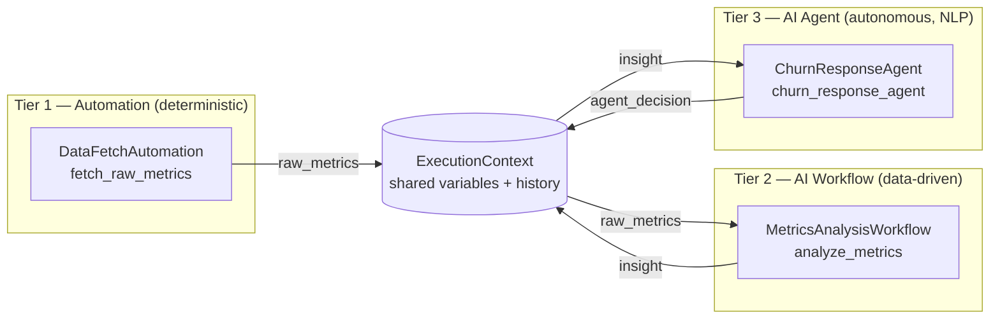

# Architecture

## 1. Why a monorepo, why synchronous-first

Every workflow, automation, and agent lives in one repository so there is exactly
one place to look for "how does the system behave end to end." A single
`ExecutionContext` object is threaded through every module in a pipeline run —
that's the "shared context window" requirement: no databases-as-message-buses, no
serializing state between separately-deployed services, just a dict and a list
that every module reads and appends to.

Synchronous-first means: given a pipeline `[A, B, C]`, `B` never starts until `A`
has returned, and `B`'s output is already merged into the context `C` sees. This
is what makes "tier-1 output feeds tier-3 input" trivial — there is no queue to
wire up, just a return dict.

## 2. Data flow: automation → workflow → agent



Concretely, in `cli.py`:

1. `discover()` scans `automations/`, `workflows/`, `agents/` for `*.yaml`
   manifests (in that tier order) and instantiates the module each one points to.
2. `Orchestrator.run()` creates one `ExecutionContext` and calls `module.run(context)`
   for each module in sequence.
3. Each module's return dict is merged into `context.variables` via
   `context.update(...)` **before** the next module runs.
4. Every step's inputs/outputs/timing/success are appended to `context.history`
   and, if a `StateStore` is attached, persisted to SQLite (`runs` + `steps` tables).

This is exactly the "output from a tier-1 script feeds a tier-3 agent" requirement:
`raw_metrics` (tier 1) → `insight` (tier 2) → `agent_decision` (tier 3), each key
just sitting in the same dict.

## 3. Core engine components

| File | Responsibility |
|---|---|
| `engine/base.py` | `Tier` enum + `BaseModule` abstract contract every module implements |
| `engine/context.py` | `ExecutionContext` (shared state) + `StepRecord` (one step's audit trail) |
| `engine/orchestrator.py` | Sequential runner; merges outputs, records history, optionally persists to `StateStore`, controls stop-vs-continue on error, emits live progress events via `on_event`. Also defines `StepSpec`, for steps that need per-step seeded/mapped inputs rather than just running a bare module. |
| `engine/registry.py` | Reads `*.yaml` manifests in a tier folder (`load_manifests`), dynamically imports and instantiates the referenced class (`instantiate`/`discover`) |
| `engine/state_store.py` | SQLite persistence of run/step history for the `status` CLI command |

`Orchestrator.stop_on_error` controls failure behavior: `True` (default) re-raises
after recording the failed step, so a broken pipeline fails loudly; `False` lets
independent later steps still run (useful once pipelines have parallel-ish
branches, or a non-critical logging agent at the tail).

`Orchestrator.run(initial_context, on_event)` also accepts an optional
`on_event` callback. If given, it's called with a stream of events as the run
happens — `step_started` / `step_completed` / `step_failed` for each module,
plus `run_completed` / `run_failed` at the end (each carries the final
`context`). Per-step events carry an `index` (the step's position in the
pipeline) alongside `tier`/`name`, specifically so a pipeline that uses the
same module twice — entirely possible once pipelines are built by picking
modules freely rather than one-per-tier — doesn't have two tracker rows
fighting over the same identity. A module can call `context.emit(kind,
message)` from inside its own `run()` to add its own events (e.g. `"thought"`,
`"tool_call"`) into that same stream, automatically tagged with which
tier/module produced them (`ExecutionContext.active_module`, set by the
orchestrator before each `module.run()` call). The CLI ignores this entirely
(`on_event=None`, a no-op); the dashboard uses it to drive the live tracker
described below.

Each pipeline "step" the orchestrator runs is a `StepSpec(module, seed)`, not
just a bare module — `seed` is a function of the *current* `ExecutionContext`,
called right before that step's `module.run()`. For the default case (bare
`BaseModule` instances, e.g. `Orchestrator([Double(), AddOne()])`) it's a
no-op wrapped in automatically by `_as_step()`. For a pipeline assembled by the
visual builder, `seed` is where a field mapping actually happens: `seed = lambda
ctx: {"notify_slack": ctx.get("insight")}` copies whatever's currently sitting
under the `insight` key (written by an earlier step) into `notify_slack` right
before this step reads it — the mapping is resolved at run time, once the
source step has actually executed, not baked in ahead of time.

## 4. Unified control layer

There are two front doors onto the same engine and the same `orchestrator.db`:

**`webapp/` — the visual control center (primary, day-to-day use).** A FastAPI
app (`webapp/main.py`) exposes:

- `GET /api/modules` — every enabled module per tier, with its manifest
  `description` and `inputs` schema, plus a `status` (`ready`/`error`) derived
  from `StateStore.latest_step_status()`.
- `POST /api/modules/{tier}/{name}/run` — builds a single-module pipeline
  (`Orchestrator([module])`), starts it in a **background thread**, and
  returns immediately with `{"stream_id": N}` — it does not wait for the run
  to finish.
- `POST /api/pipeline/run` — same idea, for the full tier-1→2→3 pipeline.
- `GET /api/stream/{stream_id}` — a Server-Sent Events stream of that run's
  events, as they happen, as `data: {...}\n\n` lines.
- `GET /api/runs` — recent, persisted run history from `StateStore`, for
  anything that wants to poll it instead.

`stream_id` is deliberately a separate, ephemeral ID space from `StateStore`'s
persisted `run_id` (`webapp/events.py::RunEventBus`) — it only exists to give a
live SSE channel something to key on, and is discarded once that stream ends.
Execution genuinely happens in a background thread (`threading.Thread`, not an
`asyncio` task), so a slow module never blocks FastAPI's event loop; a
`queue.Queue` per stream buffers events between the worker thread and whichever
request is currently reading `/api/stream/{id}`, so a client that connects a
moment late still gets everything from the start.

The static frontend (`webapp/static/`) is plain HTML/CSS/vanilla JS — no
bundler, no framework. Clicking a card's Run button (or "Run Full Pipeline")
POSTs to kick off the run, then opens `new EventSource('/api/stream/{id}')` and
renders three things live as events arrive (`app.js`):

- **A step tracker** — one row per module in that run (just one, for a single
  card; all three tiers, for the full pipeline), each showing ⚪ pending → 🟡
  running → 🟢 done / 🔴 failed as `step_started`/`step_completed`/
  `step_failed` events land.
- **An agent thought accordion** — for any tracker row whose tier is `agent`,
  `thought` and `tool_call` events append live lines to an expandable panel
  under that row (💭 for a thought, 🔧 for a tool call), so you can watch an
  agent's reasoning as it happens rather than only see its final message.
- **A toast notification** — on the terminal `run_completed`/`run_failed`
  event, a corner toast reports success or failure, the card's status pill
  updates (ready/error), and the client explicitly closes the `EventSource`
  (so a normal completion doesn't trigger the browser's automatic SSE
  reconnect).

Automations get a sky-blue accent, workflows violet, agents emerald, so the
tier boundary is visible at a glance independent of the tracker's own
pending/running/done coloring.

**`cli.py` — the scriptable / CI-friendly control layer:**

- `python cli.py list` — enumerate every discovered module per tier (health check
  that manifests + entrypoints resolve).
- `python cli.py run` — execute the pipeline once, print the final context and
  per-step status.
- `python cli.py status` — read `orchestrator.db` and print recent runs and their
  steps.

Both front doors call the exact same `Orchestrator`/`StateStore`/`registry`
code — the web layer adds zero orchestration logic of its own, only HTTP
plumbing and input coercion (`webapp/main.py::_coerce_inputs`, which applies
each field's declared `type` and `default` from the manifest).

## 5. The no-code visual pipeline builder

Everything through §4 assumes one fixed pipeline (automation → workflow →
agent, in that order). The builder lets a user compose their *own* pipeline —
any modules, any order, any number of steps — entirely from the dashboard.

**Manifests declare `outputs` too, not just `inputs`.** `outputs: [{name,
label}]` names the keys a module's `run()` meaningfully writes into context
(e.g. `fetch_raw_metrics` declares `raw_metrics`). This is purely descriptive —
nothing enforces that a module's return dict matches its declared outputs — it
exists so the builder's "map from an earlier step" dropdown has something to
offer. `GET /api/modules` includes `outputs` alongside `inputs` for exactly
this reason.

**A pipeline definition** (what the builder POSTs, and what ends up on disk)
is a name/description plus an ordered list of steps, each `{tier, name,
inputs, mappings}`:

```yaml
name: Custom Churn Chain
slug: custom_churn_chain
description: Built visually
steps:
  - tier: automation
    name: fetch_raw_metrics
    inputs: {signups: 128, churn: 14, revenue: 4210.5}
    mappings: {}
  - tier: workflow
    name: analyze_metrics
    inputs: {risk_threshold: 0.1}
    mappings: {}
  - tier: agent
    name: churn_response_agent
    inputs: {}
    mappings: {notify_slack: {step: 1, output: insight}}
```

A field is either in `inputs` (a literal, same as a module card's form) or in
`mappings` (sourced from an earlier step's declared output) — never both.
`webapp/main.py::_build_steps_from_definition` turns this into a list of
`StepSpec`s: each step's `seed` merges its static `inputs` with, for every
mapped field, `ctx.get(mapping["output"])` at the moment that step runs.

**Storage and validation** (`webapp/pipelines.py`) follow the same convention
as every other tier: `pipelines/<slug>.yaml`, one file per pipeline, plain
enough to read, diff, and hand-edit. `validate_pipeline()` runs before
anything is saved: every step's `(tier, name)` must resolve to a real,
discovered module, and every mapping must reference an *earlier* step index
whose module actually declares that output name — a typo or a forward
reference comes back as a `400` with a specific message, not a pipeline that
silently does the wrong thing (or crashes) when launched.

**One-click save-and-launch.** `POST /api/pipelines` validates, writes the
YAML file, and immediately launches the pipeline through the exact same
background-thread-plus-SSE mechanism as a single-module or full-pipeline run
(`_launch_steps`, shared with the other run endpoints) — the builder's live
tracker, agent thought accordion, and completion toast are the *same* frontend
code as everywhere else, just pointed at a differently-assembled step list.
Once saved, a pipeline gets its own card in the dashboard's **Saved Pipelines**
section (`GET /api/pipelines` to list, `POST /api/pipelines/{slug}/run` to
relaunch it later without rebuilding it).

Step reordering, arbitrary-step removal, and nested-field (dotted-path)
mapping were all originally deferred here as "addressable later without
changing the storage format" — Batches 4 and 5 addressed all three; see
their build-history entries in section 8 for how.

## 6. Diagnostics, telemetry, and everyday UI

A batch of additions that don't change how runs execute, only how visible their
state is:

- **`webapp/health.py`** runs four checks on demand (`GET /api/health`): the
  `StateStore` is reachable, every `*.yaml` manifest parses and has a `name`/
  `entrypoint`, every enabled entrypoint actually imports and instantiates, and
  which optional environment variables (currently just `ANTHROPIC_API_KEY`)
  aren't set. The last one never marks the app "degraded" — it's informational,
  since nothing bundled requires it yet. The other three do, because they'd
  otherwise surface later as a confusing error the first time someone clicks
  Run on a module with a broken manifest.
- **`StateStore.metrics_summary()`** aggregates every finished run into total
  count, success rate, and average duration — read by the header ticker.
  `GET /api/runs.csv` streams the same history as CSV via the stdlib `csv`
  module, no new dependency.
- **Per-step `duration_ms`** was added to the orchestrator's `step_completed`/
  `step_failed` events (`engine/orchestrator.py`) so the dashboard's log tabs
  can show real timing, not just pass/fail.
- **`pipeline_store.duplicate_pipeline()`** clones a saved pipeline's `steps`
  under an auto-incremented "(copy)" name, reusing the same `validate_pipeline`
  + `save_pipeline` path a fresh save takes — no separate write path to keep
  in sync.
- **Favorites are shortcuts, not copies.** An earlier design would have
  rendered a favorited card a second time inside a "Favorites" shelf — but two
  DOM elements sharing one `id` (`card__automation__fetch_raw_metrics`) breaks
  every `getElementById` lookup the tracker/status code relies on, silently
  updating only whichever element the browser finds first. Favorites are
  instead thin chips that call the exact same `runModule`/`runSavedPipeline`
  functions, which scroll to and animate the one real card elsewhere on the
  page — no duplicate IDs, ever.
- **Collapsible sections and the search bar** operate purely on CSS classes
  (`.collapsed`, `.search-hidden`, `.search-no-match`) applied to existing DOM,
  re-applied after every re-render since `innerHTML` replacement wipes any
  classes added by a previous pass.

## 7. Data ingestion, templating, the folder watcher, and source viewing

**Ingestion is one shared implementation, two triggers.**
`webapp/ingestion.py::ingest_csv_bytes()`/`ingest_pdf_bytes()` do the actual
work — hash the bytes, check `StateStore` for that hash, parse/extract, save
the raw upload plus its converted form into `artifacts/`, record the hash.
Both `POST /api/ingest/csv`/`pdf` (a browser upload) and
`webapp/watcher.py`'s background thread (a file appearing in
`watched_input/`) call the exact same functions — there is no separate
"auto-ingest" code path to drift out of sync with the manual one. Dedupe is
by SHA-256 of the file's bytes, not filename, so renaming a file doesn't
bypass it.

**The watcher is a plain polling loop**, not `watchdog`: a background
`threading.Thread` lists `watched_input/` every 2 seconds and calls a
callback for any filename it hasn't seen since it started. Files already
present at boot are marked seen immediately (not replayed as "new" on every
restart). This was a deliberate dependency trade-off — a 15-line loop against
one more third-party package for a feature that only needs to notice "a file
that wasn't here before now is."

**Template fields are generic string interpolation**, not LLM-specific
scaffolding. `engine/templating.py::render_template()` replaces `{name}` with
whatever a `lookup` callable resolves it to, leaving unknown names literal.
`interpolate_template_fields()` applies this to a manifest's `type: template`
inputs only. It's called from three places depending on what "context" means
for that run: the single-module endpoint (lookup = the request's own inputs
dict — a template field can reference a sibling field on the same card), a
custom pipeline's per-step `seed()` (lookup = live `ExecutionContext`, so a
later step can reference an earlier one's output), and the built-in
tier-1→2→3 pipeline (`_build_pipeline()` now wraps bare modules in
`StepSpec`s seeded from their own manifest defaults, specifically so a
template field's *default* value — see `churn_response_agent`'s
`custom_note` — interpolates real data even with zero user configuration).
A `BaseModule` never needs to know templating exists; by the time its `run()`
reads `context.get("custom_note")`, substitution already happened.

**Source viewing never accepts a client-supplied path.**
`webapp/linting.py::resolve_source_path()` takes a manifest's own
`entrypoint` string and resolves it via `importlib.util.find_spec()` — the
same mechanism Python itself uses to import the module — so the file lint
runs against is always exactly the file that manifest points to, never
anything a request could redirect. `ruff check --output-format=json` runs
against that one resolved path with a 10-second timeout; a non-zero exit
code (ruff's own convention for "found issues") is not treated as a failure —
only a JSON parse error or timeout falls back to an empty issue list.

## 8. Step-by-step: how this was built (and how to extend it)

1. **Define the contract.** `BaseModule` with `name`, `tier`, `description`, and a
   single `run(context) -> dict` method. Every tier implements the same shape on
   purpose — the orchestrator shouldn't need to know which tier it's calling.
2. **Define the shared state.** `ExecutionContext` — a `variables` dict for data
   and a `history` list of `StepRecord`s for audit/debugging.
3. **Build the sequential runner.** `Orchestrator.run()` iterates a list of
   `BaseModule` instances, merging each output into the context and recording a
   `StepRecord`, with a switch for stop-on-error vs. continue-on-error.
4. **Add persistence.** `StateStore` wraps SQLite with two tables (`runs`,
   `steps`) so history survives process restarts and the CLI's `status` command
   has something to read.
5. **Add extensibility.** `registry.discover(directory)` scans a folder for
   `*.yaml` manifests, each naming an `entrypoint` (`module.path:ClassName`), and
   instantiates it — this is what makes "drop a file in, don't touch the core"
   true.
6. **Write example modules per tier** (`automations/example_automation.py`,
   `workflows/example_workflow.py`, `agents/example_agent.py`) that demonstrably
   pass data forward, proving the flow in code rather than just in a diagram.
7. **Build the CLI control layer** (`cli.py`) wiring `discover()` + `Orchestrator` +
   `StateStore` into `list` / `run` / `status` subcommands.
8. **Add tests** (`tests/test_orchestrator.py`) covering context-threading and
   both error modes.
9. **Add CI** (`.github/workflows/ci.yml`) running `pytest` and a CLI smoke test
   on every push, so a broken module or a bad manifest fails fast.
10. **Add an `inputs` schema to manifests** (list of `{name, label, type, default,
    options}`) so modules can declare form fields without any engine change —
    `registry.load_manifests()` returns them as plain dicts.
11. **Build the visual control center** (`webapp/`): a FastAPI layer
    (`list_modules` / `run_module` / `run_pipeline`) over the same engine, plus a
    static, build-step-free HTML/CSS/JS dashboard that renders manifest `inputs`
    as forms and turns each module into a one-click card.
12. **Add API tests** (`tests/test_webapp.py`, via FastAPI's `TestClient`)
    covering module listing, single-module runs with overridden inputs, 404s,
    and the full-pipeline endpoint.
13. **Add live progress events.** `ExecutionContext.emit()` +
    `Orchestrator.run(..., on_event=...)` turn a run into a stream of
    step/thought/tool-call events instead of an opaque black box (also fixed a
    latent bug along the way: `finish_run("completed")` was unconditionally
    overwriting `finish_run("failed")` at the end of a continue-on-error run).
14. **Instrument the example agent** (`agents/example_agent.py`) to call
    `context.emit("thought", ...)` / `context.emit("tool_call", ...")` with
    small `time.sleep()`s between them — enough to make the live stream
    visibly stream rather than resolve instantly, which is what a real
    LLM-backed agent's latency would look like anyway.
15. **Move execution to a background thread + SSE** (`webapp/events.py`'s
    `RunEventBus`, plus `webapp/main.py`'s run endpoints returning a
    `stream_id` instead of blocking): a synchronous HTTP response can't show
    "in progress," so a live tracker requires the run to happen off the
    request thread and the client to subscribe separately.
16. **Build the tracker, thought accordion, and toasts** (`webapp/static/app.js`,
    `styles.css`) on top of that stream via `EventSource`.
17. **Add `StepSpec` to the orchestrator** (`engine/orchestrator.py`): a
    module plus a `seed(context) -> dict` function run right before it, so a
    pipeline step can pull static values *and* values mapped from an earlier
    step's output — without this, a heterogeneous, user-composed pipeline has
    no way to feed differently-named fields into each other.
18. **Tag events with a step `index`**, not just `tier`/`name` — needed the
    moment a pipeline can legitimately contain the same module twice.
19. **Add `outputs` to manifests** (mirroring `inputs`) so the builder knows
    what's available to map from at each point in a pipeline.
20. **Build pipeline storage + validation** (`webapp/pipelines.py`): the same
    `pipelines/<slug>.yaml` convention as every other tier folder, with
    `validate_pipeline()` checking every module reference and mapping before
    anything is saved or run.
21. **Wire save-and-launch + re-run endpoints** (`webapp/main.py`): `POST
    /api/pipelines` (validate, save, launch) and `POST
    /api/pipelines/{slug}/run` (relaunch a saved one), both reusing
    `_build_steps_from_definition` + the existing background-thread/SSE
    launch path — no new execution mechanism needed.
22. **Build the visual sequencer** (`webapp/static/app.js`, `index.html`,
    `styles.css`): a step-by-step builder UI where each field gets a
    "static value vs. map from Step N" dropdown, reusing the same tracker/
    thought-accordion/toast code the rest of the dashboard already had.
23. **Add pipeline tests** (`tests/test_pipelines.py`): save-and-launch end to
    end, a mapping actually changing a module's behavior (not just being
    accepted), and both validation failure modes (unknown module, bad
    mapping reference).
24. **Add startup/runtime diagnostics** (`webapp/health.py`): validate
    manifests, entrypoints, and the state store on demand via `GET
    /api/health`, surfaced as a header beacon.
25. **Add metrics + CSV export** (`StateStore.metrics_summary()`, `GET
    /api/runs.csv`, `GET /api/metrics`): aggregate run telemetry for the
    header ticker and a downloadable history.
26. **Add pipeline duplication** (`pipeline_store.duplicate_pipeline()`): clone
    a saved pipeline under an auto-incremented name via the same
    validate-and-save path a fresh save uses.
27. **Add per-step timing** (`duration_ms` on `step_completed`/`step_failed`
    events) so the dashboard's log tabs can show real durations.
28. **Build the remaining dashboard polish** (`webapp/static/`): theme toggle,
    search, favorites (as shortcuts to the one real card, not duplicates),
    collapsible sections, toast/notification history, skeleton loaders, and
    the System Info / Agent Thoughts / Raw Output log tabs.
29. **Add diagnostics tests** (`tests/test_diagnostics.py`): health check
    shape, metrics reflecting a completed run, CSV export format, and
    duplication (including the 404 case).
30. **Add shared ingestion + hash-dedupe** (`webapp/ingestion.py`,
    `ingested_files` table): CSV/PDF upload endpoints, both backed by the same
    `ingest_csv_bytes`/`ingest_pdf_bytes` functions the watcher also calls.
31. **Add the folder watcher** (`webapp/watcher.py`): a plain polling loop,
    deliberately not the `watchdog` package, wired to call the same ingestion
    functions as a manual upload.
32. **Add generic template interpolation** (`engine/templating.py`): `{name}`
    substitution against manifest `type: template` fields, applied at three
    call sites depending on what "context" means for that run (single-module
    inputs, a custom pipeline step's live context, or the built-in pipeline's
    own manifest defaults) — demonstrated via `churn_response_agent`'s
    `custom_note` field, not a fake LLM persona picker.
33. **Add read-only source + lint viewing** (`webapp/linting.py`): resolve a
    module's file via `importlib.util.find_spec()` on its own manifest
    entrypoint (never a client-supplied path), run `ruff check` against
    exactly that file.
34. **Add tests for all of the above** (`tests/test_ingestion.py`,
    `test_templating.py`, `test_watcher.py`, `test_linting.py`): dedupe by
    content hash, purge never touching `orchestrator.db`/`pipelines/`, a
    template actually changing a module's output (not just being accepted),
    the watcher ignoring pre-existing files but catching new ones, and lint
    results for both a clean file and a deliberately broken one.
35. **Extend from here:** to add a real module, drop a `<name>.py` + `<name>.yaml`
    pair into the right tier folder (see the README's "Adding a new module"
    section) — it appears in `cli.py list`, the dashboard, and the pipeline
    builder's module picker with no engine or webapp code changes. Declare
    `outputs` too if you want other steps to be able to map from it, or
    `type: template` on an input to make it interpolate against context.
36. **Add per-step execution timeout** (`engine/orchestrator.py`): `StepSpec.
    timeout_seconds` runs `module.run()` in a shared `ThreadPoolExecutor` and
    calls `future.result(timeout=...)`; a timeout is surfaced as a normal
    failed step (a `TimeoutError`), with the error message explicit that
    Python can't forcibly kill the thread — it only stops the orchestrator
    from waiting on it.
37. **Add result caching** (`webapp/cache.py`, `StateStore.set_cached_result`/
    `get_cached_result`, a new `result_cache` table): a single-module run's
    output is cached by a SHA-256 hash of `{tier, name, inputs}`; a repeat run
    with identical inputs replays instantly via a synthesized SSE event
    sequence (`_replay_cached_result` in `webapp/main.py`) instead of a second
    background thread, so the frontend's existing tracker code needs no
    special case beyond a `cached: true` flag. A **Force refresh** checkbox
    per card bypasses it. Deliberately scoped to single-module runs — a
    pipeline step's inputs can depend on live upstream context, so "same
    inputs" isn't well-defined there the way it is for one module in isolation.
38. **Add graceful shutdown** (`webapp/main.py`'s `lifespan` context manager):
    every background run thread is tracked in an `_active_run_threads` set;
    on shutdown, each gets joined with a timeout before the watcher, scheduler,
    and state store connection are torn down.
39. **Add a cron-style scheduler** (`webapp/scheduler.py`, a new `schedules`
    table in `StateStore`): a background thread polls for schedules whose
    `next_run_at` has passed and calls back into `_trigger_schedule`, which
    launches the same module/pipeline execution path as a manual run — just
    without an SSE stream, since nobody's watching a scheduled run live (a
    stream nobody drains would leak). This is a plain recurring-interval
    timer, not a real cron-expression parser — no `croniter` dependency, and
    it's honest about not supporting minute/hour/day-of-week syntax nothing
    here would use.
40. **Add CSV auto-cleansing** (`ingestion.cleanse_records`): every ingested
    CSV is trimmed, blank rows and exact-duplicate rows are dropped, and
    empty cells become `null`, applied automatically before the JSON
    conversion is saved — with the before/after counts surfaced in the
    ingestion result and a small UI banner when anything changed.
41. **Add keyword search over artifacts** (`ingestion.search_artifacts`,
    `GET /api/artifacts/search`): a case-insensitive substring search across
    every ingested file's *extracted* content (the `.json`/`.txt` conversion,
    not the raw upload bytes), returning a snippet per match.
42. **Add a process performance ticker** (`webapp/perf.py`, via `psutil`):
    this process's own CPU%, RSS memory, thread count, and uptime, polled
    into the header every few seconds — deliberately scoped to "this one
    process," not a system-wide monitor.
43. **Add run comparison** (`_parsed_steps_for_run`/`_diff_dicts` in
    `webapp/main.py`, `GET /api/runs/{id}` and `GET /api/runs/compare`): a
    step-by-step, key-level diff between any two recorded runs' outputs,
    surfaced via two dropdowns and a Compare button under Recent Runs.
44. **Add a DAG visualizer for saved pipelines** (`webapp/graph.py`,
    `GET /api/pipelines/{slug}/graph`): since a pipeline step's mapping can
    reference *any* strictly-earlier step (enforced by `validate_pipeline`),
    the step list is already a valid topological order and the mapping edges
    form a genuine DAG, not just a chain — rendered client-side as hand-built
    SVG (sequential backbone + labeled arcs for mapping edges that skip
    steps), no charting library.
45. **Add keyboard shortcuts, a regex tester, and a slowest-step highlight**:
    `/` focuses search, `Esc` closes open dropdown panels, `?` shows a
    shortcut reminder; a pure-client-side regex tester widget lives under a
    new **Tools** section; and after any multi-step run, whichever step had
    the highest `duration_ms` gets a highlighted row and a badge, read
    straight off the same SSE events the tracker already receives.
46. **Add tests for all of Batch 3** (`test_orchestrator.py`'s timeout test,
    `test_scheduler.py`, `test_webapp.py`'s cache/compare/schedule tests,
    `test_ingestion.py`'s cleansing/search tests, `test_pipelines.py`'s graph
    test, `test_diagnostics.py`'s performance test): 55 tests total, all
    exercising real behavior (a monkeypatched call counter proving a cache
    hit skips re-execution, an actual slow module proving a timeout fires,
    a real scheduler thread proving it fires on interval and honors
    pause/resume) rather than asserting shapes alone.
47. **Add pipeline step reordering** (`webapp/static/app.js`'s
    `moveBuilderStep`): swapping two step positions rewires every explicit
    mapping's step index that referenced either position, and is blocked
    outright if the step moving into the earlier slot has an explicit
    mapping referencing what's currently there (the only direction that can
    create a forward reference, since a mapping can only ever point at a
    strictly earlier step). Documented, not silently ignored: a step that
    implicitly reads a shared context key another step produces *without* a
    declared mapping can still change behavior when reordered, since every
    module's output lands in the shared context regardless of mapping — the
    builder shows this caveat inline.
48. **Add nested-path (dotted) mapping and template resolution**
    (`engine/templating.py`'s `resolve_path`, reused by both
    `interpolate_template_fields`'s `{a.b.c}` syntax and
    `_build_steps_from_definition`'s field-mapping seed): a path's base name
    is resolved via the existing flat `lookup`, then each remaining segment
    walks one level into a dict, returning `None` (leaving a template
    literal, or `None` for a mapped field) the moment a segment is missing or
    the value isn't a dict. `validate_pipeline` checks only a mapping's base
    output name against the manifest's declared outputs — it can't validate
    a nested path since the manifest doesn't describe a nested output's shape.
49. **Add an upload/ingestion size limit** (`ingestion.read_upload_with_limit`,
    `MAX_UPLOAD_BYTES` = 20 MB): uploads are read in 1 MB chunks and rejected
    (413) the moment the running total exceeds the cap, so an oversized file
    is never fully buffered into memory just to be turned away; the folder
    watcher checks `path.stat().st_size` before ever reading a dropped file.
50. **Move linting off the request thread** (`linting.read_module_source_async`,
    a dedicated `ThreadPoolExecutor`): the file read + `ruff` subprocess call
    now runs via `loop.run_in_executor`, so the async endpoint awaits it
    without blocking the event loop on a slow lint or a large file.
51. **Add state store backup/export** (`StateStore.export_snapshot()`,
    `GET /api/backup/export` for a portable JSON snapshot of every run/step/
    schedule/ingested-file record plus the saved-pipelines list, and
    `GET /api/backup/db` for the raw SQLite file itself), surfaced as two
    download links in the health panel dropdown.
52. **Add secrets redaction** (`engine/redaction.py`'s `redact_secrets`,
    wired into `Orchestrator.run()`): a dict value is masked before it's
    used to build a `StepRecord` (what `StateStore.log_step` persists) or an
    emitted SSE event — but *after* `context.update(output)`, so the live
    `ExecutionContext` a later step reads still has the real value. One
    redaction point in the engine protects every downstream consumer
    (persisted history, live SSE, the JSON backup, the result cache) at once,
    rather than requiring each to remember to redact separately.
53. **Add rate limiting to run-triggering endpoints** (`webapp/ratelimit.py`'s
    `RateLimiter`, a per-client sliding window at 30 requests/10s): guards
    module runs, pipeline runs, and save-and-launch against an accidental
    request storm. Also fixed a related frontend gap while adding this: the
    run-trigger fetch calls never checked `res.ok` before destructuring
    `stream_id`, so a 4xx/5xx response (now genuinely reachable via a 429)
    would silently try to stream from `stream_id: undefined` instead of
    surfacing the server's error — a shared `fetchRunTrigger()` helper fixes
    this at all four call sites.
54. **Add JSON file ingestion** (`ingestion.ingest_json_bytes`,
    `POST /api/ingest/json`, folder-watcher `.json` handling): a top-level
    array is treated as the record list (mirroring a CSV's rows); anything
    else is wrapped as one row. Unlike CSV/PDF, no separate converted
    artifact is written — the raw upload already ships in the format
    ingestion turns CSV/PDF into, so it's directly reused as the
    searchable/previewable artifact.
55. **Add tests for all of Batch 4, plus a shared test fixture**
    (`tests/conftest.py`'s autouse `_reset_run_rate_limiter`): the rate
    limiter is a module-level singleton shared by every test that imports
    `webapp.main` (Python loads a module once), so without a reset the whole
    suite's cumulative request count could trip it well before any single
    test meant to exercise that behavior — the fixture clears it before each
    test so results stay independent of run order or timing. 77 tests total.
56. **Add arbitrary middle-step removal to the builder**
    (`webapp/static/app.js`'s `removeBuilderStep`): the mirror image of
    Batch 4's reordering — removing a step shifts every later mapping's
    step index down by one, and is blocked outright if another step's
    explicit mapping depends on the one being removed (there's no "step N
    no longer exists" fallback value).
57. **Add parallel branch execution** (`engine.orchestrator.ParallelGroup`,
    `Orchestrator._run_parallel_group`): branches are seeded sequentially
    (a plain dict merge — no need for concurrency there) before any
    branch's `module.run()` is submitted, so no branch ever sees a
    sibling's output during setup; then every branch's `module.run()` is
    submitted directly to the shared `_EXECUTOR` and awaited with its own
    optional timeout via `future.result(timeout=...)` — deliberately not
    routed through `_run_module()`'s own timeout path, which would
    re-submit to the same pool from within a pool thread and risk
    exhausting it. Each branch still gets its own `StepRecord` and
    step_started/step_completed/step_failed events (tagged `parallel: True`
    plus `branch_index`), so nothing about a single step's own behavior
    needs to know it ran inside a group. `_EXECUTOR`'s worker count was
    bumped from 8 to 16 for headroom, since a group submits every branch at
    once. Not yet exposed in the no-code visual builder — a real, separate
    UI feature (see the roadmap).
58. **Add SSE reconnect/replay** (`webapp/events.py`'s `RunEventBus`
    rewritten from a destructive `queue.Queue` per stream to an append-only
    event list per stream, guarded by a `threading.Condition`; the
    `/api/stream/{id}` endpoint pairs this with SSE's native
    `id:`/`Last-Event-ID` mechanism): the previous queue-based bus's own
    docstring claimed "a client that connects a moment late still gets
    everything from the start," which was only true for the *first*
    connection — a second connection (or a reconnect after a drop) got
    nothing, since `queue.Queue.get()` permanently removes what it reads.
    The frontend's `subscribeToStream` also used to treat any `onerror` as
    fatal, closing the connection immediately and pre-empting the browser's
    own auto-reconnect; it now only gives up after 5 consecutive errors,
    letting a transient drop resolve itself via reconnect-and-resume.
    Finished streams' event logs are kept for 5 minutes (swept lazily on
    the next `create()` call) so a reconnect shortly after a run ends can
    still replay it.
59. **Add persistent cross-run agent memory** (`engine.context.MemoryStore`,
    exposed as `context.memory`; `StateStore.get_memory`/`set_memory`/
    `delete_memory`/`all_memory`, a new `memory` table): accepts a
    `state_store` as `Any` rather than importing `StateStore` by type, to
    avoid a `context`↔`state_store` import cycle (`state_store.py` already
    imports `StepRecord` from `context.py`). Falls back to a local
    in-memory dict when no store is attached (e.g. a bare `ExecutionContext`
    in a test), so nothing about existing code needs to change. Demonstrated
    in `churn_response_agent`, which now remembers the last run's risk
    level and calls out when a *separate, independent* later run's risk
    level differs — proving the persistence is real, not just plumbing.
    Surfaced for inspection (redacted, like everything else) via
    `GET /api/memory` and a new **Agent Memory** dashboard section.
    Fixed a latent test-isolation gap along the way:
    `test_pipeline_graph_reports_nodes_sequence_and_mapping_edges` launched
    a pipeline via `POST /api/pipelines` but never waited for it to finish,
    so its background run could leak into whichever test ran next — harmless
    before (the agent had no observable side effects), but a real source of
    flakiness the moment it gained one.
60. **Add run history retention** (`StateStore.prune_runs`,
    `POST /api/runs/purge`, a purge control next to Recent Runs): deletes
    finished runs and their steps older than a cutoff, mirroring artifact
    purge — a run still in progress is never a candidate no matter how old
    it started.
61. **Add backup restore** (`StateStore.restore_snapshot`,
    `POST /api/backup/restore`, a **Restore backup…** upload in the health
    panel): strictly additive — every table is restored via
    `INSERT OR IGNORE` keyed by its own primary key/slug, so restoring the
    same snapshot twice, or into a store that already has some of this
    data, never overwrites anything and is always safe to repeat. A
    pipeline referencing a module that doesn't exist in this install is
    skipped rather than failing the whole restore. `export_snapshot()` was
    extended to include `memory` (previously omitted) so a restore is a
    genuine round trip of everything `context.memory` can hold.
62. **Add a compact/dense view toggle** (`#density-toggle`, a
    `body.density-compact` class): shrinks card padding, grid column
    minimum width, and form-field sizing; persisted in `localStorage` via
    the exact same pattern as the light/dark theme toggle.
63. **Add tests for all of Batch 5**: `ParallelGroup` concurrency proven by
    wall-clock timing (concurrent branches finish in ~1 branch's duration,
    not the sum of all of them), `webapp/events.py`'s replay/reconnect
    behavior at both the bus level and through the real `/api/stream`
    endpoint with a genuine `Last-Event-ID` header, cross-run memory
    proven via two separate `Orchestrator.run()` calls (and, at the API
    level, two separate pipeline launches) sharing one `StateStore`, and
    restore's additive/idempotent guarantee (restoring twice inserts
    nothing new; an existing key is never clobbered). 100 tests total.
64. **Add a generic HTTP request automation** (`automations/http_request.py`
    + manifest): calls any user-supplied URL via `httpx` (already in the
    dependency tree for FastAPI's test client — no new dependency) with
    per-run method/headers/body/timeout. A non-2xx response is a *result*
    (`http_response.ok: false`), not an exception — only unreachable hosts,
    timeouts, or malformed inputs raise, and the raised message includes
    the method + URL (httpx's own "[Errno 111] Connection refused" doesn't
    say *what* couldn't be reached). Introduced a new manifest key,
    `include_in_full_pipeline: false`, so a module that makes real outbound
    calls can opt out of the fixed one-click demo pipeline while staying
    runnable standalone and in hand-built pipelines — the demo pipeline
    stays fast, deterministic, and offline.
65. **Add conditional (skip-unless) pipeline steps**
    (`engine/conditions.py`'s `evaluate_condition` + `OPERATORS`;
    `StepSpec.condition`/`condition_label`; a `step_skipped` event; a
    `condition: {source, operator, value}` key per saved-pipeline step; a
    **Run only if…** row per builder step): the condition is evaluated
    right before the step would seed and run — false means skip (no seed,
    no run, no StepRecord), never failure, and the run continues.
    Evaluation is deliberately total: numeric-looking values compare as
    numbers (everything the dashboard sends is text), a missing key or
    type mismatch is just false, and a condition callable that *raises*
    counts as false (skipping is the safe failure mode for a broken
    condition). Conditions reference context keys, never step indexes, so
    the builder's reorder/remove logic needs no condition rewiring — unlike
    mappings. Parallel-group branches accept conditions at the engine level
    too (a skipped branch neither seeds nor runs, and a skipped failing
    branch doesn't fail its group).
66. **Add a per-module circuit breaker** (`module_health` table +
    `record_module_failure`/`record_module_success`/`reset_breaker` in
    `StateStore`; `_record_breaker_event` observing every run's
    step_completed/step_failed events in `webapp/main.py`; `GET
    /api/breakers`, `POST /api/breakers/{tier}/{name}/reset`): N
    *consecutive* failures (default 3, per-module
    `circuit_breaker_threshold` manifest override) trips the breaker, and
    every launch path — module run, full pipeline, saved pipelines,
    schedules — then refuses with a 409 naming the tripped module. A
    success resets the streak but never closes an open breaker (only an
    explicit reset does, so a flaky module can't re-arm itself); a
    schedule blocked by a breaker records that as its `last_status` via
    the scheduler's existing exception handling rather than silently not
    running. Deliberately excluded from backup snapshots: breaker state is
    transient health data about *this* install's recent runs, not durable
    work product.
67. **Add XLSX run-history export** (`GET /api/runs.xlsx`, `openpyxl` —
    imported lazily inside the endpoint so serving the dashboard never
    pays for it): same runs as the CSV export plus a second **Steps**
    sheet (run_id, module, tier, success, error, timestamps) — per-step
    detail is the one thing the flat CSV genuinely can't carry, which is
    what justifies the second format existing at all.
68. **Add full-text search across run history** (`StateStore.search_steps`,
    `GET /api/runs/search`, a search box in Recent Runs): case-insensitive
    `LIKE` over every recorded step's output JSON and error text, newest
    first, each hit carrying a ±60-char snippet and which side
    (`output`/`error`) matched. No post-hoc redaction needed: step outputs
    are redacted *before* they're logged (entry 52), so the stored text —
    and therefore any snippet of it — is already safe. Declared before the
    `/api/runs/{run_id}` route so FastAPI matches `/api/runs/search`
    correctly.
69. **Add an environment/config viewer** (`health.environment_report`, `GET
    /api/environment`, an **Environment & Config** dashboard section):
    `.env.example` is treated as the source of truth for which env vars
    the project declares; each is reported set/missing, with values shown
    verbatim for non-secret names but only *length* for secret-shaped ones
    (reusing the redactor's key heuristic — the page never receives the
    actual secret). Alongside: the live values of the app's operational
    knobs (step timeout, breaker threshold, rate limit, upload cap, cache
    age, watcher/scheduler intervals, SSE retention, DB path), read from
    the running objects rather than restating constants.
70. **Expose `ParallelGroup` in the visual builder** (closing the roadmap
    gap flagged in Batch 5): a saved-pipeline step can now be `{type:
    "parallel", name?, branches: [module steps...]}` — validated to have
    ≥2 branches, each branch's mappings only referencing steps strictly
    *before* the group (branches run concurrently; there is no sibling
    ordering to depend on). A later step's mapping may reference the
    group's slot, offering the union of its branches' declared outputs —
    outputs merge into the shared context either way, so resolution at
    run time is unchanged. The builder gained **+ Add Parallel Group**,
    per-branch module selectors/fields/mappings keyed `"slot:branch"`
    (`getBuilderStepRef` resolves either key shape; move/remove dependency
    checks and index rewiring iterate branch fieldSources too), and the
    tracker renders a group header plus one indented row per branch keyed
    by the same `index`+`branch_index` the SSE events carry. The DAG
    endpoint renders a group as one node carrying its branch list, with
    branch mappings aggregated onto the group's slot.
71. **Add tests for all of Batch 6**: the HTTP module against a real
    loopback `http.server` (headers/body echo, non-2xx-is-a-result,
    malformed-header rejection) and through the real module-run endpoint;
    condition evaluation as a table of operator cases plus engine-level
    skip/continue/raising-condition behavior and API-level gated pipelines
    (skip when unmet, run when met, YAML round-trip, bad-operator/missing
    -source rejection); breaker trip/reset at store level and end-to-end
    (three real failed runs → 409 → reset → accepted again), including
    that a suite-level fixture resets breaker state so a tripped breaker
    can't leak into other test files; XLSX parsed back with `openpyxl`
    asserting both sheets and row integrity; run-history search hitting
    outputs and error text of genuinely failed runs; environment view
    asserting a set secret exposes its length but never its value; and
    parallel-group pipelines saved, run (branch-tagged events asserted),
    rejected below two branches, rejected for sibling-referencing
    mappings, and graphed. 145 tests total.
72. **Add automatic step retries with backoff** (`StepSpec.max_retries`/
    `retry_backoff_seconds`; `_run_with_retries`/`_await_branch_with_retries`
    in `engine/orchestrator.py`; a `step_retrying` event; a **Retry on
    failure** row per builder step/branch): a failing attempt is retried in
    place (no re-seed) up to `max_retries` times, waiting
    `retry_backoff_seconds * 2**attempt` between attempts and emitting
    `step_retrying` first so a dashboard can show "retry 1/3" instead of a
    step silently going quiet. Only the terminal outcome — success after
    retries, or failure once retries are exhausted — reaches a
    `step_completed`/`step_failed` event and (per Batch 6's circuit
    breaker) the breaker's failure count; a transient failure that
    eventually succeeds never counts against it. A parallel branch retries
    by resubmitting `branch.module.run` to the shared executor, blocking
    only that branch's slot in the collection loop — every other branch's
    future keeps running independently regardless of how long one
    branch's retries take.
73. **Add an inbound webhook trigger for saved pipelines**
    (`POST /api/pipelines/{slug}/webhook`; a copyable webhook URL on each
    saved-pipeline card): the POST body (a JSON object, or empty) is
    merged into step 1's own input dict before building that pipeline's
    steps (`_apply_entry_overrides`, `_build_steps_from_definition`'s new
    `entry_overrides` parameter) — unknown keys are silently ignored, same
    as every other input dict here. For a `type: parallel` first step, the
    override is applied to every branch's inputs. No auth (single-user/
    local, same as everywhere else in this app), but it still goes through
    the same rate limiter and circuit-breaker check as any other launch
    path.
74. **Add editing a saved pipeline in the builder** (an **Edit** action;
    `moduleStepToBuilderStep`/`definitionToBuilderSteps` rebuild the
    builder's internal fieldSources/condition/retry shape from a saved
    definition, resolving a saved dotted-path mapping back into
    `{step, output, nestedPath}`): renaming is disabled while editing (the
    name field only, enforced client-side) so **Save & Launch** always
    re-POSTs under the same name and therefore overwrites the same
    slug/file in place — no delete-pipeline endpoint needed, and no risk
    of an orphaned duplicate under a new name. A **New pipeline** button
    in the editing banner resets the session. Along the way, fixed the
    edit flow's `scrollIntoView` landing a target flush against the
    sticky topbar (added `scroll-margin-top` to `.builder-panel`).
75. **Add a run detail drill-down** (click-to-expand rows in Recent Runs,
    backed by the already-existing `GET /api/runs/{run_id}`; results
    cached client-side per run id since a finished run's steps never
    change): surfaced a pre-existing class-name collision along the way —
    the new table row reused `.run-row`, already a flex-row class for a
    module card's Run-button row, so the `<tr>` rendered as
    `display: flex` and its cells wrapped onto two visual lines instead of
    laying out as table columns. Renamed to `.history-row`. Also added
    `table-layout: fixed` to `.runs-table table` and `white-space: pre-wrap`
    to the drill-down's output `<pre>` — without both, a wide recorded
    JSON value could force the whole table wider than its container.
76. **Add per-module performance statistics** (`StateStore.module_stats()`
    grouping the `steps` table by (tier, name); folded into `GET
    /api/modules` per card and exposed standalone at `GET
    /api/modules/stats`): total runs, success rate, average duration. A
    module with zero recorded runs reports `total_runs: 0` and `None` for
    the rate/duration fields rather than erroring or omitting the key.
77. **Add pipeline YAML export/import**
    (`GET /api/pipelines/{slug}/export` serves the pipeline's own saved
    YAML file directly; `POST /api/pipelines/import` accepts an uploaded
    YAML file through the exact same `pipeline_store.save_pipeline()`
    validation path a builder save uses — an unknown module or bad
    mapping is rejected identically either way): import under an existing
    pipeline's name overwrites it in place, same semantics as re-saving
    an edited pipeline (entry 74).
78. **Add re-running a past run with its original inputs**
    (`StepRecord.inputs`; a new `steps.inputs` column with a
    startup-time `_migrate_locked()` migration for databases created
    before this column existed; `POST /api/runs/{run_id}/rerun`): the
    first attempt only captured a `StepSpec.seed()` call's return value,
    which is empty for the standalone "run this module" and
    scheduled-module launch paths — those seed by passing values as the
    run's `initial_context` instead, a different mechanism the engine
    didn't know to record. Fixed by snapshotting `dict(context.variables)`
    right after seeding (covers both paths, since either way the values
    are merged into context before the module runs) rather than just the
    seed function's own return value. A re-run replays each recorded
    step's module with its own recorded snapshot as a brand-new run —
    faithful per-step replay, not a reconstruction of the original
    pipeline's mappings/conditions/parallel-group topology (not part of
    run history, only each step's module + resolved inputs are). A
    secret-shaped input is redacted before it's ever logged, so replaying
    it sends the masked placeholder, never the real value. The frontend's
    **↻ Re-run with these inputs** button in a run's drill-down reuses the
    same tracker/log machinery as every other launch; since a full
    Recent-Runs refresh (needed to show the new row) collapses whatever
    detail row was open, `onDone` re-expands the freshly created run's own
    row afterward instead of leaving the just-finished result to vanish.
79. **Add tests for all of Batch 7**: retries proving exponential backoff
    timing, exhaustion vs. eventual success, and independent per-branch
    retry in a parallel group; webhook override/no-body/unknown-key/
    malformed-body/missing-pipeline/parallel-branch-override cases;
    resaving a pipeline under the same name overwriting it in place with
    no duplicate left behind (the contract the edit flow depends on);
    export/import round-tripping a real saved pipeline plus malformed-
    YAML/non-object/unknown-module rejection and overwrite-on-import;
    per-module stats reflecting a real run's delta (not an absolute count,
    since the module-level store is shared across the whole test file) and
    zero-runs reporting `None` rather than an error; and inputs-recording
    covering both seeding paths (StepSpec.seed and initial_context),
    redaction of a secret-shaped recorded input, capture even on failure,
    per-branch capture in a parallel group, a schema-migration test
    opening a pre-existing database that predates the `inputs` column, and
    end-to-end rerun of both a single-module run and a full 3-step
    pipeline run. 184 tests total.
80. **Add agent-to-agent delegation** (`agents/escalation_agent.py`, a new
    Tier 3 module): `churn_response_agent` now writes a `handoff` dict
    (`requested`/`reason`/`priority`/`risk_level`/`churn_rate`) into its
    output whenever risk is high and its `enable_handoff` toggle (default
    on) is set; `escalation_agent` reads that same key straight out of
    shared context — no explicit field mapping needed for the implicit
    read, since the builder only renders mapping selects for a module's
    *declared* inputs, and `escalation_agent` declares `inputs: []`
    deliberately. It declines cleanly (`status: "skipped"`) if no handoff
    is waiting, otherwise picks a specialist by priority and drafts a
    retention plan. This is genuine agent-to-agent delegation — one agent
    deciding *another agent* should take the case — distinct from the
    usual upstream-tier handoff every other module already does.
    `include_in_full_pipeline: false` keeps it out of the fixed 3-step demo
    (same mechanism as `http_request`, entry 64), since it only makes sense
    chained after `churn_response_agent` in a real saved pipeline.
81. **Add a run history trend sparkline** (`renderRunsTrend()` in
    `app.js`, inline SVG, no charting dependency): one bar per run, oldest
    to newest left-to-right, height encoding duration and color encoding
    status — reusing the app's existing reserved status colors
    (`--ready`/`--running`/`--error`) rather than inventing per-chart hues,
    with a legend (dot + label, never color-alone) and a hover tooltip
    (duration leads as the bold value, run id/status/timestamp follow).
    Each bar is a custom rounded-top/square-bottom SVG path (not a plain
    `<rect>`) to get the 4px data-end radius without rounding the baseline
    corners. Sits above the Recent Runs table, reusing the same `/api/runs`
    data already fetched for the table — no new endpoint.
82. **Add time-of-day (daily-at-HH:MM) scheduling** (`schedule_type` +
    `daily_time` columns on `schedules`, migrated via `_migrate_locked()`;
    `next_daily_run_at()` in `webapp/scheduler.py`): the existing
    interval-only scheduler (entry 39) now supports a second mode picked
    per schedule. `HH:MM` is interpreted in the *machine's local timezone*
    (what a user typing "09:00" actually means) via `datetime.astimezone()`,
    then converted back to UTC for storage so it compares directly against
    every other `next_run_at`, interval or daily alike, without the
    scheduler's due-check needing to know which kind it's looking at. The
    schedule-creation form gained a Frequency dropdown that swaps the
    seconds-interval field for an `<input type="time">` field.
83. **Add artifact tagging + tag-based filtering** (`artifact_tags` table
    keyed by filename — the on-disk name is already unique thanks to its
    millisecond-timestamp prefix, so no synthetic id was needed;
    `PUT /api/artifacts/{filename}/tags` replaces a file's whole tag set,
    `GET /api/artifacts?tag=` filters case-insensitively): each artifact row
    gets tag chips plus an inline "+ tag" input (Enter to add, click a
    chip's × to remove), and a second filter box next to the existing
    keyword-search box narrows the list by tag. Every chip shares one
    neutral style rather than a per-tag hue, since tags are free-text with
    unbounded cardinality — assigning a fixed categorical color per tag
    would mean an ever-growing, eventually-repeating palette, exactly what
    the project's charting conventions (established for the trend
    sparkline, entry 81) rule out for open-ended categories.
84. **Add a keyboard-driven command palette** (Ctrl/Cmd+K, `app.js`'s
    "Command palette" section; a new full-screen overlay in `index.html`):
    lists every module ("Run"), every saved pipeline ("Pipeline" — jumps to
    and flash-highlights its card rather than running it, a deliberately
    lighter action than a module command), plus three fixed actions (open
    the builder, toggle theme, toggle density). Typing filters by
    title+description; arrow keys move the active row; Enter runs the
    active command. Reuses `runModule()` unchanged for the "Run" commands
    (it already scrolls to and runs a module's card with whatever inputs
    are currently set) and adds one small new primitive, `flashHighlight()`
    (a CSS animation class toggled on/off), for the pipeline-jump case that
    had no prior equivalent.
85. **Add bulk selection and bulk purge for Recent Runs**
    (`StateStore.delete_runs(run_ids)`, `POST /api/runs/bulk-delete`): a
    checkbox per row plus a header "select all" checkbox, with a "Delete
    selected (N)" button that stays disabled until at least one row is
    checked. This is the fine-grained counterpart to the existing
    age-based purge (entry 60) — pick specific runs rather than "older
    than X hours". Checkbox clicks call `stopPropagation()` so selecting a
    row never also triggers its click-to-expand drill-down (entry 75);
    `delete_runs` silently ignores any id that no longer exists rather than
    erroring, since a run could finish disappearing (purged, or deleted by
    a concurrent bulk-delete) between the checkbox being rendered and the
    button being clicked.
86. **Add tests for all of Batch 8**: unit + API-level tests for the
    churn-response/escalation handoff across three risk scenarios (high,
    low, toggle-disabled) plus confirming `escalation_agent` is listed but
    excluded from the fixed full pipeline; `next_daily_run_at()` staying
    same-day when the target time is still ahead vs. rolling to tomorrow
    when it's passed, plus a live `Scheduler` tick proving a daily
    schedule reschedules itself ~24h out; daily-schedule creation,
    malformed-time and missing-time-field rejection, and
    unknown-schedule-type rejection through the API; artifact tag
    set/replace/dedupe-and-sort/blank-entry-dropping, unknown-filename
    rejection, and case-insensitive tag filtering; and
    `delete_runs`/`/api/runs/bulk-delete` removing only the chosen ids,
    ignoring unknown ids, and no-op on an empty selection. The trend
    sparkline and command palette are pure frontend features with no new
    backend surface to unit-test (consistent with how earlier
    frontend-only features like the theme toggle and keyboard shortcuts
    were verified) — both were live-verified in a real browser instead,
    including a Ctrl+K open/filter/Escape-close/jump-to-pipeline/run-a-
    module/toggle-density round trip and a bulk-select-then-delete round
    trip confirming rows actually disappear. 212 tests total.
87. **Add .xlsx spreadsheet ingestion** (`ingestion.xlsx_bytes_to_records()`,
    reading the first sheet's row 1 as headers via openpyxl — already a
    dependency for the XLSX run-history export, imported lazily here too so
    serving the dashboard never pays for it; `POST /api/ingest/xlsx`): reuses
    `cleanse_records()` unchanged, so an .xlsx upload gets the exact same
    trim/blank-row/duplicate-row cleanup a CSV upload already does once it's
    parsed into records. Wired into the dropzone, the file-type accept list,
    and the filesystem watcher's `.csv`/`.pdf`/`.json`/`.xlsx` dispatch.
88. **Add pipeline version history with diff/restore**
    (`pipelines/_versions/<slug>/<timestamp>.yaml`, one file per prior
    version, written by `_archive_current_version()` right before
    `save_pipeline()` overwrites the current file — covers a builder
    re-save, an import under an existing name, and a restore alike, since
    all three go through the same `save_pipeline()` call): `GET
    /api/pipelines/{slug}/versions` lists them newest-first (the version id
    is itself a fixed-width UTC timestamp, so lexicographic and
    chronological order coincide), `GET .../versions/{id}` returns the
    archived definition plus a `_diff_dicts()` comparison against current
    (the same shallow key-level diff helper `/api/runs/compare` already
    uses), and `POST .../versions/{id}/restore` re-validates the old
    definition against modules on disk *today* and saves it as current —
    which means restoring is itself undoable, since `save_pipeline()`
    archives the pre-restore definition on the way in. A same-microsecond
    double-save (unlikely, but possible on a fast test run) gets a `-N`
    disambiguating suffix rather than silently overwriting one archived
    version with another. A **History** action on each saved-pipeline card
    expands a version list with **View diff** / **Restore** per row.
89. **Add a global scheduler pause/resume switch** (`Scheduler.paused`, an
    in-memory flag checked first thing in `_tick()`; `POST
    /api/scheduler/pause` / `/resume`, `GET /api/scheduler/status`): a
    maintenance-window control distinct from disabling an individual
    schedule — while paused, nothing fires no matter what any one
    schedule's own `enabled` state says, and every schedule's state is left
    completely untouched, so resuming picks up exactly where pausing left
    off. In-memory only (like `poll_interval`), so it resets to unpaused on
    a server restart — deliberately not persisted, since this is a live
    "stop everything right now" switch, not a saved setting. The Schedules
    section header gets a **⏸ Pause all** / **▶ Resume all** toggle plus a
    banner while paused.
90. **Add a resource usage alert banner** (pure frontend — `loadPerformance()`
    in `app.js`, already polling the existing `/api/performance` endpoint
    every 3s): crossing a CPU (80%) or memory (500MB) threshold highlights
    the specific ticker stat and shows a dismissable-by-recovery banner
    below the header, plus a one-time toast on the OK→WARN transition (not
    on every poll, so it doesn't spam). Thresholds are fixed constants, not
    user-configurable — this is a single lightweight local process, and the
    two numbers are called out in comments if they ever need revisiting.
91. **Add pipeline builder undo** (`builderUndoStack`, a bounded array of
    deep-cloned `builderSteps` snapshots; Ctrl/Cmd+Z or a new **↶ Undo**
    button): scoped deliberately to *structural* changes — add/remove a
    step or branch, reorder, swap a step's module — not every field-level
    keystroke or toggle, which would flood the stack with edits nobody
    thinks of as an undoable "action." `snapshotBuilderUndo()` is called
    once at each such mutation's call site, right after its own guard
    clauses pass (so a blocked removal/move, which changes nothing, never
    pushes a spurious snapshot); the stack is cleared whenever `builderSteps`
    is replaced wholesale instead of incrementally edited (opening a
    different pipeline for editing, or canceling an edit back to a blank
    pipeline), since undoing "into" an unrelated pipeline's history would
    make no sense.
92. **Add a shared agent blackboard** (`engine.context.Blackboard`, exposed
    as `context.blackboard`; a new `blackboard` column on `runs`, populated
    by `Orchestrator.run()` at every `finish_run()` call site and redacted
    the same way `context.variables` already is before persisting): a
    second, complementary multi-agent collaboration pattern alongside batch
    8's handoff — where a handoff is a point-to-point request from one
    named agent to another, the blackboard is a broadcast channel any
    agent-tier module can post a free-form, timestamped note to and any
    other agent (now or later in the same run) can read in full, with
    neither side needing to know who else is participating. Wired for
    real: `churn_response_agent` posts its risk assessment and decision;
    `escalation_agent` reads whatever's already on the board (not just the
    `handoff` key) before acting, and posts its own outcome whether it acts
    or declines. `GET /api/runs/{run_id}` now also returns `blackboard`;
    the run detail drill-down renders a **🗒 Shared Agent Blackboard**
    section when it's non-empty.
93. **Add tests for all of Batch 9**: XLSX ingestion's structured-record
    parsing, blank-row skipping, content-hash dedupe, and malformed-file
    rejection, plus a filesystem-watcher round trip; pipeline version
    history's archive-on-first-save no-op, archive-on-resave, multiple
    versions surviving multiple resaves, restore bringing back the old
    definition (and archiving the pre-restore one), and 404s for an
    unknown pipeline or version; `Scheduler.paused` blocking a due-and-
    enabled schedule from firing and resuming letting it fire, plus an API
    round trip through pause/status/resume that always resumes at the end
    so it can't leak into later tests sharing the same app-level scheduler;
    `Blackboard.post()`/`.all()` ordering, extra fields, and copy-not-
    reference semantics, an orchestrator run persisting a real module's
    blackboard entry with a secret-shaped extra field redacted, an empty
    blackboard for a run where nothing posted, and both
    `churn_response_agent`/`escalation_agent` posting genuine notes
    through a real chained pipeline (high-risk and low-risk alike, since
    `escalation_agent` posts a note whether it acts or declines). The
    resource-usage banner and builder undo are pure frontend features with
    no new backend surface (consistent with how earlier frontend-only
    features were verified) — both were live-verified in a real browser
    instead, including a mocked-high-usage round trip for the banner and
    an add/remove/undo/Ctrl+Z round trip for the builder. 238 tests total.
94. **Add a runtime module enable/disable toggle** (`module_overrides` table
    — `(tier, name)` primary key, `enabled`, `updated_at`; `set_module_enabled()`
    / `get_module_enabled_override()` / `all_module_overrides()` on
    `StateStore`; `PATCH /api/modules/{tier}/{name}`): a card's own On/Off
    switch, independent of the module's manifest `enabled` flag and
    persisted across a restart — no YAML edit needed. Folded into the same
    pre-launch check the circuit breaker already used, renamed
    `_ensure_breakers_closed` → `_ensure_modules_runnable` (still the one
    function checked at all 8 launch-path call sites), so a disabled module
    blocks standalone run, full pipeline, saved pipeline, schedule, webhook,
    and rerun exactly like a tripped breaker — same 409, a distinct message.
    `_is_module_effectively_enabled()` resolves the override if one's ever
    been set, else falls back to the manifest's own `enabled` default. `GET
    /api/modules` now reports `runtime_enabled` per module for the card's
    toggle state.
95. **Add URL-based file ingestion** (`webapp/ingestion.py`'s
    `filename_from_url()` / `fetch_url_bytes()`, a streaming
    `httpx.Client(...).stream("GET", url)` read in 1MB chunks against the
    same `MAX_UPLOAD_BYTES` ceiling and `UploadTooLargeError` a direct
    upload already enforces; `POST /api/ingest/url`, dispatched by file
    extension to the same `ingest_csv_bytes` / `ingest_json_bytes` /
    `ingest_xlsx_bytes` parsers a direct upload uses): paste a link next to
    the dropzone instead of only dragging a local file — same size cap,
    same content-hash duplicate detection, same auto-cleansing.
96. **Add a pipeline starter template gallery** (`webapp/templates.py`'s
    static, hand-written `PIPELINE_TEMPLATES` list — not user data, not
    persisted, not editable through the API; `save_pipeline_from_template()`
    in `webapp/pipelines.py`, reusing `duplicate_pipeline()`'s
    non-colliding-name pattern; `GET /api/pipeline-templates`, `POST
    /api/pipeline-templates/{id}/clone`): three templates built entirely
    from the five bundled modules — the basic 3-tier churn-response chain,
    batch 8's multi-agent handoff-with-escalation chain, and an
    outbound-HTTP webhook notifier — so a new user has genuinely useful
    starting points instead of always building from one blank step. A
    **Pipeline Templates** section with a card per template and a **Use
    this template** button that clones it into Saved Pipelines.
97. **Add a Recent Actions audit trail** (`audit_log` table — append-only,
    `action`/`detail`/`created_at`; `record_audit_event()` /
    `list_audit_events()` on `StateStore`; `GET /api/audit-log`): every
    destructive/administrative action — run purge, bulk-delete runs,
    artifact purge, backup restore, circuit breaker reset, scheduler
    pause/resume, pipeline version restore — logs one row at its existing
    call site, no new abstraction layer. A **Recent Actions** panel lists
    them newest-first with a human label, detail, and timestamp; the
    dashboard refreshes it right after triggering any of the above so it's
    never stale without a manual click.
98. **Add a one-click module self-test** (`POST /api/self-test`): actually
    calls every enabled module's `run()` once with its own manifest's
    default inputs (`_coerce_inputs(manifest, {})`, the same defaults a
    card's own Run button uses when no field is touched) — unlike
    `/api/health`, which only confirms manifests parse and entrypoints
    instantiate, this catches a module that imports fine but breaks the
    moment it's actually called. Each module gets its own fresh,
    disposable `ExecutionContext` with no `state_store` attached, so a
    self-test run never touches real run history, circuit breaker counts,
    or persistent agent memory (`MemoryStore` falls back to a throwaway
    in-memory dict with no store attached) — and it's deliberately never
    logged to the audit trail, since it's a read-only diagnostic, not an
    administrative action. A module disabled via batch 10's own toggle is
    reported `skipped` rather than attempted. A **🧪 Self-Test** button in
    the header opens a dropdown reporting pass/fail per module with error
    detail and timing, mirroring the existing health-panel/notifications
    dropdown pattern.
99. **Add tests for all of Batch 10**: module-toggle precedence (override
    beats manifest default) and its block-then-lift round trip across
    every launch path, plus a 404 for an unknown module; URL ingestion's
    CSV/JSON/XLSX dispatch, a 404 upstream, a too-large stream, and
    content-hash dedupe against a real local `HTTPServer` fixture (content
    deliberately made byte-distinct from other test files' fixtures after
    two cross-file dedupe collisions surfaced only on a full-suite run);
    every template listed and cloned, distinct-name-on-second-clone, a 404
    for an unknown template, and the escalation template's handoff mapping
    actually running end-to-end through the real high-risk path; every
    audited action logging a row with the right action/detail (circuit
    breaker reset, run purge, bulk-delete, artifact purge, scheduler
    pause/resume, pipeline version restore, backup restore) plus
    newest-first ordering and a `limit` round trip at the store level; the
    self-test endpoint covering every bundled module with a definite
    status and timing, a real `fetch_raw_metrics` pass proving genuine
    execution (not just import), a disabled module reported `skipped`,
    and confirming a self-test run never grows run history, never mutates
    persistent agent memory, and never appears in the audit log. 279 tests
    total.
100. **Add deleting a saved pipeline** (`delete_pipeline()` in
     `webapp/pipelines.py`; `DELETE /api/pipelines/{slug}`): removes only the
     current `<slug>.yaml` — its archived `_versions/<slug>/` history is
     deliberately left in place, since neither `list_pipeline_versions()`
     nor `restore_pipeline_version()` ever required the current file to
     exist. `GET /api/pipelines/{slug}/versions` was relaxed to 404 only
     when there's truly nothing under a slug (no current file *and* no
     archived versions), so a deleted pipeline's history stays listable and
     restorable via the API without recreating it under the same name
     first. A **Delete** button (with a browser `confirm()`) on each saved-
     pipeline card; a lingering frontend bug was caught here too —
     `renderSavedPipelines()` hid the whole section when the list went to
     zero but never cleared `savedPipelinesGrid.innerHTML`, leaving a stale
     (deleted) card sitting hidden in the DOM — fixed alongside this feature.
101. **Add saving a pipeline without launching it** (`PipelineDefinition.launch:
     bool = True` on `POST /api/pipelines`; `false` skips
     `_ensure_modules_runnable` and the launch step, returning just
     `{"pipeline": saved}` with no `stream_id`): the original "Save & Launch"
     button stays the default (omitting `launch` behaves exactly as before),
     and a new **Save** button posts with `launch: false` for a draft that
     isn't ready to fire yet, or one only ever meant to be triggered by a
     schedule or webhook. The builder's validation + payload-building logic
     was extracted into a shared `collectBuilderPipelinePayload()` so both
     buttons validate identically without duplicating the step-serialization
     code.
102. **Add a runtime-configurable circuit breaker threshold** (new
     `breaker_overrides` table — `(tier, name)` primary key, `threshold`,
     `updated_at`, kept separate from `module_overrides` since the two
     toggles are independent; `set_breaker_threshold()` /
     `get_breaker_threshold_override()` / `clear_breaker_threshold_override()`
     on `StateStore`; `PATCH` / `DELETE /api/breakers/{tier}/{name}/threshold`):
     `_breaker_threshold()` checks the override first, falling back to the
     module's manifest `circuit_breaker_threshold` (or the engine-wide
     default of 3) exactly like `_is_module_effectively_enabled()` already
     does for the enable/disable toggle. Lowering the threshold trips the
     breaker sooner on the very next failure; raising it never silently
     un-trips an already-open breaker, consistent with the existing
     "only an explicit reset closes it" rule. Each module card gets a
     compact **Breaker trips after N failure(s)** control with a **Set**
     button and a **Use default** button that appears only when overridden.
103. **Add diffing two saved pipelines** (`GET /api/pipelines/compare?a=&b=`):
     reuses `_diff_dicts()` — the same shallow key-level diff already
     powering `/api/runs/compare` and a pipeline's own version history —
     applied to two different pipelines' current definitions instead of two
     runs or two versions of one. A **Compare** row appears under Saved
     Pipelines once there are at least two to compare, with two `<select>`s
     and a result panel styled like the existing run-comparison bar.
104. **Add a CSV export for the Recent Actions audit trail**
     (`GET /api/audit-log.csv`): mirrors `GET /api/runs.csv`'s exact
     `csv.DictWriter` + `StreamingResponse` pattern. An **Export CSV** link
     next to the panel's **Refresh** button.
105. **Add a new-module scaffolding wizard** (`webapp/scaffold.py`'s
     `scaffold_module()`; `POST /api/modules/scaffold`): generates a starter
     `<name>.py` + `<name>.yaml` pair in the right tier directory — the
     exact boilerplate the README's "Adding a new module" section otherwise
     asks a user to hand-write. The description is embedded via Python's
     `!r` format conversion (never string-formatted directly into source),
     so any quotes/backslashes/newlines a user types still produce valid,
     compilable Python; the YAML manifest is built as a dict and written
     with `yaml.safe_dump()` rather than hand-templated, for the same
     reason. The derived module name follows the same lowercase/underscore
     convention as a pipeline slug, with the extra constraint that it must
     start with a letter (Python can't `import 123_thing`). Collides loudly
     (400) rather than overwriting if a module of that name already exists
     in the target tier. Immediately discoverable with no server restart,
     since the registry re-scans each tier directory on every request. A
     small form under **Tools** (tier, name, description) with a
     **Scaffold module** button.
106. **Add tests for all of Batch 11**: pipeline deletion (removed from the
     saved list, 404 for an unknown slug, and — the actual point of leaving
     version history intact — a deleted pipeline's versions still listable
     and restorable back to a real saved pipeline); save-without-launch
     persisting but never creating a run row, still validating and blocking
     a bad module reference, and launch remaining the default when omitted;
     breaker-threshold override precedence, the modules listing reflecting
     both the effective threshold and whether it's overridden, rejecting a
     threshold under 1, 404s for an unknown module, and the two behavioral
     proofs that matter most — lowering the threshold trips the breaker on
     the very first failure, and raising it afterward doesn't silently
     un-trip an already-open one; pipeline comparison reporting the right
     differing keys, no differences for two pipelines with identical steps,
     and 404s when either slug is unknown; the audit CSV export's header,
     row content, and `limit` handling; module scaffolding's generated
     `.py` actually parsing as valid Python and its class actually
     instantiating and running (not just "looks like a stub"), a
     tricky description (quotes, a backslash, a newline) surviving into
     valid Python *and* a correct YAML value, rejections for an unknown
     tier / a letters-and-numbers-free name / a name that would start with
     a digit / a same-tier collision, and the same set of checks again
     through the real HTTP endpoint end-to-end (with an autouse fixture
     cleaning up every file it creates, since — unlike pipelines/artifacts —
     scaffolding writes into the real, git-tracked `automations/`/
     `workflows/`/`agents/` source directories). Also root-caused a
     pre-existing flaky test discovered while stabilizing this batch's
     full-suite run: `handle_event()` in `_run_in_background()` (Batch 3)
     calls `bus.publish(event)` and then `_record_breaker_event(event)` for
     the same event, in that order, in the background worker thread — but
     there's no happens-before relationship enforced between that thread
     and whichever thread a test's stream-read resumes on after observing
     "run_failed"/"step_failed" over SSE, so a test that awaits that event
     and then immediately asserts or resets breaker state can race the
     recording itself, sometimes running before it, sometimes after. This
     let `test_pipeline_step_fails_for_real_once_retries_are_exhausted`
     (Batch 7) leave `fetch_raw_metrics`'s breaker tripped roughly one run
     in five, even with a `finally: store.reset_breaker(...)` at the end of
     that test — the reset itself could race the delayed recording and
     lose. Fixed generally rather than per-test: a new autouse
     `_reset_all_circuit_breakers` fixture in `tests/conftest.py` resets
     every module's breaker before each test in the whole suite, closing
     the window regardless of which test or file caused the pollution.
     Confirmed stable across 6 consecutive full clean-state runs after the
     fix (2 of the preceding ~10 runs had failed on this same test before
     it). 311 tests total.
107. **Add pipeline builder validation without saving** (`POST
     /api/pipelines/validate`): calls `pipeline_store.validate_pipeline()` —
     the same module-reference/mapping/condition/retry checks a real save
     already runs — and returns its result without ever calling
     `save_pipeline()` or launching a run. A **Validate** button next to
     **Save** / **Save & Launch** in the builder.
108. **Add importing a pipeline from a URL** (`POST
     /api/pipelines/import-url`): the same YAML-parse-then-`save_pipeline()`
     path `POST /api/pipelines/import` already uses for an uploaded file,
     fed by Batch 10's `ingestion.fetch_url_bytes()` instead of a direct
     upload. A URL input next to **Import pipeline…** in the builder header.
109. **Add duplicating an existing module** (`webapp/scaffold.py`'s
     `duplicate_module()`; `POST /api/modules/{tier}/{name}/duplicate`):
     complements Batch 11's from-scratch scaffold with a working starting
     point — copies the source module's manifest (inputs/outputs/
     `circuit_breaker_threshold` and all) and its Python source, renaming
     the class and its `name = "..."` attribute via a targeted, line-
     anchored regex replace. Two real bugs surfaced and were fixed while
     wiring this up against the actual bundled modules (not just synthetic
     scaffolded ones): the source file path was wrongly assumed to match
     the manifest's own `name` (e.g. `fetch_raw_metrics`), when a hand-
     written module's file can be named anything (`example_automation.py`)
     — fixed by deriving the path from the entrypoint's module segment
     instead; and the description-replacement regex only matched double-
     quoted strings, missing scaffold-generated modules whose description
     is embedded via `repr()` (single-quoted for a plain string) — fixed
     by matching either quote style. A **⧉** button on every module card.
110. **Add an artifact content viewer** (`ingestion.read_artifact_content()`;
     `GET /api/artifacts/{filename}/content`): structured records (a CSV/
     XLSX `.json` sidecar, or a raw `.csv` original) render as a capped
     table (`MAX_ARTIFACT_PREVIEW_ROWS`), extracted PDF text (`.txt`
     sidecar) as capped plain text (`MAX_ARTIFACT_PREVIEW_CHARS`), a
     directly-uploaded `.json` as either depending on whether its top-level
     shape is a list or a single object, and a binary original (`.pdf`,
     `.xlsx`) that has no directly-viewable content points to its `.txt`/
     `.json` companion instead of erroring. A **View** button per artifact
     row expands an inline content panel, mirroring the run-history
     drill-down's expand-in-place pattern rather than a separate page.
111. **Add saved input presets per module** (new `input_presets` table —
     `(tier, name, preset_name)` primary key, `inputs` JSON, `created_at`;
     `save_input_preset()` / `list_input_presets()` / `delete_input_preset()`
     on `StateStore`; `GET`/`POST /api/modules/{tier}/{name}/presets`,
     `DELETE .../presets/{preset_name}`): a named set of input values for a
     module's own card, reusable later instead of retyping the same
     combination. Reuses the existing `field__{tier}__{name}__{fieldName}`
     DOM id convention `runModule()` already relies on to collect current
     values (for saving) and to write values back (for loading) — no new
     field-tracking mechanism needed. A **Presets…** dropdown plus
     **Load** / **Save as…** / **Delete** buttons on any module card that
     declares at least one input field.
112. **Add bulk-tagging artifacts** (`POST /api/artifacts/bulk-tags`):
     applies one tag to every selected file's *existing* tag set (a union,
     not a replace) — reads each file's current tags via
     `store.all_artifact_tags()`, adds the new tag, and re-saves through
     the same `set_artifact_tags()` a single-file edit already uses.
     Unknown filenames in the batch are skipped rather than failing the
     whole request. Checkboxes per row plus a header "select all", mirroring
     Recent Runs' existing bulk-select/bulk-purge pattern exactly, with an
     **Apply tag to selected (N)** button that enables only once something's
     checked.
113. **Add tests for all of Batch 12**: pipeline validation accepting a
     well-formed definition without persisting it or touching run history,
     and rejecting a bad module reference / bad mapping the same way a real
     save would; URL-based pipeline import's happy path, a bad-module
     rejection, a non-mapping YAML document, malformed YAML, a 404
     upstream, and an oversized response, via a real local `HTTPServer`
     fixture; module duplication's generated source actually parsing as
     valid Python *and* its class actually instantiating and running (not
     just a syntax check), the source module's own inputs/outputs schema
     surviving into the copy, an overridable description, a 400-equivalent
     for an unknown source module, and a collision with an existing target
     — both at the `webapp.scaffold` function level and through the real
     HTTP endpoint against an actual bundled module (`fetch_raw_metrics`),
     with an autouse fixture cleaning up every file it creates in the real,
     git-tracked source directories; the artifact viewer's table/text/json/
     unsupported `kind` branches (including a directly-uploaded JSON object
     vs. a CSV/XLSX sidecar array), a 404 for an unknown artifact, and a
     path-traversal attempt in the filename also 404ing rather than
     resolving outside `artifacts/`; input presets' save-list-delete round
     trip, per-module scoping (the same preset name in two different
     modules stays independent), overwrite-on-resave, and 404s for an
     unknown module on every preset endpoint; bulk-tagging adding to (not
     replacing) a file's existing tags, skipping an unknown filename
     without failing the batch, and rejecting a blank tag — with test
     fixture content deliberately kept byte-distinct from other fixtures
     already in the same file after a real content-hash dedup collision
     surfaced on a full-suite run (`bulk_a.csv`'s placeholder `1,2` content
     collided with an existing `a.csv` fixture earlier in the same file).
     348 tests total, stable across repeated clean full-suite runs.
114. **Add pipeline tagging + tag filter** (new `pipeline_tags` table —
     `slug` primary key, `tags` JSON, `updated_at`; `set_pipeline_tags()` /
     `get_pipeline_tags()` / `all_pipeline_tags()` / `delete_pipeline_tags()`
     on `StateStore`, kept as its own table rather than folded into
     `artifact_tags` since the two are keyed by different identity concepts
     (filename vs. slug); `PUT /api/pipelines/{slug}/tags`, `GET
     /api/pipelines?tag=` for filtering, and `DELETE /api/pipelines/{slug}`
     now also calls `delete_pipeline_tags()` so a deleted pipeline's tags
     don't orphan). Tag chips + a `+ tag` input on every saved-pipeline
     card, mirroring the artifact-tagging UI exactly, plus a **Filter by
     tag…** box above the Saved Pipelines grid.
115. **Add a "used by" reverse lookup for modules** (`pipelines_using_module(tier,
     name)` in `webapp/pipelines.py` scans every saved pipeline's steps —
     including parallel-group branches — for a reference to the given
     module; folded into `GET /api/modules`'s existing per-module payload
     as `used_by: [slug, ...]`). A module card shows "Used by: a, b" only
     when non-empty; clicking a pipeline name scrolls to and flashes its
     card, reusing the command palette's own `flashHighlight()` jump
     behavior. Lets a user see the blast radius before disabling, deleting,
     or duplicating a module out from under something that depends on it.
116. **Add free-text notes on past runs** (new `run_notes` table — `run_id`
     primary key referencing `runs(id)`, `note`, `updated_at`;
     `set_run_note()` (empty string deletes the row instead of storing
     blank), `get_run_note()`, `all_run_notes()`, `run_exists()` on
     `StateStore`; both `prune_runs()` and `delete_runs()` now also delete
     from `run_notes` so a purged run's note doesn't orphan;
     `PUT /api/runs/{run_id}/note`, and `note` folded into both
     `GET /api/runs` and `GET /api/runs/{run_id}`'s payloads). An editable
     textarea + **Save note** button in the run detail drill-down, and a
     small 📝 indicator next to any run in Recent Runs that has one —
     updated in place after a save rather than re-rendering (and
     collapsing) the whole table.
117. **Add full-text search across saved pipeline definitions**
     (`search_pipelines()` in `webapp/pipelines.py` — a case-insensitive
     keyword search across every saved pipeline's raw YAML text, not just
     the name/description the header search omnibar already matches on,
     mirroring `ingestion.search_artifacts()`'s content-search pattern
     exactly, snippet included; `GET /api/pipelines/search?q=`). A dedicated
     search box above the Saved Pipelines grid — distinct from the global
     omnibar — for finding a pipeline by something inside a step's input
     values, mapped fields, or conditions.
118. **Add a column schema summary on CSV/XLSX ingest** (`infer_schema()` in
     `webapp/ingestion.py` — column names in first-seen order, a majority-
     vote inferred type per column (int/float/bool/date/text, with `int`
     folded into `float` when a column mixes both, and `mixed` only when no
     type clears a 90% majority), plus row count; folded into
     `read_artifact_content()`'s `"table"`-kind response for both a raw
     `.csv` upload and a CSV/XLSX `.json` sidecar as a `schema` key).
     Deliberately not used by `cleanse_records()`, which stays type-agnostic
     on purpose — this is a read-only display summary, never used to coerce
     ingested values. Shown as a row of chips ("column: type") above the
     table in the artifact content viewer.
119. **Add a persistent alert/notification center** (new `notifications`
     table — `id`, `kind`, `message`, `created_at`, `read`; `add_notification()`
     / `list_notifications(unread_only=)` / `unread_notification_count()` /
     `mark_notification_read()` / `mark_all_notifications_read()` on
     `StateStore`; `GET /api/notifications`, `GET
     /api/notifications/unread-count`, `POST /api/notifications`, `POST
     /api/notifications/{id}/read`, `POST /api/notifications/mark-all-read`).
     Unlike a toast (gone on reload) or the audit log (a record of
     user-*initiated* actions), this is a durable feed of events the app
     itself decides are worth surfacing. Three write paths: a circuit
     breaker trip (hooked into `_record_breaker_event`'s existing
     "just tripped" check in `webapp/main.py`); a scheduled run's trigger
     raising (`Scheduler` gained an optional `on_error(schedule,
     error_message)` callback, defaulting to `None` so every prior caller
     and test keeps working unchanged, wired to a new
     `_notify_schedule_error` in `webapp/main.py`); and the frontend's own
     resource-usage alert banner, which POSTs a notification on its
     false→true threshold transition (never on every poll tick) via the new
     endpoint. The existing bell-icon dropdown (previously only ephemeral
     toast history) now has two sections — "Alerts" (persistent, fetched on
     open, marked read on open) and "Recent activity" (the original
     in-memory toast log) — with the unread badge summing both counts and
     polling `/api/notifications/unread-count` every 5s so it stays current
     even without opening the panel.
120. **Add tests for all of Batch 13**: pipeline tag set/read/case-insensitive
     filter/blank-tag-stripping and tags clearing on delete; the "used by"
     lookup for both a plain step and a parallel-group branch, and staying
     empty for an unreferenced module; run notes' set/clear/default-empty
     round trip and a 404 for an unknown run id; deep pipeline search
     matching a keyword inside step inputs and returning empty for a blank
     or unmatched query; `infer_schema()`'s type inference (int/float/bool/
     date/text, mixed-majority, int+float folding to float, null cells
     ignored, empty-input edge case) plus the artifact-content endpoint
     surfacing a `schema` key for both a raw CSV and a JSON sidecar;
     notifications' store-level add/list-newest-first/unread-count/mark-one/
     mark-all/unread-only-filter, a real circuit breaker trip (via the
     existing `http_request`-against-an-unreachable-URL pattern with the
     threshold overridden to 1) actually producing a `breaker_tripped`
     notification, the `Scheduler.on_error` hook itself (fires with the
     schedule dict and error message; a scheduler built without one never
     raises), and confirming the app's own shared `_scheduler` is
     constructed with `on_error=_notify_schedule_error` rather than left at
     the `None` default. Also caught (mid-batch, before it shipped) a stale
     `orchestrator.db` left over between separate `python -m pytest`
     invocations in the same working directory silently satisfying the
     result-cache and content-hash-dedup tables from a *previous* run,
     producing spurious failures/`StopIteration`s that vanished the moment
     `orchestrator.db` was deleted first — confirmed not a code bug by
     reproducing it in isolation, then fixing the *procedure* (delete
     `orchestrator.db` before every pytest invocation, not just before a
     commit) rather than any application code. 385 tests total, stable
     across repeated clean full-suite runs.
121. **Add step duplication in the pipeline builder** (frontend-only, no
     backend change — `duplicateBuilderStep(index)` in `webapp/static/app.js`
     deep-clones the step or parallel group at `index` (sharing the read-only
     `module` descriptor object by reference, deep-copying `fieldSources`/
     `condition`/`retry`/`note` via a JSON round trip) and splices it in at
     `index + 1`, then bumps every later mapping's `source.step` that pointed
     past the insertion point — the mirror image of `removeBuilderStep`'s own
     index bookkeeping. A **⧉** button added to `stepControlsHtml()` next to
     the existing move-up/move-down/remove controls. Verified only through
     Playwright, matching the precedent set by the builder-undo feature
     (also pure frontend state, also never pytest-covered).
122. **Add weekly (day-of-week + time) scheduling** (`day_of_week` column on
     `schedules` — nullable INTEGER, 0=Monday..6=Sunday to match
     `datetime.weekday()` — added via the same `_migrate_locked()` pattern as
     `daily_time`; `next_weekly_run_at(day_of_week, daily_time, after)` in
     `webapp/scheduler.py`, alongside the existing `next_daily_run_at()`,
     reusing its own local-time-then-convert-to-UTC approach and adding a
     `(day_of_week - candidate.weekday()) % 7` day offset before the
     already-passed-today rollover check; `Scheduler._tick()` branches on
     `schedule_type == "weekly"`; `POST /api/schedules` validates
     `daily_time` and `day_of_week` (0-6) the same way the daily path
     already validates `daily_time` alone). A third **Weekly on a day**
     option in the scheduling form's frequency dropdown reveals a
     day-of-week select alongside a time input.
123. **Add an artifact tag directory** (`GET /api/artifacts/tags-summary`
     aggregates `store.all_artifact_tags()` into `{tag, count}` entries,
     sorted by count descending then tag name, filtering out tags on
     artifacts that no longer exist on disk so a purge doesn't leave stale
     counts behind). A tag-cloud row of chips above the artifacts list,
     refreshed every time the artifact list itself reloads; clicking a chip
     fills the existing tag-filter box and re-queries.
124. **Add notification mute preferences** (new `notification_mutes` table —
     `kind` primary key, `muted`, `updated_at`; `set_notification_kind_muted()`
     / `is_notification_kind_muted()` / `all_notification_mute_state()` on
     `StateStore`; `add_notification()` itself now checks the mute state
     first and returns `None` — writing nothing — for a muted kind, so every
     write path (breaker trips, schedule failures, the frontend's own
     resource-alert POST) respects a mute without each call site needing to
     know about it; `GET`/`PUT /api/notifications/preferences[/{kind}]`).
     `POST /api/notifications` now reports `{created: false, kind, muted:
     true}` instead of silently returning a fake notification when the
     kind is muted. A toggle row per kind (breaker trips, schedule
     failures, resource alerts) added to the bell icon's dropdown under a
     new "Preferences" heading.
125. **Add "export all saved pipelines" as a zip bundle**
     (`GET /api/pipelines/export-all` builds an in-memory `zipfile.ZipFile`
     over every saved pipeline's own YAML file, streamed back the same way
     `GET /api/runs.xlsx` already streams a binary response — distinct from
     both exporting one pipeline and the full state-store backup snapshot,
     which covers run/schedule/memory history too, not just pipeline
     definitions; 404s when there are no saved pipelines at all). A plain
     **⬇ Export all** download link in the Saved Pipelines section header,
     no JS needed beyond the anchor's own `download` attribute.
126. **Add per-step author notes in the pipeline builder** (`note: str = ""`
     on `PipelineStepSpec` in `webapp/main.py`; `_normalize_step()` /
     `_normalize_module_step()` in `webapp/pipelines.py` strip a blank note
     the same way they already omit an unset `condition`/`retry`, and only
     a top-level step or parallel *group* carries one — an individual
     branch inside a group never does, matching the granularity the
     group's own optional `name` already uses; `build_pipeline_graph()` in
     `webapp/graph.py` folds `note` onto each node). Purely descriptive
     documentation of the pipeline's own design, never read by anything at
     runtime — distinct from Batch 13's run notes, which annotate one
     past *execution*, not the definition itself. A collapsible-by-default
     textarea under every step/group's header in the builder, surviving a
     module swap the same way `condition`/`retry` already do, carried
     through duplicate-step and edit-existing-pipeline round trips; shown
     as a native SVG `<title>` tooltip (plus a small dot marker) on its
     node in the DAG view.
127. **Add tests for all of Batch 14**: weekly scheduling's `next_weekly_run_at()`
     (same-day-still-ahead, same-day-already-passed rolls a full week,
     correct day-of-week selection) and a real `Scheduler` firing a
     due weekly schedule end-to-end; the `/api/schedules` weekly path's
     malformed-time/missing-time/invalid-day-of-week/missing-day-of-week
     rejections; the tag directory's count aggregation, sort-by-count-then-
     name ordering, and exclusion of a purged artifact's stale tag; mute
     preferences' store-level round trip, `add_notification()` becoming a
     genuine no-op (not just hidden) for a muted kind, and the create
     endpoint's `{created: false}` response shape; export-all-pipelines
     zip contents and its 404 when nothing is saved; step/group notes
     surviving the saved-YAML round trip, blank notes never being persisted,
     a branch never inheriting its group's note, and the graph endpoint
     surfacing a step's note. 410 tests total, stable across repeated
     clean full-suite runs.
128. **Add artifact favorites** (frontend-only, no backend change — the
     existing localStorage-backed favorites system, previously scoped to
     `module::` and `pipeline::` key prefixes, gains an `artifact::{filename}`
     prefix; a new `currentArtifacts` array mirrors `currentModulesByTier`/
     `currentPipelines` so `renderFavoritesSection()` can resolve an
     artifact favorite back to its live metadata). Rather than a "Run"
     action (which makes no sense for a file), an artifact favorite chip
     gets a "View" action wired to the same `toggleArtifactContent()` the
     artifact list's own View button already uses, scrolling to and
     expanding the row. Verified only through Playwright, same as every
     other pure-frontend feature this project has shipped (builder undo,
     step duplication).
129. **Add bulk tag removal for artifacts** (`POST /api/artifacts/bulk-untag`,
     the structural mirror of Batch 12's `POST /api/artifacts/bulk-tags` --
     same selected-filenames-plus-one-tag shape, same
     skip-unknown-filenames-without-failing behavior, but `discard()`s the
     tag from each file's existing set instead of `add()`ing it). A file
     that never had the tag is reported as `untagged` anyway (it's still a
     real, existing artifact, just a no-op) -- only a genuinely unknown
     filename gets skipped. A second **Remove tag from selected** button
     added next to the existing bulk-tag button, sharing the same tag-name
     input and selection-count enable/disable logic.
130. **Add quick-fill from a module's last run** (`StateStore.latest_step_inputs(tier,
     name)` -- a single `ORDER BY id DESC LIMIT 1` query against the `steps`
     table scoped to both tier and name (module names aren't guaranteed
     globally unique across tiers, unlike the older, name-only
     `latest_step_status()`); `GET /api/modules/{tier}/{name}/last-run-inputs`,
     404 when the module's never been run). A secret-shaped input is
     already redacted at the point it's stored, the same redaction every
     other history view lives with -- this endpoint doesn't add or remove
     any redaction of its own. A **↺ Use last run's inputs** button added
     to the existing input-presets row, reusing its own field-filling logic
     but requiring no named preset to exist ahead of time.
131. **Add search across run notes** (`StateStore.search_run_notes(query,
     limit=20)` -- a case-insensitive `LIKE` query with `%`/`_` escaped so
     it's a literal substring search, not a glob, mirroring
     `webapp.pipelines.search_pipelines()`'s content-search pattern applied
     to run annotations instead of pipeline YAML;
     `GET /api/runs/search-notes`, registered *before*
     `GET /api/runs/{run_id}` in `webapp/main.py` -- same route-ordering
     requirement `/api/runs/search`, `/api/runs/compare`, etc. already
     established, since a literal 2-segment path and a dynamic 2-segment
     path collide unless the literal one is matched first). A second,
     separate search box under Recent Runs, distinct from the existing
     step-output/error search -- clicking a hit's run number scrolls to and
     expands that run's row if it's within the currently loaded page.
132. **Add branching a pipeline version into a new pipeline**
     (`webapp.pipelines.branch_pipeline_version(slug, version_id, new_name,
     tier_dirs)` -- loads the archived version same as
     `restore_pipeline_version()`, but instead of overwriting `slug` it
     re-slugifies `new_name` and calls `save_pipeline()` under that new
     slug entirely, 400ing on a name collision rather than silently
     clobbering an existing pipeline the way `restore_pipeline_version()`'s
     in-place overwrite is expected to; `POST
     /api/pipelines/{slug}/versions/{version_id}/branch`). A **Branch as
     new…** button added next to each version's existing **Restore**
     button in the pipeline History panel, prompting for the new name.
133. **Add clearing read notifications** (`StateStore.clear_read_notifications()`
     -- a single `DELETE FROM notifications WHERE read = 1`, distinct from
     `mark_all_notifications_read()`, which only flips the flag and leaves
     every row in place forever; `POST /api/notifications/clear-read`). A
     **Clear read** button appears in the Alerts section's own heading only
     when at least one alert is actually read, so it's never shown as a
     dead click when there's nothing to clear.
134. **Add tests for all of Batch 15**: `latest_step_inputs()`'s never-run
     None case, most-recent-wins ordering, and tier+name scoping (a shared
     module *name* across two different tiers keeps independent last-run
     inputs); the last-run-inputs endpoint's 404 and its reflecting the
     most recent of two real runs; bulk-untag keeping a file's other tags,
     no-op on a tag it never had, skipping an unknown filename, and
     rejecting a blank tag; run-notes search matching a keyword, staying
     case-insensitive, and returning empty for a blank or unmatched query;
     branching a version into a genuinely new, independent pipeline
     (confirming the *original*'s current definition is untouched),
     rejecting a colliding target name, 404ing for an unknown version, and
     rejecting a blank name; clear-read-notifications' store-level
     read-only deletion and its endpoint round trip. 429 tests total,
     stable across repeated clean full-suite runs.

135. **Add a one-time future-scheduled run** (a fourth `schedule_type`,
     `"once"`, alongside `interval`/`daily`/`weekly` -- no new columns
     needed, since the existing nullable `interval_seconds`/`daily_time`/
     `day_of_week` are all simply unused for this type). `Scheduler._tick()`
     fires it exactly like any other due schedule but, instead of computing
     a real next run time, calls `set_schedule_enabled(id, False)` right
     after so `due_schedules()`'s own `WHERE enabled = 1` filter naturally
     excludes it from every future tick -- no separate "has this already
     fired" tracking needed. `POST /api/schedules` accepts a `run_at` ISO
     8601 datetime for this type, converts it to UTC via
     `datetime.fromisoformat(...).astimezone(timezone.utc)` (handles both a
     naive `datetime-local` value, assumed system-local, and an
     already-tz-aware one), and 400s on a blank, malformed, or
     already-past `run_at`. A **Once at a date/time** option in the
     existing schedule-frequency dropdown reveals a `datetime-local` input.
136. **Add renaming a tag across every artifact at once**
     (`POST /api/artifacts/rename-tag` -- iterates
     `store.all_artifact_tags()` once, and for every file carrying
     `old_tag` swaps it for `new_tag` via the existing per-file
     `set_artifact_tags()` write path, merging rather than duplicating if
     that file already has `new_tag` too, since tags are already stored as
     a de-duplicated sorted list). A small ✎ button next to each chip in
     the artifact tag directory prompts for the new name and reports how
     many files it touched.
137. **Add comparing two artifacts' schemas**
     (`GET /api/artifacts/compare-schema?a=&b=` -- reuses the existing
     `infer_schema()`-backed `schema` field from
     `ingestion.read_artifact_content()` for each side, 404s on an unknown
     filename and 400s if either side isn't a table-shaped artifact with an
     inferable schema, then reports columns only in A, only in B, matching
     columns, and any shared column whose inferred type disagrees).
     Selecting exactly two files in the artifact list enables a new
     **Compare schemas** button next to the existing bulk-tag controls,
     rendering the diff inline, mirroring the run-compare/pipeline-compare
     UI pattern already used elsewhere.
138. **Add exporting notifications/alerts to CSV**
     (`GET /api/notifications.csv` -- the same `csv.DictWriter` +
     `StreamingResponse` pattern as `GET /api/audit-log.csv`, over
     `id, kind, message, created_at, read`). An **Export CSV** link sits in
     the bell-icon dropdown's Alerts section heading, next to the existing
     conditional **Clear read** button.
139. **Add a Recently Viewed quick-access strip** (frontend-only,
     `localStorage`-backed under a new `aiboss-recently-viewed` key --
     unlike Favorites, which is an explicit unordered `Set` the user
     curates, this is an implicit most-recent-first array capped at 8
     entries, sharing the exact same `module::tier::name` /
     `pipeline::slug` / `artifact::filename` key namespace so it reuses
     `renderFavoriteChip()` and `wireFavoriteToggles()` unchanged). A key is
     recorded whenever a module is run, a saved pipeline is run, or an
     artifact's content is opened; the new **Recently Viewed** section
     hides itself automatically once its recorded keys resolve to zero
     still-existing entries, the same self-hiding rule Favorites already
     follows.
140. **Add tests for all of Batch 16**: a scheduler test firing a `"once"`
     schedule exactly once across several poll ticks and then finding it
     disabled; the `once` schedule create endpoint's future-datetime
     success case, past-`run_at` rejection, missing-`run_at` rejection, and
     malformed-`run_at` rejection; tag rename across multiple affected
     files, merging into an already-present tag without duplicating,
     a no-op when nothing has the tag, and rejecting blank or identical
     old/new names; schema-compare's matching-schemas case, unique-column
     detection on each side, a type-mismatch flag on a shared column, a
     404 on an unknown filename, and a 400 on a non-table artifact;
     notifications-CSV containing a just-created row and respecting
     `limit`. 446 tests total, stable across repeated clean full-suite
     runs. Live-verified end to end with Playwright against a freshly
     started server: creating and confirming a real once-schedule in the
     Schedules list, renaming a tag across two tagged files via the
     directory's ✎ button, selecting two artifacts and reading a rendered
     schema diff, exporting notifications to CSV and finding a newly
     created notification's message inside it, and confirming the
     Recently Viewed strip appears and updates after both viewing an
     artifact and running a module.
141. **Add notifying when a one-time schedule successfully fires**
     (`Scheduler` gains an optional `on_once_fired(schedule)` callback,
     alongside the existing `on_error`, called only when a `"once"`
     schedule's trigger succeeds -- a recurring schedule's success is
     unremarkable and already visible in the Schedules list, but a
     one-time schedule is set up ahead of time and easy to forget about,
     so its firing is the one case worth a dedicated notification. A new
     `schedule_once_fired` notification kind, muteable like every other
     kind, rendered with a success (green) dot rather than the generic
     "running" one).
142. **Add clearing all favorites at once** (a **Clear all** button in the
     Favorites section heading empties `favoriteKeys` in a single action --
     frontend-only, `localStorage`-backed, mirroring the per-item star
     toggle but for everything at once; also refreshes the Recently Viewed
     strip since a cleared favorite may still appear there under a
     different lifecycle).
143. **Add exporting the artifacts list to CSV** (`GET /api/artifacts.csv`
     -- the same `csv.DictWriter` + `StreamingResponse` pattern as the
     notifications/audit-log CSV exports, over
     `filename, size_bytes, tags, modified_at`; tags are joined with `;`
     since a CSV cell can't hold a list, and `modified_at` is rendered as
     an ISO 8601 UTC string even though the JSON API exposes the raw Unix
     timestamp). An **Export CSV** link sits next to the existing Purge
     control in the artifacts row.
144. **Add duplicating an existing schedule** (frontend-only -- a
     **Duplicate** button per schedule row reopens the create-schedule
     form pre-filled with that schedule's kind/target/frequency settings
     via a new `fillScheduleFormFrom()` helper, for editing before saving
     as a new schedule; no new backend endpoint needed since it reuses the
     existing `POST /api/schedules`. A duplicated one-time schedule
     deliberately leaves `run_at` blank rather than copying an
     already-passed time forward, forcing the user to pick a new future
     instant).
145. **Add bulk-deleting saved pipelines** (`POST /api/pipelines/bulk-delete`
     -- mirrors the existing bulk-delete-runs pattern: iterates the given
     slugs, deletes each via the same `pipeline_store.delete_pipeline()`
     used by the single-delete endpoint, skips an unknown slug rather than
     failing the whole batch, and clears that pipeline's tags too. A
     checkbox per saved-pipeline card plus a **Delete selected** button in
     the filter row, confirmed with a native `confirm()` prompt before
     sending the request. Originally scoped as a pipeline-level
     description/notes field, but `PipelineDefinition.description` already
     covers that end to end -- builder input, card display, save/load,
     diff, and YAML export/import all already round-trip it, confirmed via
     existing test coverage in `tests/test_pipelines.py` -- so this slot
     was repurposed to a genuinely missing feature instead.
146. **Add tests for all of Batch 17**: the scheduler firing
     `on_once_fired` only on a successful `"once"` trigger (never on an
     error, and never when the hook is left at its `None` default); the
     app's own scheduler being wired with `on_once_fired`; a
     `schedule_once_fired` notification's kind and message for both a
     module and a pipeline schedule; `schedule_once_fired` appearing in
     both `NOTIFICATION_KINDS` and the notification-preferences default
     response; artifacts.csv containing an uploaded file's tags and being
     valid-but-empty with nothing ingested; bulk-deleting saved pipelines
     removing every selected slug while leaving others untouched, skipping
     an unknown slug, a no-op on an empty selection, and clearing tags
     alongside the deleted pipeline. 459 tests total, stable across
     repeated clean full-suite runs. Live-verified end to end with
     Playwright against a freshly started server: creating a near-future
     one-time schedule and polling until its success notification
     appears, favoriting something and confirming **Clear all** empties
     and hides the Favorites section, downloading `artifacts.csv` and
     confirming the **Export CSV** link is present, clicking **Duplicate**
     on a schedule and confirming the form reopens pre-filled, and
     checkbox-selecting two saved pipelines and confirming **Delete
     selected** removes both.
147. **Add downloading an artifact's raw file**
     (`GET /api/artifacts/{filename}/download` -- a `FileResponse` of the
     original uploaded bytes as an attachment, distinct from the existing
     `GET .../content`, which returns extracted/derived content (a CSV's
     parsed rows, a PDF's stripped text) rather than the file itself). A
     small ⬇ button sits next to each artifact's existing **View** button.
148. **Add bulk pause/resume/delete for schedules**
     (`POST /api/schedules/bulk-set-enabled` and
     `POST /api/schedules/bulk-delete` -- mirror the existing per-schedule
     `PATCH`/`DELETE` endpoints applied to a whole selection at once; an
     unknown id is silently skipped for `bulk-set-enabled` (mirroring
     bulk-tag's unknown-filename handling) and is simply a no-op delete
     for `bulk-delete`, since `delete_schedule()` already tolerates that).
     A checkbox per schedule row plus **Pause selected** / **Resume
     selected** / **Delete selected** buttons, mirroring the existing
     bulk-select pattern already used for Recent Runs, artifacts, and
     saved pipelines.
149. **Add exporting agent memory to CSV** (`GET /api/memory.csv` -- the
     same `csv.DictWriter` + `StreamingResponse` pattern as every other
     CSV export, over `key, value, updated_at`; goes through the same
     `redact_secrets()` pass as `GET /api/memory` so a secret-shaped key
     doesn't leak its value into the download either, and each value is
     JSON-encoded into its own cell since a memory value can be any JSON
     type, not just a scalar). An **Export CSV** link sits in the Agent
     Memory panel's heading, next to the existing **Clear all** button.
150. **Add mute-all/unmute-all notification preferences**
     (`PUT /api/notifications/preferences` -- sets every kind in
     `NOTIFICATION_KINDS` to the same muted state in one call, alongside
     the existing per-kind `PUT .../preferences/{kind}`). **Mute all** /
     **Unmute all** buttons sit next to the Preferences heading in the
     bell-icon dropdown.
151. **Add version-to-version pipeline diff**
     (`GET /api/pipelines/{slug}/versions/{version_id}/compare/{other_version_id}`
     -- diffs any two archived versions of the same pipeline against each
     other, reusing the same `_diff_dicts()` shallow diff as the existing
     version-vs-*current* diff at `GET .../versions/{version_id}`, which
     only ever compares one archived version against what's live today).
     A checkbox per version row in the History panel plus a **Compare
     selected** button, enabled only once exactly two are checked,
     rendering the diff inline -- mirroring the two-pipeline and
     two-artifact compare UI patterns already used elsewhere.
152. **Add tests for all of Batch 18**: downloading an artifact returns
     its exact original bytes and 404s for an unknown filename or a
     path-traversal attempt; bulk-set-enabled pausing and resuming a
     selection and skipping an unknown id; bulk-delete removing every
     selected schedule; memory.csv containing a plain entry while
     redacting a secret-shaped one, and being valid-but-empty with
     nothing stored; mute-all/unmute-all flipping every kind at once and
     actually suppressing a new notification while muted; comparing two
     pipeline versions reporting a differing `steps` key, an empty diff
     for identical re-saves, and 404ing when either version id is
     unknown. 473 tests total, stable across repeated clean full-suite
     runs. Live-verified end to end with Playwright against a freshly
     started server: downloading an artifact's raw bytes and confirming
     the ⬇ link is present, bulk-pausing/resuming/deleting a pair of
     schedules and confirming each API-level effect, downloading
     `memory.csv` and confirming its **Export CSV** link, muting then
     unmuting every notification kind via the bell icon's Preferences
     section, and checkbox-comparing two archived pipeline versions and
     reading the rendered diff.
153. **Add a select-all checkbox for schedules** (frontend-only -- a
     **Select all** checkbox above the bulk-action row mirrors the
     existing `#artifact-select-all` pattern: checking it checks (and
     selects) every visible schedule row in one action, unchecking it
     clears the whole selection, and it self-updates to reflect the
     current selection whenever an individual row's checkbox changes).
154. **Add search across notifications**
     (`StateStore.search_notifications(query, limit=20)` -- the same
     `LIKE`-with-escaped-wildcards pattern as `search_run_notes()`,
     applied to the `notifications.message` column instead of run
     annotations; `GET /api/notifications/search?q=`). A search box in
     the bell icon's Alerts section filters just that list (via its own
     `#notifications-alerts-list` container, kept separate from the
     search input itself so retyping doesn't blow away input focus on
     every keystroke the way rebuilding the whole panel would).
155. **Add bulk-importing pipelines from a zip bundle**
     (`POST /api/pipelines/import-zip` -- the counterpart to the existing
     `GET /api/pipelines/export-all` zip export: reads every `.yaml`
     member out of an uploaded zip and imports each through the exact
     same `save_pipeline()` validation as a single import, skipping
     non-`.yaml` members and reporting any per-file failure (bad YAML,
     an unknown module reference) alongside whatever succeeded rather
     than failing the whole batch). An **Import zip…** file picker sits
     next to the existing single-file **Import pipeline…** control.
156. **Add bulk-favoriting selected artifacts** (frontend-only -- a
     **★ Favorite selected** button reuses the existing artifact
     bulk-selection checkboxes already wired for bulk-tag/untag/compare,
     adding an `artifact::filename` key to `favoriteKeys` for every
     selected file in one action).
157. **Add clearing the Recently Viewed strip** (frontend-only -- a
     **Clear** button in the Recently Viewed section heading empties
     `recentlyViewedKeys` in one action, mirroring the **Clear all**
     button Batch 17 already added to Favorites).
158. **Add tests for all of Batch 19**: searching notifications finds a
     keyword case-insensitively, returns empty for a blank query, and
     finds nothing for an unmatched keyword; bulk zip import importing
     every `.yaml` member, ignoring non-YAML members, reporting a
     per-file failure without blocking the rest of the batch, rejecting
     a non-zip file, and 400ing when no YAML files are present. 482 tests
     total, stable across repeated clean full-suite runs. Live-verified
     end to end with Playwright against a freshly started server:
     checking/unchecking select-all toggles every schedule row, typing
     into the notifications search box filters the Alerts list to a
     planted marker message, uploading a zip via the **Import zip…**
     picker imports both bundled pipelines, checkbox-selecting two
     artifacts and clicking **★ Favorite selected** adds both to
     `localStorage` favorites, and viewing an artifact then clicking
     **Clear** empties and hides the Recently Viewed section.
159. **Add a select-all checkbox for saved pipelines** (frontend-only --
     mirrors the schedules-select-all pattern from Batch 19: checking it
     checks (and selects) every visible saved-pipeline card in one action
     before a bulk delete, unchecking it clears the whole selection, and
     it self-syncs to reflect the current selection whenever an
     individual card's checkbox changes).
160. **Add search across the audit log**
     (`StateStore.search_audit_events(query, limit=20)` -- the same
     `LIKE`-with-escaped-wildcards pattern as `search_run_notes()` and
     `search_notifications()`, matched against either the `action` or
     `detail` column; `GET /api/audit-log/search?q=`). A search box above
     the Recent Actions list filters just that panel, following the same
     separate-container pattern the notifications search box already
     established so retyping doesn't lose input focus.
161. **Add checkbox-based bulk mark-read/delete for notifications**
     (`StateStore.mark_notifications_read(ids)` and
     `delete_notifications(ids)` -- an id-list `IN (...)` query each,
     finer-grained than the existing mark-all-read (which flips every
     unread row) and clear-read (which only ever deletes already-read
     rows); `POST /api/notifications/bulk-mark-read` and
     `POST /api/notifications/bulk-delete`, the latter deleting read and
     unread alike since a user's checkbox selection isn't limited to
     read-only rows). A checkbox per Alert row plus **Mark selected
     read** / **Delete selected** buttons; checkbox wiring is factored
     into its own `wireNotificationCheckboxes()` so both the full panel
     render and the search-filtered re-render (which only replaces the
     `#notifications-alerts-list` sub-container) attach fresh listeners
     to whichever rows are currently on screen.
162. **Add exporting a single run's full detail as JSON**
     (`GET /api/runs/{run_id}.json` -- every step's inputs/outputs/timing,
     the shared blackboard, and any note, as a downloadable JSON file;
     distinct from `GET /api/runs.csv`/`.xlsx`, which only ever cover the
     summary run-history list, never one run's full nested detail.
     Registered *before* `GET /api/runs/{run_id}` in the source file --
     the same route-ordering requirement documented throughout this
     project: a plain `{run_id}` (typed `int`) route still *matches* a
     path like `42.json` at the routing layer since Starlette's default
     path-segment matching isn't dot-aware, and only 422s afterward when
     FastAPI tries to coerce `"42.json"` to `int` -- so the more specific
     literal-suffixed route has to be tried first, or it never gets a
     chance to run at all). A **⬇ Download JSON** link sits next to the
     existing **↻ Re-run** button in the run detail drill-down toolbar.
163. **Add search across agent memory**
     (`StateStore.search_memory(query, limit=20)` -- matched against
     either the memory `key` or its JSON-encoded `value` text;
     `GET /api/memory/search?q=`, redacted through the exact same
     `redact_secrets()` pass as `GET /api/memory` so a secret-shaped key
     never leaks its value into a search result either). A search box in
     the Agent Memory panel filters that list the same way the audit-log
     and notifications search boxes do.
164. **Add tests for all of Batch 20**: searching the audit log matches
     case-insensitively across both the action and detail columns and
     returns empty for a blank or unmatched query; bulk-marking a
     selected set of notifications read without touching the rest, and
     being a no-op for unknown ids; bulk-deleting notifications
     regardless of read state, and being a no-op on an empty selection;
     the run-detail JSON download exactly matching the regular detail
     endpoint's JSON body and 404ing for an unknown run id; searching
     memory by key, by value substring, redacting a secret-shaped key in
     the results, and returning empty for a blank or unmatched query.
     497 tests total, stable across repeated clean full-suite runs.
     Live-verified end to end with Playwright against a freshly started
     server: checking/unchecking select-all toggles every saved-pipeline
     card, typing into the audit-log search box filters the Recent
     Actions list to a real `artifact_purge` event, checkbox-selecting
     notifications and using **Mark selected read** then **Delete
     selected** confirmed at the API level, downloading a run's
     `.json` detail and finding the **⬇ Download JSON** link in the run
     detail view, and — after actually running `churn_response_agent`
     (the one bundled module that writes to memory) rather than stubbing
     it out — searching for its `last_risk_level` key and confirming the
     Agent Memory panel's search box filters down to it.
165. **Add a select-all checkbox for notification alerts**
     (`#notifications-select-all` in the bell icon's Alerts panel --
     the same `.schedule-select-all-label` pattern reused across
     schedules/pipelines/notifications: checking it selects every alert
     currently in `persistentNotifications`, wired inside
     `wireNotificationBulkControls()` alongside the individual
     per-row checkboxes so both stay in sync).
166. **Add bulk delete for selected artifacts**
     (`ingestion.delete_artifact(filename)` -- deletes one named file
     regardless of age, the finer-grained counterpart to
     `purge_old_artifacts()`'s age-based sweep; `POST
     /api/artifacts/bulk-delete` accepts a filename list, sanitizes each
     through `Path(filename).name` against traversal, and skips unknown
     names rather than failing the whole batch, same convention as
     bulk-tagging). A **Delete selected** button next to the existing
     **Favorite selected** button in the artifacts bulk-action row, with
     a confirm prompt before deleting.
167. **Add exporting per-module performance stats to CSV**
     (`GET /api/modules/stats.csv` -- the same rows as `GET
     /api/modules/stats`, streamed as a downloadable CSV; a 2-segment
     literal route, so no conflict with the 3-segment
     `/api/modules/{tier}/{name}/...` dynamic routes). A new "Module
     Performance Stats" panel in the Tools section lists every module
     with recorded runs (run count, success rate, average duration) next
     to an **Export CSV** download link.
168. **Add search/filter for schedules by keyword**
     (a client-side filter box above the Schedules list -- the full
     schedule list is already loaded into the page via `loadSchedules()`,
     so filtering by target name/tier/kind is a pure in-memory
     `Array.filter()` over a newly cached `cachedSchedules`, re-rendered
     through a `renderSchedulesList()` split out from the original fetch
     so the filter box can re-render without a network round trip; the
     select-all checkbox and its "every row checked" state now operate
     on the filtered/visible set rather than the full list, matching how
     a header checkbox should behave against what's actually on screen).
169. **Add search across the pipeline template gallery**
     (the same client-side cache-and-filter approach as schedules: a
     `cachedPipelineTemplates` array plus an `applyPipelineTemplateFilter()`
     that matches a filter box's query against each template's name,
     description, and module chain, since the whole gallery is static
     built-in content already loaded in one shot).
170. **Add tests for all of Batch 21**: bulk-deleting artifacts removes
     every selected file, skips unknown filenames without failing the
     batch, is a no-op on an empty selection, and rejects path traversal
     in a filename; the module-stats CSV export has a header row and one
     row per module with recorded runs. 502 tests total, stable across
     repeated clean full-suite runs. Live-verified end to end with
     Playwright against a freshly started server: checking the
     notifications select-all checkbox selects every seeded alert and
     enables the bulk-delete button; checkbox-selecting an uploaded
     artifact and clicking **Delete selected** (confirming the dialog)
     actually removes it from `GET /api/artifacts`; downloading
     `/api/modules/stats.csv` returns a real header plus a row for a
     module with runs, matching what the new Module Performance Stats
     panel renders; typing into the schedule filter box narrows the
     Schedules list to a real match and shows "No schedules match your
     filter" for a nonsense query, restoring the full list when cleared;
     the same filter/clear round trip confirmed against the Pipeline
     Templates gallery.
171. **Add exporting the schedule list to CSV**
     (`GET /api/schedules.csv` -- every schedule's kind/target/cadence/
     enabled state/next-and-last-run info as a downloadable CSV, mirroring
     every other CSV export in this app; a literal path, not a suffix on a
     dynamic segment, so no route-ordering conflict with
     `/api/schedules/{schedule_id}`). An **Export CSV** link sits next to
     the existing **⏸ Pause all** / **+ Add Schedule** buttons in the
     Schedules section heading.
172. **Add renaming a saved pipeline in place**
     (`pipeline_store.rename_pipeline(old_slug, new_name)` -- distinct
     from `duplicate_pipeline()`, which clones under a new slug and
     leaves the original alone; since a pipeline's slug is just its name
     slugified, a rename that actually changes the slug means moving the
     YAML file *and* its archived version-history directory to the new
     slug rather than just rewriting a field. `POST
     /api/pipelines/{slug}/rename` also migrates the pipeline's tags
     (`get_pipeline_tags`/`set_pipeline_tags`/`delete_pipeline_tags`) and
     repoints any schedule targeting it by slug via a new
     `StateStore.repoint_pipeline_schedules(old_slug, new_slug)`, since
     both live in the state store rather than the pipeline's own YAML.
     A rename that doesn't change the slug (e.g. only case or whitespace)
     just rewrites the `name` field in place, no file move needed. A
     **Rename** button sits next to **Edit** on each saved pipeline card.
173. **Add bulk enable/disable for modules**
     (`POST /api/modules/bulk-set-enabled` -- accepts a list of
     `{tier, name}` refs plus a target `enabled` state, calling the same
     `store.set_module_enabled()` used by the single-module toggle for
     each one; an unknown tier/name is skipped rather than failing the
     whole batch, same convention as bulk-tagging). A checkbox on every
     module card across all three tiers, wired through a shared
     `selectedModuleRefs` set keyed by `tier::name`, plus a header
     "Select all modules" checkbox and **Enable selected** / **Disable
     selected** buttons above the Modules directory -- the same
     select-all/bulk-action pattern used for schedules, pipelines,
     artifacts, and notifications, just spanning three separately
     rendered tier sections instead of one list.
174. **Add bulk tag removal for saved pipelines**
     (`POST /api/pipelines/bulk-untag` -- the pipeline counterpart to
     `POST /api/artifacts/bulk-untag`: removes one tag from every
     selected pipeline's existing tag set via `store.all_pipeline_tags()`
     + `set_pipeline_tags()`, leaving any other tags alone; an unknown
     slug is skipped, a pipeline that never had the tag is a no-op, not
     skipped). A tag-removal input and **Remove tag from selected**
     button sit next to the existing bulk-delete button in the Saved
     Pipelines toolbar.
175. **Add a "show only disabled/tripped" module filter toggle**
     (a checkbox above the Modules directory that hides every module
     card except ones already flagged `.module-disabled` or
     `.breaker-tripped` -- both classes the card template already
     applies, so the filter is pure class-membership checking, no new
     state needed. Pairs with task 173: spot the problem modules, then
     bulk-select and re-enable them. A discovery made while building this
     task: the existing global search omnibar already filters module
     cards by name/description live, which made a plain name-filter box
     redundant -- this triage-oriented filter is a genuinely distinct
     feature instead of rebuilding what search already does).
176. **Add tests for all of Batch 22**: the schedules CSV export has a
     header row and a matching data row for a created schedule; renaming
     a pipeline moves its slug and keeps its steps, renaming to the same
     slug only changes the display name, renaming migrates tags and
     repoints a schedule pointed at the old slug, and rejects a collision
     with an existing pipeline name; bulk-enabling/disabling a module
     selection round-trips through the listing, skips an unknown module,
     and is a no-op on an empty selection; bulk-untagging pipelines
     removes the tag but keeps others, is a no-op for a pipeline that
     never had the tag, skips unknown slugs, and rejects a blank tag.
     515 tests total, stable across repeated clean full-suite runs.
     Live-verified end to end with Playwright against a freshly started
     server: downloading `/api/schedules.csv` and matching a real created
     schedule's row; clicking **Rename** on a pipeline card (confirming
     the browser prompt), watching its slug change in `GET /api/pipelines`
     and its old slug disappear; checkbox-selecting a tagged pipeline and
     using **Remove tag from selected** to confirm one tag was stripped
     while another survived; checkbox-selecting a module and clicking
     **Disable selected**, confirming `runtime_enabled` flips to `false`
     in the listing; checking the "Show only disabled / tripped" toggle
     and confirming only the just-disabled module stayed visible while
     every healthy module in every tier was hidden.
177. **Add bulk-adding a tag to selected saved pipelines**
     (`POST /api/pipelines/bulk-tags` -- the pipeline counterpart to
     `POST /api/artifacts/bulk-tags`: adds one tag to every selected
     pipeline's existing tag set via `store.all_pipeline_tags()` +
     `set_pipeline_tags()`, same as typing into a pipeline's own '+ tag'
     field just applied to a whole selection; an unknown slug is skipped
     rather than failing the batch). An **Apply tag to selected** input
     and button sit next to the existing bulk-untag controls in the
     Saved Pipelines toolbar, completing tag parity between artifacts
     and pipelines.
178. **Add bulk circuit breaker resets for modules**
     (`POST /api/breakers/bulk-reset` -- accepts a list of `{tier, name}`
     refs and calls the same `store.reset_breaker()` used by the
     single-module reset for each one; an unknown tier/name is skipped
     rather than failing the whole batch. The shared `ModuleRef` Pydantic
     model, previously defined only where bulk-enable/disable needed it,
     was moved earlier in the file so this route -- which sits before
     that one -- could reuse it instead of duplicating the class). A
     **Reset breakers for selected** button sits next to **Enable
     selected**/**Disable selected** above the Modules directory, reusing
     the exact same `selectedModuleRefs` checkbox selection built for
     bulk enable/disable in Batch 22 -- pairs naturally with the "show
     only disabled/tripped" filter: spot the problem modules, then
     bulk-select and clear them.
179. **Add clearing the audit log**
     (`StateStore.clear_audit_log()` -- an unconditional `DELETE FROM
     audit_log`, mirroring `clear_read_notifications()`'s reset pattern
     but with no read/unread or age-based filter, since the audit log has
     no such distinction. `POST /api/audit-log/clear` doesn't log its own
     action, the same convention `clear_read_notifications()` follows --
     a reset control isn't itself a destructive/administrative action
     worth recording). A **Clear** button (with a confirm prompt) sits
     next to the existing **Export CSV**/**Refresh** buttons in the
     Recent Actions heading.
180. **Add pipeline version history retention/pruning**
     (`pipeline_store.prune_pipeline_versions(slug, keep)` -- deletes a
     single pipeline's oldest archived version files, keeping only the
     `keep` most recent by sorting `_versions/<slug>/*.yaml` newest-first
     and unlinking everything past that cutoff; per-pipeline and
     count-based, unlike `StateStore.prune_runs()`'s global age-based
     sweep, since different pipelines accumulate version history at very
     different rates. `POST /api/pipelines/{slug}/versions/prune?keep=N`
     -- a POST route, so unlike the run-detail `.json`-suffix case
     elsewhere in this app, it doesn't collide with the GET
     `.../versions/{version_id}` route at the same path depth; FastAPI
     dispatches by method first, so literal-vs-dynamic ordering only
     matters within one HTTP method). A "Keep latest N" number input and
     **Prune older versions** button (with a confirm prompt) sit at the
     top of each pipeline's History panel, right below the
     version-compare bar.
181. **Add tests for all of Batch 23**: bulk-tagging pipelines applies a
     tag to every selection while preserving existing tags, and skips
     unknown slugs; bulk-resetting breakers reopens every selected
     module and clears its consecutive-failure count, and skips an
     unknown module; clearing the audit log deletes every entry and is a
     no-op when already empty; pruning pipeline versions keeps only the
     newest N, defaults to keeping 5, is a no-op when already under the
     keep count, rejects a negative keep, and 404s for an unknown slug.
     528 tests total, stable across repeated clean full-suite runs.
     Live-verified end to end with Playwright against a freshly started
     server: checkbox-selecting a pipeline and using **Apply tag to
     selected** confirmed the tag landed in `GET /api/pipelines`;
     tripping the `http_request` circuit breaker with three consecutive
     failed runs against an unreachable URL, then checkbox-selecting it
     and clicking **Reset breakers for selected** confirmed
     `breaker.tripped` flipped back to `false`; clicking **Clear** on the
     audit log (confirming the dialog) emptied `GET /api/audit-log`
     entirely; saving a pipeline four times to accumulate three archived
     versions, then opening its History panel, setting "Keep latest" to
     1, and clicking **Prune older versions** (confirming the dialog)
     left exactly one version behind.
182. **Add bulk downloading selected artifacts as a zip**
     (`POST /api/artifacts/bulk-download` -- a zip built from disk on
     demand from a filename list, mirroring how `GET
     /api/pipelines/export-all` bundles every saved pipeline, except this
     has to be POST since a checkbox multi-select doesn't fit cleanly in
     a GET's query string; an unknown filename is skipped rather than
     failing the batch, 404 only if none of the requested files exist).
     The frontend can't use a plain `<a href download>` link the way
     every other export does, since the file list is dynamic selection
     state -- it `fetch()`s the zip as a blob, then builds a throwaway
     `<a>` with `URL.createObjectURL()` and clicks it programmatically to
     trigger the browser's save dialog, cleaning up the object URL
     afterward. A **⬇ Download selected** button sits next to the
     existing **★ Favorite selected** button in the artifacts toolbar.
183. **Add bulk clearing circuit breaker threshold overrides**
     (`POST /api/breakers/bulk-clear-threshold` -- reuses the same
     `ModuleRef` list shape as bulk-enable/disable and bulk-reset,
     calling `store.clear_breaker_threshold_override()` for each; an
     unknown tier/name is skipped. Distinct from task 178's bulk-reset,
     which clears the trip *state* -- this clears the threshold
     *configuration* back to the manifest default, the bulk counterpart
     to the existing single-module `DELETE
     /api/breakers/{tier}/{name}/threshold`). A **Clear threshold
     overrides** button sits next to **Reset breakers for selected**
     above the Modules directory, reusing the same `selectedModuleRefs`
     checkbox selection.
184. **Add exporting the module "used by" reverse lookup to CSV**
     (`GET /api/modules/used-by.csv` -- one row per enabled module across
     every tier, with a semicolon-joined list of the saved pipeline slugs
     that reference it via `pipeline_store.pipelines_using_module()`; a
     semicolon rather than a comma since a plain comma would collide with
     the CSV column separator. A 2-segment literal path, so no conflict
     with the 3-segment `/api/modules/{tier}/{name}/...` dynamic routes).
     An **Export used-by CSV** link sits in the bulk-action toolbar above
     the Modules directory, next to the "Select all modules" checkbox.
185. **Add bulk duplicating selected saved pipelines**
     (`POST /api/pipelines/bulk-duplicate` -- calls the existing
     `pipeline_store.duplicate_pipeline()` for each selected slug, so
     every clone gets the same non-colliding '(copy)' naming scheme as
     the single-pipeline duplicate action; an unknown slug is skipped
     rather than failing the batch). A **Duplicate selected** button
     sits next to **Delete selected** in the Saved Pipelines toolbar.
     While verifying this batch, a pre-existing, unrelated flaky test in
     `tests/test_scheduler.py` surfaced: two weekly-schedule tests built
     their "2 hours from now" / "1 hour ago" fixture from the real
     `datetime.now()`, which silently broke whenever the suite happened
     to run within about 2 hours of local midnight (adding 2 hours would
     spill into the next calendar day while the test's `target_day`
     stayed pinned to "today", so `next_weekly_run_at` correctly -- but
     unexpectedly, for the test's own assumption -- rolled a full week
     forward instead of staying "later today"). Fixed by anchoring both
     tests' `after` fixture to local noon instead of the actual current
     time, eliminating the day-boundary dependency entirely; not a
     regression from this batch's own changes, just something a clean
     double full-suite run surfaced along the way.
186. **Add tests for all of Batch 24**: bulk-downloading artifacts
     returns a zip containing every selected file and skips unknown
     filenames, 404ing only when nothing requested exists or the
     selection is empty; bulk-clearing breaker thresholds reverts every
     selected module and skips an unknown one; the module used-by CSV
     export has a header and a row per module, semicolon-joining multiple
     using pipelines and leaving the column blank for an unused module;
     bulk-duplicating pipelines clones every selection with the '(copy)'
     naming scheme and skips unknown slugs. 540 tests total, stable
     across repeated clean full-suite runs. Live-verified end to end with
     Playwright against a freshly started server: checkbox-selecting two
     uploaded artifacts and clicking **⬇ Download selected** triggered a
     real browser download whose zip contained exactly those two files;
     overriding a module's breaker threshold, then checkbox-selecting it
     and clicking **Clear threshold overrides** confirmed
     `threshold_overridden` flipped back to `false`; downloading
     `/api/modules/used-by.csv` after saving a pipeline that uses
     `fetch_raw_metrics` found that pipeline's slug in the matching CSV
     row; checkbox-selecting a saved pipeline and clicking **Duplicate
     selected** produced a real `_copy` slug in `GET /api/pipelines`.
187. **Add age-based audit log purging**
     (`StateStore.purge_audit_log(older_than_hours)` -- a `DELETE FROM
     audit_log WHERE created_at < cutoff`, mirroring `prune_runs()`/
     `purge_old_artifacts()`'s age-based sweep pattern; distinct from
     `clear_audit_log()`'s unconditional wipe, which stays as the
     full-reset option. `POST /api/audit-log/purge?older_than_hours=N`,
     defaulting to 24). A "Purge older than" number input and **Purge**
     button sit next to the existing **Export CSV**/**Clear** buttons in
     the Recent Actions heading, matching the run-history purge control's
     layout exactly.
188. **Add sending a test webhook from a saved pipeline card**
     (no new backend endpoint -- reuses the existing `POST
     /api/pipelines/{slug}/webhook` that already accepts an empty JSON
     body. `sendTestWebhook()` mirrors `runSavedPipeline()` almost
     exactly: same tracker/log-tabs UI, same `subscribeToStream()`
     progress handling, just POSTing to the webhook route instead of the
     `/run` route so the actual webhook code path -- not just the normal
     run path -- gets exercised). A **▶ Send test** button sits next to
     the existing **📋 Copy URL** button in each pipeline card's webhook
     row.
189. **Add a runtime-configurable rate limit**
     (a new single-row `rate_limit_override` table -- `CHECK (id = 1)`
     enforces there's ever only one row, since there's only one rate
     limiter to configure, unlike the per-module `breaker_overrides`
     table. `StateStore.set_rate_limit_override()`/
     `get_rate_limit_override()`/`clear_rate_limit_override()` mirror the
     breaker-threshold-override trio exactly. On import, `webapp/main.py`
     applies any persisted override to the module-level `_run_rate_limiter`
     singleton immediately, before the first request; `PATCH
     /api/ratelimit` updates both the persisted override and the live
     limiter's `max_requests`/`window_seconds` attributes directly so it
     takes effect immediately (already-recorded sliding-window hits
     aren't retroactively rescored); `DELETE /api/ratelimit` reverts both
     to the hardcoded `DEFAULT_RATE_LIMIT_MAX_REQUESTS`/
     `DEFAULT_RATE_LIMIT_WINDOW_SECONDS` module constants). A small
     "Run rate limit — max / per (seconds)" control with **Save**/**Use
     default** buttons sits at the bottom of the Environment & Config
     panel's Runtime Settings section, which already showed this value
     read-only. The test suite's autouse rate-limiter-reset fixture
     (`tests/conftest.py`) was extended to also clear any persisted
     override and restore the hardcoded default after every test, not
     just clear in-memory hit counts before it, so a test exercising the
     new override can never leak a changed limit into whatever runs next.
190. **Add importing agent memory from a JSON file**
     (`POST /api/memory/import` -- an `UploadFile` read through the same
     `ingestion.read_upload_with_limit()` size-capped reader every other
     file-upload endpoint uses, parsed as a JSON object, then each
     key/value pair upserted via the same `store.set_memory()` a module
     itself would call. Additive, not a wholesale replace -- an existing
     key is overwritten, everything else in memory is left untouched;
     the restore counterpart to `GET /api/memory.csv`'s export, for
     seeding memory by hand or restoring a previous export rather than
     waiting for a module to write it naturally). An **Import…** file
     picker sits next to the existing **Export CSV**/**Clear all**
     buttons in the Agent Memory panel heading.
191. **Add tests for all of Batch 25**: purging the audit log by age
     removes only entries older than the cutoff and defaults to 24
     hours; setting the rate limit overrides the live limiter immediately
     (verified by actually tripping it at the new lower `max_requests`),
     clearing it reverts to the hardcoded default, and both reject a
     non-positive `max_requests`/`window_seconds`; importing memory
     upserts every key from the JSON file, rejects invalid JSON, and
     rejects a non-object top-level value. 551 tests total, stable across
     repeated clean full-suite runs (one isolated, non-reproducible
     failure was observed once during this batch's verification --
     `test_module_stats_start_at_zero_and_update_after_a_real_run` --
     which passed instantly in isolation and on every subsequent full-run
     retry; it touches none of this batch's own code paths and looks like
     the same category of background-worker-thread timing race already
     called out in `tests/conftest.py`'s circuit-breaker reset fixture,
     not a regression from Batch 25). Live-verified end to end with
     Playwright against a freshly started server: setting the audit-log
     purge window to 0 hours removed a pre-existing entry from
     `GET /api/audit-log`; clicking **▶ Send test** on a saved pipeline
     card actually launched a run that reached `completed` in
     `GET /api/runs`; saving a rate limit of 5 requests / 30s through the
     Environment panel and reading it back via `GET /api/ratelimit`
     confirmed `overridden: true`, then **Use default** reverted it;
     uploading a small JSON file through the Agent Memory panel's
     **Import…** picker landed the expected key/value pair in
     `GET /api/memory`.
192. **Add favoriting a schedule** (frontend-only -- the existing
     localStorage favorites system already supports arbitrary prefixed
     keys, so a `schedule::{id}` key slots in alongside
     `module::`/`pipeline::`/`artifact::` with no backend change. A ★
     toggle sits in each schedule row's actions next to Pause/Resume;
     `renderFavoritesSection()` resolves a stored `schedule::` key against
     the already-loaded `cachedSchedules` list to build its favorites-grid
     entry, showing the same `[tier] name` / `pipeline: name` label used
     in the schedule list plus its cadence description. Its "view" action
     scrolls the schedule row into view and flashes the existing
     `.jump-highlight` CSS class rather than introducing a new one).
193. **Add a free-text label/note per schedule**
     (a new `label TEXT NOT NULL DEFAULT ''` column on `schedules`,
     migrated in idempotently like every other schedule column;
     `_SCHEDULE_COLUMNS` gained `label` at the *end* of the tuple
     specifically so every existing positional `zip(columns, row)`
     mapping and raw `SELECT {', '.join(_SCHEDULE_COLUMNS)}` call site
     picks it up automatically with no other code changes needed.
     `StateStore.set_schedule_label()` follows the same
     update-then-re-`SELECT` pattern as `set_schedule_enabled()`. The
     existing `PATCH /api/schedules/{id}` endpoint gained an optional
     `label` field on `ScheduleUpdate` alongside the existing `enabled`
     field -- both are now optional, and the handler applies whichever
     one(s) are present, rejecting a payload with neither with a 400 --
     rather than adding a second endpoint for what's still "update this
     schedule." Each schedule row shows its label as a small pill next to
     the target name when set, with an **Add label** / **Edit label**
     button opening a `prompt()` (mirroring the existing rename-pipeline
     pattern) that PATCHes the new field; the schedule CSV export gained
     a `label` column). The pre-existing local variable named `label`
     inside `renderSchedulesList()`'s row-template map callback (computing
     the `[tier] name` / `pipeline: name` target description) was renamed
     to `targetLabel` to avoid colliding with the new `schedule.label`
     field from the API.
194. **Add downloading a pipeline's DAG graph as a standalone SVG file**
     (frontend-only -- the DAG panel already renders a raw `<svg>...</svg>`
     string client-side via `renderDagSvg()`; a **Download SVG** button in
     a small toolbar above the graph reads the live `<svg>` element back
     out of the DOM with `XMLSerializer`, prepends an XML declaration, and
     triggers a save via the same Blob + throwaway-`<a>`-element technique
     used for the Batch 24 bulk-artifact-zip download -- no backend
     endpoint needed since the graph is already fully client-rendered).
195. **Add quick status-filter chips (All / Completed / Failed / Running)
     to Recent Runs** (frontend-only -- each history row already carries
     its run's `status` in a table cell; it now also carries it as a
     `data-status` attribute on the row itself so a chip click can filter
     without re-fetching. Clicking a chip toggles a `.status-filter-hidden`
     class across non-matching rows -- and, via a `+` adjacent-sibling CSS
     rule, hides that row's detail-expansion row too -- mirroring the
     existing `search-hidden`/`problems-filter-hidden` class-toggle
     pattern rather than re-rendering the table. Considered filtering by
     module/tier instead, but `GET /api/runs` records only
     `id`/`started_at`/`finished_at`/`status`/`note` per run -- a run can
     span multiple steps/modules, so there's no single tier to filter by
     -- and swapped to status, which every run genuinely has exactly one
     of).
196. **Add tests for all of Batch 26**: setting and clearing a schedule's
     label round-trips through `PATCH`/`GET /api/schedules`; a `PATCH`
     with neither `enabled` nor `label` is rejected (400) and a `PATCH`
     against an unknown schedule id is rejected (404) whether or not a
     valid field is supplied; the schedule CSV export's header and rows
     include the new `label` column. 553 tests total, stable across two
     repeated clean full-suite runs. Live-verified end to end with
     Playwright against a freshly started server: starring a schedule's
     row made it appear in the Favorites strip; setting a label via the
     PATCH endpoint showed the pill on the row, and clicking **Edit
     label** and accepting a native `prompt()` dialog changed it again;
     opening a saved pipeline's DAG graph and clicking **Download SVG**
     produced a real `<svg>...</svg>` file download named
     `{slug}_dag.svg`; running one module to completion and a second
     (`http_request` with a deliberately empty URL, which fails
     immediately with no network call) to failure, then clicking the
     **Failed**/**Completed**/**All** chips, showed only the
     matching-status rows each time and the original row count again
     under **All**.
197. **Add bulk favoriting selected schedules** (frontend-only -- a
     **★ Favorite selected** button next to the existing schedule bulk
     pause/resume/delete actions adds every checked schedule's
     `schedule::{id}` key to the same `favoriteKeys` Set the single-schedule
     ★ toggle from Batch 26 uses, then calls `saveFavoriteKeys()` and
     `renderFavoritesSection()` once for the whole selection rather than
     per-row, mirroring the existing Batch 19 bulk-favorite-artifacts
     button).
198. **Add exporting agent memory to JSON**
     (`GET /api/memory.json` -- returns the same redacted `{key: value}`
     shape `POST /api/memory/import` expects, unlike the existing CSV
     export's per-row `key,value,updated_at` shape, which isn't directly
     re-importable. An **Export JSON** link sits next to the existing
     **Export CSV** link in the Agent Memory panel heading).
199. **Add bulk clearing labels from selected schedules**
     (`POST /api/schedules/bulk-clear-label` -- loops
     `store.set_schedule_label(id, "")` over a user-picked set of ids,
     skipping unknown ones, mirroring the existing bulk-remove-tag pattern
     for artifacts/pipelines. A **Clear labels** button sits next to the
     new bulk-favorite button in the schedule bulk-action row).
200. **Add aggregate artifact storage stats to the panel heading**
     (frontend-only -- `loadArtifacts()` now sums `size_bytes` across
     whatever `GET /api/artifacts` returns -- respecting the active tag
     filter, since that's the same list already being rendered -- and
     writes a "(N files, X MB)" summary next to the **Artifacts** heading
     using the existing `formatBytes()` helper. No backend change: the
     size was already in the API response, just not surfaced anywhere).
201. **Add tests for all of Batch 27**: bulk-clearing schedule labels blanks
     only the selected ids and leaves an unselected schedule's label
     untouched; the memory JSON export round-trips through the existing
     import endpoint and redacts a secret-shaped key exactly like the CSV
     export does; an empty memory store exports as `{}`. 556 tests total,
     stable across two repeated clean full-suite runs. Live-verified end
     to end with Playwright against a freshly started server: checkbox-
     selecting two schedules and clicking **★ Favorite selected** added
     both `schedule::{id}` keys to the persisted favorites in
     `localStorage`; clicking **Clear labels** on the same selection
     blanked both schedules' labels via `GET /api/schedules`; clicking
     **Export JSON** in the Agent Memory panel downloaded a real
     `memory.json` file containing a previously-imported key; uploading a
     CSV file and reloading showed "(2 files, 86 B)" next to the
     **Artifacts** heading.
202. **Add exporting selected schedules as JSON**
     (`POST /api/schedules/bulk-export` -- takes a `schedule_ids` list,
     looks each one up via `store.list_schedules()`, and streams the
     matches back as a JSON array download, silently skipping unknown
     ids. Unlike the full-list `GET /api/schedules.csv` export, this needs
     a POST body rather than a plain link, so the frontend uses the same
     fetch-as-blob-then-click-a-throwaway-`<a>` technique as the Batch 24
     bulk-artifact-zip download. An **⬇ Export selected JSON** button
     sits next to the other schedule bulk-action buttons).
203. **Add exporting circuit breaker states to CSV**
     (`GET /api/breakers.csv` -- the same list `GET /api/breakers` already
     returns, as a downloadable CSV with a `tier,name,consecutive_
     failures,tripped,updated_at` header, mirroring every other CSV
     export in the app. An **Export breakers CSV** link sits next to the
     existing **Export used-by CSV** link above the Modules directory).
204. **Add exporting a saved pipeline definition as JSON**
     (`GET /api/pipelines/{slug}/export.json` -- the same definition the
     existing `GET /api/pipelines/{slug}/export` YAML download returns,
     just JSON-serialized instead; not re-importable via
     `POST /api/pipelines/import`, which only reads YAML, so it's a
     read-only alternate format for a user or tool that prefers JSON. The
     existing pipeline-card **Export** button was relabeled **Export
     YAML** and a new **Export JSON** link sits next to it. No route-
     ordering concern versus the existing `.../export` route: `export`
     and `export.json` are both fully literal terminal path segments, so
     FastAPI can always tell them apart regardless of registration order
     -- unlike the earlier `{run_id}` vs `{run_id}.json` case, where one
     side of the ambiguity was a dynamic capture).
205. **Add sorting the schedule list** (frontend-only -- a **Sort: next
     run / Sort: name** dropdown above the schedule list reorders
     `renderSchedulesList()`'s already-filtered array by `next_run_at` or
     `name` before rendering, alongside the existing Batch 21 keyword
     filter. Sorts a shallow copy of the filtered array, not the shared
     `cachedSchedules` reference, so the sort choice never leaks into
     other features that read `cachedSchedules` in creation order).
206. **Add tests for all of Batch 28**: bulk-exporting schedules returns
     only the requested ids as a JSON array and silently skips an unknown
     id; the breakers CSV export has the right header and a row for a
     module with a real tracked failure; the pipeline JSON export returns
     the same fields as the existing YAML export for both a real pipeline
     and an unknown slug (404). 560 tests total, stable across two
     repeated clean full-suite runs. Live-verified end to end with
     Playwright against a freshly started server: checkbox-selecting two
     schedules and clicking **⬇ Export selected JSON** downloaded a JSON
     file containing exactly those two schedules' ids; switching the sort
     dropdown to **Sort: name** reordered the visible rows alphabetically;
     tripping `http_request`'s breaker with an empty URL and clicking
     **Export breakers CSV** downloaded a CSV whose header and a data row
     for `automation,http_request` were both present; clicking **Export
     JSON** on a saved pipeline card downloaded a JSON file whose `slug`
     and `name` matched.
207. **Add bulk exporting selected notifications to CSV**
     (`POST /api/notifications/bulk-export` -- takes a `notification_ids`
     list, filters `store.list_notifications()` down to just those, and
     streams the matches back as a CSV with the same
     `id,kind,message,created_at,read` header as the full-list
     `GET /api/notifications.csv` export. An **Export selected CSV**
     button sits next to the existing **Mark selected read**/**Delete
     selected** bulk buttons in the Alerts panel, using the same
     fetch-as-blob-then-click-a-throwaway-`<a>` download technique as
     every other POST-driven export in this app).
208. **Add sorting the Alerts panel's notification list** (frontend-only --
     a **Sort: newest first / Sort: kind** dropdown reorders a shallow
     copy of `persistentNotifications` (`sortedNotifications()`) before
     `renderNotificationRows()` renders it, mirroring the Batch 28
     schedule-sort dropdown pattern. Newest-first was already the de
     facto order the API returned rows in; this makes that explicit and
     adds an alternate).
209. **Add exporting the artifact tag directory to CSV**
     (`GET /api/artifacts/tags-summary.csv` -- the same tag/count pairs
     `GET /api/artifacts/tags-summary` already returns, as a downloadable
     `tag,count` CSV, mirroring every other CSV export in the app. An
     **Export tags CSV** link sits next to the existing **Export CSV**
     link above the Artifacts list).
210. **Add bulk exporting selected artifacts' metadata to CSV**
     (`POST /api/artifacts/bulk-export-csv` -- takes a `filenames` list
     and streams back just those rows in the same
     `filename,size_bytes,tags,modified_at` shape as the full-list
     `GET /api/artifacts.csv` export, complementing the existing
     bulk-download's zip of file *content* with a metadata-only
     counterpart. An **Export selected CSV** button sits next to the
     existing **⬇ Download selected** button in the artifact bulk-action
     row).
211. **Add tests for all of Batch 29**: bulk-exporting notifications
     returns only the selected ids' rows; bulk-exporting artifact metadata
     returns only the selected filenames' rows (and is header-only for an
     empty selection); the tag-directory CSV export's header and rows
     match the JSON summary endpoint. One test-only fix along the way:
     a newly added tags-summary-CSV test used trivial CSV byte content
     (`"x,y\n1,2\n"`) that collided with the app's own duplicate-content
     ingestion blocker against some other test's identical bytes
     elsewhere in the full suite, silently skipping the file write and
     causing a `StopIteration` looking the artifact back up by name --
     fixed by using distinctive numbers, the same convention every
     neighboring test in that file already followed. 564 tests total,
     stable across two repeated clean full-suite runs. Live-verified end
     to end with Playwright against a freshly started server: switching
     the Alerts panel's sort dropdown reordered notifications; checkbox-
     selecting two notifications and clicking **Export selected CSV**
     downloaded a CSV containing exactly those two messages; tagging an
     uploaded artifact and clicking **Export tags CSV** downloaded a CSV
     whose header and a row for that tag were both present; checkbox-
     selecting that same artifact and clicking its own **Export selected
     CSV** button downloaded a CSV row with its filename and tag.
212. **Add a "Run now" button for a schedule**
     (`POST /api/schedules/{id}/run-now` -- looks the schedule up and
     calls the exact same `_trigger_schedule()` function the real
     scheduler's own timer calls, so a manual run goes through the same
     breaker/enabled checks and lands in Recent Runs identically to a
     real fire. Deliberately does *not* call `record_schedule_run()` --
     the schedule's own `next_run_at`/`last_run_at`/`last_status`
     bookkeeping is untouched, which is the entire point: this is "don't
     make me wait for the next tick," not "reschedule." A **▶ Run now**
     button sits next to the existing Pause/Resume button on each
     schedule row).
213. **Add renaming an artifact file**
     (`POST /api/artifacts/{filename}/rename`, backed by a new
     `ingestion.rename_artifact()` that moves the file on disk and a new
     `StateStore.rename_artifact_tags()` that moves its tag-store row to
     follow -- tags are keyed by filename, so without the second step a
     rename would silently orphan them under the old name. Distinct from
     the existing `POST /api/artifacts/rename-tag`, which relabels a
     *tag* across every file that carries it, not a single file's own
     name. 404s for an unknown source file, 409s if the destination name
     is already taken. A **Rename** button sits next to the existing
     **View** button on each artifact row, using the same `prompt()`
     pattern as the existing pipeline-rename feature).
214. **Add "Jump to section" and per-schedule commands to the command
     palette** (frontend-only -- the palette (Batch 8) had only Run/
     Pipeline-jump commands plus 3 generic actions and hadn't been
     extended since, even though Schedules, Agent Memory, and Recent Runs
     sections were all added in later batches. Added a "Jump to
     Ingestion & Artifacts/Schedules/Agent Memory/Recent Runs" command
     per section, plus a per-schedule "jump to this schedule" command
     mirroring the existing per-pipeline jump command -- scrolls the row
     into view and flashes it with the existing `.jump-highlight` class).
215. **Add tests for all of Batch 30**: running a schedule now launches a
     real run without changing its `last_run_at`/`next_run_at`/
     `last_status`, and 404s for an unknown schedule id; renaming an
     artifact moves both the file and its tags, 404s for an unknown
     source file, 409s if the destination name is taken, and rejects a
     blank destination name. 570 tests total, stable across two repeated
     clean full-suite runs. Live-verified end to end with Playwright
     against a freshly started server: clicking **▶ Run now** on a
     schedule (with the real background scheduler paused first, since
     the test schedule's own `next_run_at` was already due and would
     otherwise race the assertion) launched a new run while leaving the
     schedule's own `last_run_at` untouched; clicking **Rename** on an
     artifact and accepting the native `prompt()` moved both the file and
     its tag to the new name in `GET /api/artifacts`; opening the command
     palette (Ctrl/Cmd+K) and typing found both "Jump to Schedules" and
     "Jump to Agent Memory" entries.
216. **Add desktop browser notifications for critical alerts**
     (frontend-only -- a `#desktop-notifications-toggle` checkbox in the
     notifications panel's Preferences section requests
     `Notification.requestPermission()` on first enable and persists the
     opt-in to `localStorage`. A `setInterval` poll every 5s fetches
     `GET /api/notifications?limit=20` and fires a native
     `new Notification(...)` for any notification newer than the last one
     seen whose `kind` is in a small critical set
     (`breaker_tripped`, `schedule_failed`) -- not every notification kind,
     since desktop popups for routine events would just be noise).
217. **Add automatic periodic backup snapshot to disk**
     (`webapp/auto_backup.py`, a new `AutoBackup` class mirroring the
     existing `Scheduler`'s background-thread-timer architecture:
     `configure(enabled, interval_hours, keep_count)`,
     `status()`, `start()`/`stop()`, `run_now()` (bypasses the interval
     check, used by both the manual endpoint and tests), a `_tick()` that
     checks whether `interval_hours` has elapsed since `last_backup_at`, a
     `_write_snapshot()` that writes `backup_<UTC-timestamp>.json` into a
     new `backups/` directory via the same `build_snapshot` callable the
     existing `GET /api/backup/export` endpoint uses, and a `_prune()` that
     keeps only the `keep_count` most recent files by filename sort.
     Config is in-memory-only and resets to disabled on restart, the same
     precedent as the existing scheduler's `paused` flag. New endpoints:
     `GET /api/backup/auto/status`, `PATCH /api/backup/auto`,
     `POST /api/backup/auto/run-now`. A new Environment & Config panel row
     exposes an enable checkbox, interval-hours and keep-count number
     inputs, a **Save** button, and a **Back up now** button, with a status
     line showing when the last backup ran).
218. **Add bulk "Run now" for selected schedules**
     (`POST /api/schedules/bulk-run-now`, reusing the same
     `_trigger_schedule()` function the real scheduler and the single-
     schedule `POST /api/schedules/{id}/run-now` (Batch 30) both call, so a
     bulk run goes through identical breaker/enabled checks and lands in
     Recent Runs identically to a real fire, without touching any selected
     schedule's own `next_run_at`/`last_run_at`/`last_status` bookkeeping.
     Best-effort per id: one schedule failing to trigger doesn't stop the
     rest of the selection, matching every other bulk action in this app.
     A **▶ Run now selected** button joins the existing bulk pause/resume/
     favorite/clear-label/export/delete buttons above the schedule list).
219. **Add tests for all of Batch 31**: `AutoBackup` unit tests covering
     `run_now()` writing a snapshot and updating `last_backup_at`, pruning
     down to `keep_count`, `status()` computing `next_backup_at`, the
     background loop firing when enabled and due, and never firing while
     disabled; webapp-level tests for the default-disabled status, invalid
     `interval_hours`/`keep_count` rejection, and a configure-then-run-now
     round trip that leaves a real file in `backups/`; bulk-run-now tests
     covering triggering every selected id (reporting unknown ids in
     `failed` without blocking the rest) and a no-op empty selection. Also
     fixed a newly-surfaced flaky weekly-scheduler integration test
     (`test_scheduler_fires_a_weekly_schedule_whose_day_and_time_are_already_due`)
     that failed whenever the suite happened to run before 09:00 local
     time -- its hardcoded `daily_time="09:00"` was sometimes still in the
     future relative to the real wall clock the live background thread
     compares against (unlike the pure-function unit tests, this one can't
     fake `now`, since a real thread has to actually pick the schedule up),
     so the fix changed the anchor to local midnight (`"00:00"`), which is
     guaranteed to already be "due" no matter the real time of day. 580
     tests total, stable across multiple repeated full-suite runs.
     Live-verified end to end with Playwright against a freshly started
     server: toggling the desktop notifications checkbox flipped its
     checked state and persisted; enabling auto backup, saving a 2-hour/
     keep-3 config, and clicking **Back up now** updated the status line
     away from "Last backup: never" and produced a real
     `backup_<timestamp>.json` file in `backups/` on disk; seeding two
     interval schedules via the API, checkbox-selecting both, and clicking
     **▶ Run now selected** launched real runs for both, visible in
     `GET /api/runs`.
220. **Add listing + restoring from an automatic backup snapshot**
     (`GET /api/backup/auto/list` enumerates `backup_*.json` files in
     `backups/` newest-first with size and modified time;
     `POST /api/backup/auto/restore/{filename}` restores directly from one
     of them, sharing the same additive-merge helper
     (`_apply_backup_restore()`, factored out of the existing upload-based
     `POST /api/backup/restore`) so the two restore paths can never drift
     apart. The filename is validated against path traversal -- rejected
     unless it has no `/`/`\`, starts with `backup_`, and ends with
     `.json` -- before ever touching the filesystem. A new list appears
     under the auto-backup panel row, each entry with its own **Restore**
     button and a confirm() dialog before acting).
221. **Add a notification when an automatic backup fails**
     (`AutoBackup.__init__` gained an optional `on_failure` callback;
     `_tick()` now wraps its call to `run_now()` in a try/except so a
     write failure (disk full, permissions, whatever) can't silently kill
     the background thread's loop the way an uncaught exception in
     `_loop()` would have -- instead it's swallowed and handed to
     `on_failure`, which `webapp/main.py` wires to
     `store.add_notification("backup_failed", ...)`. A direct call to
     `run_now()` -- e.g. from the manual "Back up now" endpoint -- still
     raises normally, since `on_failure` is scoped to the timer's own
     tick, not every caller. `backup_failed` joins the existing
     `NOTIFICATION_KINDS` tuple and the frontend's
     `CRITICAL_NOTIFICATION_KINDS` set from Batch 31, so a failed backup
     also triggers a desktop notification for anyone opted in).
222. **Add bulk duplicate for selected schedules**
     (`POST /api/schedules/bulk-duplicate` -- actually clones each
     checkbox-selected schedule into a brand new row via
     `store.create_schedule()`, carrying over kind/tier/name/inputs/
     schedule_type/daily_time/day_of_week. This is a genuinely different
     feature from the existing per-row **Duplicate** button (Batch 17),
     which only pre-fills the create-schedule form for the user to review
     and submit -- confirmed while building this that no schedule-cloning
     backend endpoint had ever actually existed. An interval clone's
     `next_run_at` is recomputed as "now" (its own fresh countdown); a
     daily/weekly clone's is recomputed via the same
     `next_daily_run_at`/`next_weekly_run_at` helpers `POST /api/schedules`
     itself uses; a one-time clone just carries its `next_run_at` over
     as-is. Unknown ids are skipped rather than failing the whole batch,
     matching every other bulk action in this app. A **⧉ Duplicate
     selected** button joins the other bulk schedule actions).
223. **Add tests for all of Batch 32**: `AutoBackup` unit tests for the
     background loop calling `on_failure` on a write exception while
     leaving `last_backup_at` untouched and the loop itself still running,
     and confirming a direct `run_now()` call still raises rather than
     going through `on_failure`; webapp-level tests for listing backups
     when none exist, listing + restoring a real snapshot file end to end,
     404s on an unknown or path-traversal filename, and a failing
     `_tick()` landing a `backup_failed` notification visible via
     `GET /api/notifications`; bulk-duplicate-schedules tests covering
     cloning a selection while skipping an unknown id, a no-op empty
     selection, and a daily schedule's clone getting its own freshly
     computed `next_run_at`. Also fixed a test in `test_notifications.py`
     that hardcoded the full `NOTIFICATION_KINDS` set and broke the moment
     `backup_failed` was added to it -- updated to include the new kind.
     589 tests total, stable across two repeated clean full-suite runs.
     Live-verified end to end with Playwright against a freshly started
     server: enabling auto backup and clicking **Back up now**, then
     reloading, showed a snapshot row with a working **Restore** button
     that produced a "Restored" toast; seeding two interval schedules,
     checkbox-selecting both, and clicking **⧉ Duplicate selected**
     produced exactly two new schedule rows in `GET /api/schedules`.
224. **Add a one-click "Schedule this pipeline" shortcut**
     (frontend-only -- while auditing what to build next it turned out
     Batch 17's "duplicate a schedule" per-row button never actually
     called a schedule-cloning backend endpoint at all; it only calls the
     existing `fillScheduleFormFrom()` helper to pre-fill the create form.
     This batch reuses that exact helper for a genuinely new target: a
     **🕐 Schedule** button on every saved pipeline card that calls
     `fillScheduleFormFrom({ kind: "pipeline", name: slug, schedule_type:
     "interval", interval_seconds: 60 })`, pre-filling kind/target and
     scrolling the create-schedule form into view -- no new endpoint
     needed since it reuses the existing `POST /api/schedules`).
225. **Add deleting an individual automatic backup snapshot**
     (`DELETE /api/backup/auto/snapshot/{filename}` -- the filename
     validation from `POST /api/backup/auto/restore/{filename}` (Batch 32)
     was factored out into a shared `_resolve_auto_backup_path()` helper
     so both endpoints reject path traversal and non-snapshot filenames
     identically. A **Delete** button joins the existing **Restore**
     button on every row of the snapshot list added last batch, for
     freeing disk space or discarding one bad snapshot without waiting
     for the configured `keep_count` to prune it on its own schedule).
226. **Add a free-text note field for artifacts**
     (new `artifact_notes` SQLite table plus `set_artifact_note()`/
     `get_artifact_note()`/`all_artifact_notes()`/`rename_artifact_note()`
     on `StateStore`, keyed by filename the same way `artifact_tags`
     already is. `PUT /api/artifacts/{filename}/note` sets it (blank
     clears it); `GET /api/artifacts` now returns a `note` field on every
     file; `POST /api/artifacts/{filename}/rename` now moves the note row
     to follow the file the same way it already moves the tag row. This
     is deliberately separate from tags -- tags are short structured
     keywords, a note is a single longer human comment, mirroring the
     existing per-schedule label from Batch 26. An **Add/Edit note**
     button sits next to the existing **Rename** button on each artifact
     row, showing a truncated preview underneath the filename when set).
227. **Add exporting the full run history as JSON**
     (`GET /api/runs.json` -- the same summary run list `GET /api/runs.csv`
     and `/api/runs.xlsx` already serve, as a downloadable `.json` file.
     Distinct from the existing `GET /api/runs/{run_id}.json`, which
     downloads one run's full nested detail (steps, inputs/outputs, the
     shared blackboard) rather than the summary list -- confirmed the two
     routes don't conflict since `/api/runs.json` and
     `/api/runs/{run_id}.json` have a different number of path segments.
     A plain `<a href download>` **Export JSON** link joins the existing
     **Export CSV**/**Export XLSX** links above Recent Runs, no JS wiring
     needed since it's a static GET like its siblings).
228. **Add tests for all of Batch 33**: an artifact-note round trip
     (set/replace/clear, unknown-filename 404, renaming carries the note
     along with its tags) and a default-empty-note check on the plain
     list endpoint; an automatic-backup-snapshot delete round trip and a
     404 on an unknown or path-traversal filename; a `GET /api/runs.json`
     shape check. The one-click pipeline-scheduling shortcut needed no new
     backend tests since it calls only the already-tested
     `POST /api/schedules` endpoint. 596 tests total, stable across
     three repeated clean full-suite runs. Live-verified end to end with
     Playwright against a freshly started server: clicking a pipeline
     card's **🕐 Schedule** button pre-filled the create-schedule form
     with `kind=pipeline` and the right target slug; enabling auto backup,
     backing up now, reloading, and clicking a snapshot's **Delete** button
     removed it from `GET /api/backup/auto/list`; uploading a CSV,
     clicking **Add note**, and accepting a prompt saved the note, visible
     in `GET /api/artifacts`; the **Export JSON** link pointed at
     `/api/runs.json`, which returned a JSON list.
229. **Add exporting the automatic backup snapshot list to CSV**
     (`GET /api/backup/auto/list.csv` -- the listing logic itself was
     factored out of the existing `GET /api/backup/auto/list` into a
     shared `_list_auto_backups()` helper so the JSON and CSV endpoints
     can never drift into two different listings of the same directory.
     An **Export snapshots CSV** link joins the panel added in Batch 32).
230. **Add bulk import artifacts from a zip bundle**
     (`POST /api/artifacts/import-zip` -- the artifact-side counterpart to
     the existing `POST /api/pipelines/import-zip` (Batch 19). Each zip
     member is dispatched by its own extension through the exact same
     per-type `ingest_*_bytes()` function (and therefore the same
     content-hash dedupe) as a direct single-file upload, reusing the
     `_URL_INGEST_DISPATCH` dict already built for the URL-ingest feature
     plus a `.pdf` entry (`_ZIP_INGEST_DISPATCH = {**_URL_INGEST_DISPATCH,
     ".pdf": ingest_pdf_bytes}`). One bad or duplicate file doesn't block
     the rest; an unrecognized extension is silently skipped rather than
     reported as a failure -- a zip full of a user's other files
     shouldn't read as broken. Response shape:
     `{imported, duplicates, failed}`. An **Import zip…** control joins
     the ingestion panel's existing upload/URL controls).
231. **Add downloading all automatic backup snapshots as a zip**
     (`GET /api/backup/auto/download-all` -- mirrors how
     `POST /api/artifacts/bulk-download` (Batch 24) zips a selection of
     artifacts, except there's no selection to make here: it's a plain
     GET that bundles every file `_list_auto_backups()` currently
     reports, 404ing only if the directory is empty rather than returning
     an empty zip. A **Download all as zip** link joins the snapshot
     panel).
232. **Add a next-occurrences preview for daily/weekly schedules**
     (`GET /api/schedules/{id}/next-occurrences?count=5` -- two new
     helpers in `webapp/scheduler.py`, `next_n_daily_run_ats()` and
     `next_n_weekly_run_ats()`, chain the existing
     `next_daily_run_at()`/`next_weekly_run_at()` forward one period at a
     time (feeding each result back in as the next call's `after`, which
     works because the hour/minute/weekday already match on the second
     call, so the "already passed" check reliably rolls forward by
     exactly one day or one week rather than needing any new date math).
     400s for an interval schedule (whose next occurrences are just a
     trivial `now + n*interval`) or a one-time schedule (which only ever
     fires once) -- daily/weekly are the only cadences where "what are my
     next few fire times" is genuinely non-obvious enough to preview. A
     **Preview next** button appears only on daily/weekly schedule rows,
     toggling an inline list of the next 5 fire times).
233. **Add tests for all of Batch 34**: a CSV-list round trip (header-only
     when empty, matching the JSON listing when populated) for automatic
     backups; a zip-import round trip for artifacts (every recognized type
     ingested, non-ingestible members ignored, a duplicate reported
     without blocking a new file, a non-zip rejected, an all-unrecognized
     zip 400s); a download-all-snapshots round trip (the zip's member
     names match the JSON listing exactly) and a 404 when empty; unit
     tests for `next_n_daily_run_ats()`/`next_n_weekly_run_ats()`
     (evenly-spaced future occurrences) plus webapp-level tests for the
     next-occurrences endpoint (a daily schedule's occurrences strictly
     increasing, a 400 for an interval/once schedule, a 404 for an
     unknown id). 610 tests total, stable across two repeated clean
     full-suite runs. Live-verified end to end with Playwright against a
     freshly started server: the snapshot CSV export had the right header
     and rows; uploading a zip with a `.csv` and a `.json` member ingested
     both, visible in `GET /api/artifacts`; the "download all" zip's
     member names matched `GET /api/backup/auto/list` exactly; clicking
     **Preview next** on a freshly created daily schedule showed 5
     evenly-spaced future fire times inline.
234. **Add age-based purge for automatic backup snapshots**
     (`AutoBackup.purge_older_than(hours)` -- reads the cutoff from each
     snapshot's own filename-encoded timestamp (not file mtime, which
     could be disturbed by copying/restoring the directory), deleting
     anything older. This is a companion to the existing keep_count-based
     `_prune()` the background timer already runs after every write:
     keep_count always keeps exactly N most recent regardless of age,
     while this is a manual "clear out anything past this age" mirroring
     the existing age-based audit-log purge
     (`POST /api/audit-log/purge`). New endpoint:
     `POST /api/backup/auto/purge?older_than_hours=N`, 400s on a
     non-positive cutoff. A "Purge snapshots older than N hours" control
     joins the panel).
235. **Add comparing two automatic backup snapshots**
     (`GET /api/backup/auto/compare?a=<file>&b=<file>` -- diffs two
     snapshots' top-level record counts (runs/steps/schedules/
     ingested_files/pipelines/memory), returning each snapshot's own
     counts plus the delta between them. Deliberately not a full deep
     diff of every field -- a snapshot can hold thousands of run/step
     rows, so "how many of each record type changed" is the useful,
     cheap-to-compute question when deciding which snapshot to restore
     from, mirroring the existing pipeline-version diff and artifact-
     schema-compare features' shallow-but-useful comparison style. Reuses
     `_resolve_auto_backup_path()` for both filenames' validation. UI:
     each snapshot row gained a checkbox; selecting exactly two enables a
     **Compare selected** button that renders the per-key delta inline).
236. **Add a command palette jump to Environment & Config**
     (frontend-only -- the palette's "Jump to section" list (Batches 8, 30)
     never covered the Environment & Config panel, where every
     auto-backup control added since Batch 31 lives. Added "Jump to
     Environment & Config (auto backup)" alongside the existing section
     shortcuts).
237. **Add tests for all of Batch 35**: `AutoBackup.purge_older_than()`
     unit tests (deletes only snapshots past the cutoff, based on a
     renamed-to-look-stale filename since real time can't be rewound in a
     test; a no-op when the directory doesn't exist yet) plus a webapp-
     level purge round trip and a 400 on a non-positive cutoff; a
     snapshot-compare round trip (seed two snapshots with a run added in
     between, assert the delta reflects it, assert both snapshots' own
     `exported_at`/counts are present) and a 404 for an unknown filename.
     The command palette entry needed no new test, matching the existing
     precedent that palette entries are frontend-only and verified live
     rather than under pytest (no test file anywhere in this repo covers
     the palette). 616 tests total, stable across two repeated clean
     full-suite runs. Live-verified end to end with Playwright against a
     freshly started server: seeding two snapshots, renaming one to look
     200 hours old, and purging with a 168-hour cutoff left only the
     fresh one in `GET /api/backup/auto/list`; checkbox-selecting two
     snapshots and clicking **Compare selected** rendered a per-key delta
     panel; opening the command palette (Ctrl/Cmd+K) and typing "auto
     backup" surfaced the new jump entry.
238. **Add forwarding critical notifications to a webhook URL, and a test-send button**
     (every notification-creation call site in `webapp/main.py` was
     refactored to go through a single new `_notify(kind, message)` choke
     point instead of calling `store.add_notification()` directly, so
     webhook forwarding lives in exactly one place rather than repeated at
     each of the 5 existing call sites (breaker trips, schedule failures,
     one-time schedule fires, backup failures, and the frontend's own
     resource-alert endpoint). `_notify()` forwards to a configured
     outbound webhook (`httpx.post(..., timeout=5.0)`) only for the
     critical kinds already surfaced as desktop notifications in Batch 31
     (`breaker_tripped`, `schedule_failed`, `backup_failed`) -- a plain
     HTTP POST to a user-supplied URL, the same trust model as the
     existing `http_request` module and URL-ingestion feature, not a SaaS
     integration. A forwarding failure is recorded to the audit log rather
     than raised, and deliberately never re-routed back through
     `_notify()` itself, to avoid a "webhook failed" notification trying
     to re-forward itself in a loop. New endpoints: `GET`/`PATCH
     /api/notifications/webhook` (config, in-memory only, matching the
     existing rate-limit and auto-backup config precedent) and
     `POST /api/notifications/webhook/test` -- the notification-webhook
     counterpart to the existing "send a test webhook from a saved
     pipeline card" (Batch 25), which tests this app's own *inbound*
     webhook receiver rather than an outbound one. The webhook config UI
     (URL input, enable checkbox, Save and Send test buttons) lives in the
     Alerts panel's Preferences section, next to the existing desktop-
     notifications toggle).
239. **Add bulk clear notes from selected artifacts**
     (`POST /api/artifacts/bulk-clear-note`, reusing the existing
     `BulkDeleteArtifacts` model (`filenames: list[str]`) already defined
     for `POST /api/artifacts/bulk-delete`. Mirrors the existing bulk-
     clear-schedule-labels pattern from Batch 27: a filename that never
     had a note is still counted as cleared rather than skipped, since
     it's still a real existing artifact, just with nothing to remove. A
     **Clear notes** button joins the other bulk artifact-selection
     actions).
240. **Add tests for all of Batch 36**: a webhook-config round trip
     (defaults to disabled, enabling without a URL 400s, disabling never
     requires one); a test-send round trip against a real local
     `http.server.HTTPServer` (mirroring the existing outbound-HTTP test
     pattern from `test_ingest_url.py`) plus a failure report against an
     unreachable address; a real circuit-breaker trip (the same
     `UNREACHABLE_URL` + threshold-1 trick as the existing breaker-
     notification test) forwarding to that same local server, confirming
     the end-to-end wiring rather than just the forwarding function in
     isolation; a non-critical kind (`resource_alert`) NOT forwarding; and
     forwarding being a no-op while the webhook is configured but
     disabled. Bulk-clear-note tests covering a selection with an unknown
     filename mixed in, and a no-op empty selection. 628 tests total,
     stable across two repeated clean full-suite runs. Live-verified end
     to end with Playwright against a freshly started server, with a real
     local HTTP server standing in for the external webhook target:
     saving the webhook URL through the UI and clicking **Send test**
     delivered a real POST the local server received; tripping a real
     circuit breaker (module threshold set to 1, then a genuinely failing
     `http_request` run against an unreachable address) forwarded a
     `breaker_tripped` notification to that same server; uploading a CSV,
     setting its note via the API, checkbox-selecting it, and clicking
     **Clear notes** blanked the note, confirmed via `GET /api/artifacts`.
241. **Add downloading a single automatic backup snapshot file**
     (`GET /api/backup/auto/snapshot/{filename}`, returning
     `FileResponse(path, filename=filename, media_type="application/json")`
     for the raw snapshot -- distinct from the existing
     `POST /api/backup/auto/restore/{filename}`, which merges the
     snapshot's contents into the live store rather than just handing
     back the file, and from the existing "download all as zip" bundle,
     which packages every snapshot rather than just one. Reuses the
     existing `_resolve_auto_backup_path()` filename-validation helper, so
     it inherits the same path-traversal and unknown-filename 404
     protections as the sibling `DELETE` handler on the identical path --
     no conflict, since FastAPI dispatches by HTTP method first. A plain
     **⬇ Download** link (no JS wiring needed) added to each snapshot row,
     right before the existing **Restore** button).
242. **Add searching across artifact notes**
     (`StateStore.search_artifact_notes()` and
     `GET /api/artifacts/search-notes`, mirroring `search_run_notes()`'s
     exact SQL LIKE-with-escaped-wildcards pattern -- an artifact without
     a note is never a match. Distinct from the existing
     `ingestion.search_artifacts()` / `GET /api/artifacts/search`, which
     only searches extracted `.json`/`.txt` file content and never looks
     at the separately-stored `note` field. A **Search notes** box and
     results list added to the Data Ingestion panel, below the existing
     ingested-content search box, mirroring the run-notes search UI from
     Batch 15).
243. **Add exporting the full module directory to CSV**
     (`GET /api/modules/directory.csv`, one row per enabled module with
     tier, name, description, runtime-enabled state, live status, and
     breaker-tripped flag together -- the one module CSV export that
     carries the description and status fields, which none of the
     existing `used-by.csv`, `stats.csv`, or `breakers.csv` exports do. An
     **Export directory CSV** link joins the other two module CSV export
     links in the modules panel's bulk-action row).
244. **Add tests for all of Batch 37**: a snapshot-download round trip
     (content matches the on-disk file's JSON, correct content-type and
     content-disposition) plus the existing 404-on-unknown/unsafe-filename
     pattern reused for the new endpoint; an artifact-notes search test
     confirming only the noted, matching file comes back and an unrelated
     note is excluded, plus a blank-query-returns-empty test; a module-
     directory CSV test parsing the response with `csv.DictReader` and
     checking every expected column is present and correctly typed for a
     known module. 633 tests total, stable across two repeated clean
     full-suite runs. Live-verified end to end with Playwright against a
     freshly started server: triggering a real backup snapshot then
     confirming both the rendered **⬇ Download** link's href and a direct
     GET against it return matching JSON; ingesting a CSV, setting a
     unique note on it via the API, typing a matching keyword into the
     new **Search notes** box, and confirming the result list shows the
     right filename and note text; and confirming the **Export directory
     CSV** link's target returns a well-formed CSV with the expected
     header row and at least one data row.
245. **Add matching schedule labels in the schedule keyword filter**
     (`renderSchedulesList()`'s haystack in `webapp/static/app.js` was
     `${kind} ${tier} ${name}` -- the free-text label field (added in
     Batch 26) was never included, so a labeled schedule was only
     findable by its target module/pipeline name. Extended the haystack
     to include `s.label`. No backend change: `label` was already
     returned on every schedule object).
246. **Add protecting an automatic backup snapshot from purge**
     (a new `protected_backups` table in `engine/state_store.py`, keyed
     by filename like `artifact_notes`/`artifact_tags` -- presence of the
     row is the flag. `AutoBackup` (`webapp/auto_backup.py`) takes an
     optional `get_protected: Callable[[], set]` constructor argument,
     used by both `_prune()` (the keep_count-based background pruning)
     and `purge_older_than()` (the age-based manual purge) to skip any
     filename it returns -- two independent removal paths, one shared
     protection check. `webapp/main.py` wires
     `get_protected=lambda: store.all_protected_backup_filenames()` into
     the single `_auto_backup` instance. `PUT
     /api/backup/auto/snapshot/{filename}/protect` toggles the flag,
     reusing `_resolve_auto_backup_path()` for the same 404/path-
     traversal protection every sibling snapshot endpoint gets.
     `GET /api/backup/auto/list` (and its CSV export) now carries a
     `protected` field per snapshot. A single-file `DELETE` still works
     regardless of the flag -- protection only exempts a snapshot from
     the two automatic/bulk removal paths, not from an explicit user
     action -- and deleting one now also clears its now-orphaned
     `protected_backups` row via `store.clear_backup_protection()`. A
     **📌 Protect**/**Unprotect** toggle button and a "📌 protected" badge
     were added to each snapshot row).
247. **Add exporting notifications to JSON**
     (`GET /api/notifications.json`, mirroring the existing
     `GET /api/runs.json` and `GET /api/memory.json` pattern -- a
     `StreamingResponse` with a `Content-Disposition: attachment` header
     around `json.dumps(store.list_notifications(...), indent=2)`.
     Distinct from the existing `GET /api/notifications.csv`, which only
     offered CSV. An **Export JSON** link was added next to the existing
     **Export CSV** link in the Alerts panel).
248. **Add tests for all of Batch 38**: two `AutoBackup` unit tests
     confirming `purge_older_than()` and `_prune()` each skip a filename
     returned by a `get_protected` callback that would otherwise have
     been deleted by cutoff-age or keep_count respectively; an API-level
     protect/unprotect round trip confirming the `protected` field
     flips in `GET /api/backup/auto/list`, the existing 404-on-unknown/
     unsafe-filename pattern reused for the new protect endpoint, and a
     test confirming a `DELETE` on a protected snapshot still succeeds
     and clears its now-stale protection row; both existing auto-backup-
     list CSV header tests updated for the new trailing `protected`
     column; a notifications.json round trip confirming the exported
     list matches `GET /api/notifications` at the same limit, plus a
     limit-respecting test. 640 tests total, stable across two repeated
     clean full-suite runs. Live-verified end to end with Playwright
     against a freshly started server: labeling a schedule with a unique
     marker and confirming the schedule filter box surfaces it by that
     label text alone (and a nonsense query hides it); triggering a real
     backup snapshot, clicking its **📌 Protect** button, confirming
     `GET /api/backup/auto/list` reports `protected: true` and the button
     now reads **Unprotect**, then unprotecting via the API directly and
     confirming the list reflects it; and confirming the notifications
     panel's **Export JSON** link's target returns valid JSON containing
     a freshly posted notification.
249. **Add sorting artifacts by name, size, or date modified**
     (discovered while starting the originally-planned "search modules by
     keyword" task that the modules panel is already fully covered by the
     existing global search omnibar -- `data-search-text` on each module
     card (name + description) was already wired to `applySearchFilter()`
     since Batch 1, so a dedicated modules search box would have been a
     pure duplicate. Swapped for a genuinely missing feature instead:
     schedules got a sort control in Batch 28 (#205) and notifications in
     Batch 29 (#208), but artifacts never did. A new `#artifact-sort`
     `<select>` (name / size / date modified) added next to the existing
     search and tag-filter inputs; `loadArtifacts()` sorts the fetched
     `files` array client-side before rendering, exactly like the
     existing `renderSchedulesList()` sort branch).
250. **Add renaming a tag across all saved pipelines at once**
     (`POST /api/pipelines/rename-tag`, mirroring
     `POST /api/artifacts/rename-tag` (Batch 16) exactly but applied to
     `pipeline_store`'s own independent tag set (`store.all_pipeline_tags()`
     / `store.set_pipeline_tags()`) instead of the artifact one -- pipeline
     tags and artifact tags have always been two separate tag systems, and
     only the artifact one had a bulk rename. If a pipeline already
     carries the new tag too, the rename merges into that rather than
     duplicating, same as every other tag-set operation in this app. A
     **Rename tag everywhere** control (two text inputs + a button) added
     to the Saved Pipelines panel's filter row).
251. **Add bulk protect/unprotect for selected automatic backup snapshots**
     (`POST /api/backup/auto/bulk-protect`, body
     `{filenames: list[str], protected: bool}` -- the bulk counterpart to
     last batch's single-snapshot `PUT
     /api/backup/auto/snapshot/{filename}/protect`, reusing the exact same
     `selectedSnapshotFilenames` checkbox selection the Compare feature
     already puts on each row. An unknown or unsafe filename in the
     selection is skipped rather than failing the whole batch, matching
     every other bulk action in this app. **📌 Protect selected** /
     **Unprotect selected** buttons added next to **Compare selected**,
     enabled whenever at least one snapshot is checked -- unlike Compare,
     which requires exactly two).
252. **Add tests for all of Batch 39**: a pipeline-tag-rename round trip
     confirming a tag is relabeled only on pipelines that carry it and
     other tags on those pipelines survive untouched, a merge-into-an-
     existing-tag test (no duplicate), and a blank/identical-tag rejection
     test; a bulk-protect round trip protecting two snapshots at once
     (with an unknown filename mixed into the selection skipped rather
     than failing the batch) then unprotecting one of them and confirming
     the other stays protected, plus a no-op-on-empty-selection test. 645
     tests total, stable across two repeated clean full-suite runs.
     Live-verified end to end with Playwright against a freshly started
     server: uploading two CSVs with names on opposite ends of the
     alphabet, switching the new artifact sort dropdown to "name" and
     confirming the rendered order changes, then switching to "date" and
     confirming the newest upload sorts first; tagging a saved pipeline,
     typing the tag into the new rename-tag inputs and clicking **Rename
     tag everywhere**, then confirming `GET /api/pipelines` shows the
     pipeline's tag updated; and checkbox-selecting two real backup
     snapshots, clicking **📌 Protect selected**, confirming both report
     `protected: true` in `GET /api/backup/auto/list`, then clicking
     **Unprotect selected** and confirming both flip back to `false`.
253. **Add exporting the audit log to JSON**
     (`GET /api/audit-log.json`, mirroring the exact
     `StreamingResponse`-with-`Content-Disposition`-attachment pattern
     already used by `runs.json`, `memory.json`, and `notifications.json`
     -- only a CSV export existed for the audit log before this. An
     **Export JSON** link added next to the existing **Export CSV** link
     in the Recent Actions panel).
254. **Add duplicating an artifact**
     (`ingestion.duplicate_artifact()`, a new `shutil.copy2`-based sibling
     to the existing `rename_artifact()` -- copies rather than moves, and
     raises the same `ArtifactRenameError` for an unknown source or a
     name collision on the destination, reusing its exact error-to-status-
     code mapping (404 vs 409) in the new
     `POST /api/artifacts/{filename}/duplicate` endpoint. Copies the
     source's tags and note onto the new name, same as rename does. Every
     other entity type in this app (modules, saved pipelines, schedules)
     already had a duplicate feature; artifacts were the one gap. A **⧉
     Duplicate** button added per artifact row, prompting for the new name
     with a `<stem>_copy<ext>` suggestion).
255. **Add bulk-exporting selected saved pipelines as a zip bundle**
     (`POST /api/pipelines/bulk-export-zip`, body `{slugs: list[str]}` --
     the checkbox-selection counterpart to `GET /api/pipelines/export-all`
     (always bundles every saved pipeline, no selection to make),
     mirroring how `POST /api/artifacts/bulk-download` already zips a
     selection of artifacts instead of everything. An unknown slug is
     skipped rather than failing the whole batch; 404s only if none of
     the requested slugs exist. A **⬇ Export selected as zip** button
     added to the Saved Pipelines panel's bulk-action row, using the
     existing blob-download pattern from the artifact bulk-download
     button).
256. **Add tests for all of Batch 40**: an audit-log.json round trip
     confirming the exported list matches `GET /api/audit-log` at the
     same limit, plus a limit-respecting test; an artifact-duplicate round
     trip confirming the original file survives, the copy carries over
     tags and note, and both have identical content, plus the existing
     404/409/blank-name rejection patterns reused from the rename tests;
     a bulk-pipeline-zip-export test confirming only the selected
     pipelines' YAML files appear in the zip (with an unknown slug mixed
     into the selection skipped) plus a 404-on-nothing-selected-exists
     test. 653 tests total, stable across two repeated clean full-suite
     runs (one transient single-test failure on an intermediate run
     turned out to be a pre-existing test-ordering flake, not a
     regression -- it passed cleanly in isolation and on both bracketing
     full-suite runs). Live-verified end to end with Playwright against a
     freshly started server: confirming the Recent Actions panel's
     **Export JSON** link returns a well-formed, non-empty JSON array;
     uploading a CSV, clicking its new **⧉ Duplicate** button, accepting a
     browser-native prompt dialog with a new filename, and confirming
     `GET /api/artifacts` lists both the original and the duplicate; and
     checkbox-selecting two real saved pipelines, clicking **⬇ Export
     selected as zip**, and confirming the downloaded zip contains exactly
     those two pipelines' YAML files.
257. **Add renaming a memory key**
     (`StateStore.rename_memory_key()`, a single atomic `UPDATE memory SET
     key = ... WHERE key = ...` under the existing lock -- raises
     `KeyError` for an unknown source key and `ValueError` for a collision
     on the destination, letting `POST /api/memory/{key}/rename` map both
     to the same 404/409 pattern `rename_artifact()`/`rename_pipeline()`
     already established. A **Rename** button added per memory row, using
     the same `prompt()`-based UI already used for artifact/tag renames).
258. **Add bulk-exporting selected schedules to CSV**
     (`POST /api/schedules/bulk-export-csv`, reusing the exact same
     `fieldnames` list as `GET /api/schedules.csv` -- the selection-scoped
     CSV counterpart to the existing selection-scoped JSON export
     (`POST /api/schedules/bulk-export`, Batch 28), mirroring the
     bulk-export-csv pattern notifications and artifacts already had. An
     **⬇ Export selected CSV** button added next to the existing **⬇
     Export selected JSON** button in the Schedules panel).
259. **Add a pipeline tag directory with counts**
     (`GET /api/pipelines/tags-summary` (+ `.csv` export), the pipeline
     counterpart to the existing artifact tag directory
     (`GET /api/artifacts/tags-summary`, Batch 14) -- counts only tags on
     pipelines that still exist, so a deleted pipeline's stale tag row
     never inflates a count. A tag-directory panel (chip + count, with a
     ✎ rename-everywhere button reusing the existing
     `POST /api/pipelines/rename-tag` endpoint from Batch 39) added below
     the Saved Pipelines filter row, mirroring the artifact tag directory
     UI verbatim).
260. **Add tests for all of Batch 41**: a memory-key-rename round trip
     confirming the value moves to the new key and the old key
     disappears, plus 404/409/blank-new-key rejection tests; a
     bulk-schedule-CSV-export test confirming only the selected
     schedules' rows appear (with an unknown id skipped) and a
     just-a-header-on-empty-selection test; a pipeline-tags-summary round
     trip confirming per-tag counts, the CSV export's header and rows,
     and that a deleted pipeline's tag is excluded from the count. 662
     tests total, stable across two repeated clean full-suite runs.
     Live-verified end to end with Playwright against a freshly started
     server: importing a memory key via the JSON import endpoint,
     clicking its new **Rename** button, accepting a prompt dialog with a
     new key name, and confirming `GET /api/memory` shows the value moved
     to the new key; checkbox-selecting two real schedules and clicking
     **⬇ Export selected CSV**, then confirming the downloaded file
     contains both schedule ids; and tagging a saved pipeline, confirming
     the new tag directory panel shows the tag with its count, and
     clicking the tag chip to confirm it populates the tag filter box.

261. **Add clearing a module's enable/disable override**
     (`StateStore.clear_module_enabled_override()`, a single `DELETE FROM
     module_overrides WHERE tier = ? AND name = ?` -- mirrors the existing
     circuit-breaker-threshold-override clear pattern
     (`clear_breaker_threshold_override()`, Batch 24) exactly. `GET
     /api/modules` now reports `enabled_overridden` per module (parallel
     to the pre-existing `breaker.threshold_overridden`), so `DELETE
     /api/modules/{tier}/{name}/enabled-override` and `POST
     /api/modules/bulk-clear-enabled-override` (skip-unknown-module,
     no-op-on-empty-selection, audit-logged) let a user revert a module
     back to its manifest-declared `enabled` default instead of leaving a
     stale runtime on/off override in place forever. A **Use default**
     button appears per module card only when an override actually
     exists, next to the existing On/Off toggle; a **Clear enabled
     overrides** bulk button added alongside the existing bulk
     enable/disable/reset-breaker/clear-threshold buttons).
262. **Add filtering notifications by kind**
     (a **Filter by kind** `<select>` added to the Alerts panel, populated
     from the same five notification kinds
     (`breaker_tripped`/`schedule_failed`/`resource_alert`/
     `schedule_once_fired`/`backup_failed`) already used by the mute-
     preferences panel -- purely client-side, composing with the existing
     sort control and the existing debounced search box rather than
     adding a new backend endpoint. Selecting a kind narrows both the
     normal alert list and any active search's results to just that
     kind; "All kinds" clears it).
263. **Add sorting saved pipelines by name or date modified**
     (`webapp/pipelines.py`'s `list_pipelines()` now stamps each
     definition with `modified_at` (the YAML file's mtime, the same raw
     epoch-float convention `ingestion.list_artifacts()` already uses for
     artifacts) -- a **Sort: date modified / Sort: name** `<select>`
     added to the Saved Pipelines filter row, sorting the already-fetched
     list client-side exactly like the existing artifact sort control
     does, defaulting to newest-modified-first).
264. **Add tests for all of Batch 42**: a module-enabled-override-clear
     round trip (disable via the existing toggle endpoint, clear the
     override, confirm it reverts to the manifest default and
     `enabled_overridden` flips back to false) plus a 404-for-unknown-
     module test; the equivalent bulk-clear trio (reverts every selected
     module, skips an unknown module, no-op on an empty selection),
     mirroring the existing bulk-clear-breaker-threshold tests; a
     pipeline-listing test confirming `modified_at` is present on `GET
     /api/pipelines` and matches the saved file's actual mtime. 668 tests
     total, stable across two repeated clean full-suite runs.
     Live-verified end to end with Playwright against a freshly started
     server: disabling a module, clicking its new **Use default** button,
     and confirming the toggle flips back to On and the button
     disappears; checkbox-selecting two disabled modules and clicking
     **Clear enabled overrides**, confirming both revert to enabled;
     opening the Alerts panel, selecting a specific kind from the new
     filter dropdown, and confirming the control is wired without error;
     and saving two differently-named pipelines, switching the new sort
     control to **Sort: name**, and confirming they render in alphabetical
     order.

265. **Add exporting the module directory to JSON**
     (`GET /api/modules/directory.json`, the same name/tier/description/
     enabled/status/breaker_tripped row shape as the existing
     `GET /api/modules/directory.csv` -- just the JSON-mirrors-CSV pattern
     already used elsewhere (runs.json, memory.json, notifications.json,
     audit-log.json) filling in the one remaining CSV-only export gap. An
     **Export directory JSON** link added next to the existing **Export
     directory CSV** link).
266. **Add exporting the module used-by lookup to JSON**
     (`GET /api/modules/used-by.json`, the JSON counterpart to
     `GET /api/modules/used-by.csv` -- unlike the CSV export, `used_by` is
     a real JSON list per module rather than a semicolon-joined string,
     since JSON has no column-separator collision to work around. An
     **Export used-by JSON** link added next to the existing **Export
     used-by CSV** link).
267. **Add exporting the artifact tag directory to JSON**
     (`GET /api/artifacts/tags-summary.json`, the JSON counterpart to
     `GET /api/artifacts/tags-summary.csv` -- same tag/count rows as the
     existing plain `GET /api/artifacts/tags-summary` endpoint, just served
     as a downloadable attachment. An **Export tags JSON** link added next
     to the existing **Export tags CSV** link in the artifact tag directory
     UI).
268. **Add tests for all of Batch 43**: a used-by.json round trip
     confirming `used_by` is a real JSON list (not semicolon-joined) and
     matches the CSV export's data; a directory.json round trip confirming
     the row shape and types (booleans, not CSV's string "True"/"False");
     an artifact-tags-summary.json test confirming it returns exactly the
     same data as the existing non-download endpoint. 671 tests total,
     stable across two repeated clean full-suite runs. Live-verified end
     to end with Playwright against a freshly started server: clicking
     each of the three new **Export ... JSON** links and confirming the
     downloaded file is well-formed JSON with the expected shape --
     including, for the used-by export, tagging a fresh pipeline to a
     module and confirming that pipeline's slug shows up in the module's
     `used_by` array in the downloaded file.

269. **Add exporting module performance stats to JSON**
     (`GET /api/modules/stats.json`, the downloadable-file counterpart to
     the existing plain `GET /api/modules/stats` endpoint and its CSV
     export -- the same JSON-mirrors-CSV pattern already used elsewhere.
     An **Export JSON** link added next to the existing **Export CSV**
     link in the Module Performance Stats panel).
270. **Add exporting circuit breaker states to JSON**
     (`GET /api/breakers.json`, the downloadable-file counterpart to
     `GET /api/breakers` and its existing CSV export. An **Export
     breakers JSON** link added next to the existing **Export breakers
     CSV** link).
271. **Add exporting the pipeline tag directory to JSON**
     (`GET /api/pipelines/tags-summary.json`, the downloadable-file
     counterpart to `GET /api/pipelines/tags-summary` and its existing
     CSV export -- mirrors the artifact tags-summary JSON export from
     Batch 43. An **Export tags JSON** link added next to the existing
     **Export tags CSV** link in the pipeline tag directory).
272. **Add tests for all of Batch 44**: a breakers.json test confirming it
     returns exactly the same data as the plain `GET /api/breakers`
     endpoint; a module-stats.json test confirming the same for
     `GET /api/modules/stats` (fixed along the way: the first draft of
     this test raced the module run's background thread against the
     stats read, since standalone module runs return a `stream_id`
     immediately rather than blocking until the run lands in the store --
     fixed by collecting the run's SSE stream to completion before
     reading stats, the same pattern already used throughout
     `test_webapp.py`); a pipeline-tags-summary.json test mirroring the
     artifact one from Batch 43. 674 tests total, stable across two
     repeated clean full-suite runs. Live-verified end to end with
     Playwright against a freshly started server: clicking each of the
     three new **Export ... JSON** links (including tagging a fresh
     pipeline first, for the pipeline tag directory export) and
     confirming each downloaded file is well-formed JSON with the
     expected data.

273. **Add checkbox-based bulk selection to the agent memory panel**
     (a `.memory-select-checkbox` per row, a **Select all** checkbox, and
     two new bulk-action buttons -- the persistent memory panel was the
     one major list in this app (unlike artifacts, saved pipelines, and
     schedules) with no bulk-selection UI at all before this).
274. **Add bulk-deleting selected memory keys**
     (`POST /api/memory/bulk-delete`, body `{keys: list[str]}` -- the
     finer-grained counterpart to deleting one key at a time (`DELETE
     /api/memory/{key}`) or clearing everything (`DELETE /api/memory`),
     mirroring the existing bulk-delete pattern for artifacts, saved
     pipelines, and schedules. An unknown key is skipped rather than
     failing the whole batch. A **Delete selected** button added to the
     memory panel's new bulk-action row).
275. **Add bulk-exporting selected memory keys to CSV**
     (`POST /api/memory/bulk-export-csv`, reusing the exact same
     key/value/updated_at row shape and `redact_secrets()` pass as
     `GET /api/memory.csv` -- the selection-scoped counterpart to the
     full-list export, mirroring notifications/artifacts/schedules'
     existing bulk-export-csv pattern. An **Export selected CSV** button
     added to the same bulk-action row).
276. **Add duplicating a memory key**
     (`POST /api/memory/{key}/duplicate`, body `{new_key: str}` --
     copies a memory entry's value to a new key while keeping the
     original, distinct from `rename_memory_key()` (which moves it).
     Mirrors rename's 404 (unknown source) / 409 (destination collision)
     status-code pattern. Modules, saved pipelines, schedules, and
     artifacts already all had a duplicate feature; memory was the one
     remaining gap. A **Duplicate** button added per memory row, using
     the same `prompt()`-based UI already used for artifact/pipeline
     renames and duplicates).
277. **Add tests for all of Batch 45**: a duplicate-memory-key round trip
     confirming both the original and the new key hold the same value,
     plus 404/409/blank-new-key rejection tests mirroring the existing
     rename tests; a bulk-delete round trip confirming only the selected
     keys are removed, plus a skip-unknown-key test and a
     no-op-on-empty-selection test; a bulk-export-CSV test confirming
     only the selected keys appear in the download (with secrets still
     redacted) plus a just-a-header-on-empty-selection test. 683 tests
     total, stable across two repeated clean full-suite runs.
     Live-verified end to end with Playwright against a freshly started
     server: seeding two memory keys via import, clicking the new
     **Duplicate** button on one and accepting a prompt dialog with a new
     key name, confirming both the original and the copy hold the same
     value; then checkbox-selecting both original keys, clicking
     **Export selected CSV** and confirming the downloaded file contains
     only those two keys (not the duplicate), then clicking **Delete
     selected** and confirming both are gone while the duplicate
     survives.

278. **Add protecting a run from age-based retention pruning**
     (a `protected_runs` table plus `StateStore.set_run_protected()`/
     `is_run_protected()`/`all_protected_run_ids()`, mirroring the
     automatic-backup-snapshot protection pattern
     (`set_backup_protected()`, Batch 38 #248) exactly, but for run
     history instead of backup files -- `prune_runs()`'s age-based sweep
     (Batch 5 #60) now skips any protected run id, and `delete_runs()`
     cleans up a stale protection row when a protected run is explicitly
     deleted by id (mirroring how a manual backup-snapshot delete clears
     its own protection row). `PUT /api/runs/{run_id}/protect` 404s for
     an unknown run id, same as the existing run-note endpoint. A
     🔒/🔓 **Protect** toggle button added inline on each Recent Runs row).
279. **Add bulk-protecting/unprotecting selected runs**
     (`POST /api/runs/bulk-protect`, body `{run_ids: list[int], protected:
     bool}` -- mirrors `POST /api/backup/auto/bulk-protect`'s exact
     shape, skipping an unknown run id rather than failing the whole
     batch. **Protect selected** / **Unprotect selected** buttons added
     to Recent Runs' existing bulk-action row, alongside the pre-existing
     **Delete selected**).
280. **Add a "🔒 Protected" quick-filter chip for Recent Runs**
     (joins the existing status-filter chips -- All/Completed/Failed/
     Running, Batch 26 #195 -- narrowing the already-rendered list to
     just protected runs, the same client-side row-hiding mechanism the
     status chips already use).
281. **Add tests for all of Batch 46**: a `prune_runs()` unit test
     confirming a protected run survives its own age cutoff (mirroring
     the existing automatic-backup-purge protection test); single
     protect/unprotect API round trips plus a 404-for-unknown-run-id
     test; a test confirming an explicit delete of a protected run still
     succeeds and clears its protection row; a bulk-protect round trip
     confirming an unknown run id is skipped, plus a
     no-op-on-empty-selection test. 689 tests total, stable across two
     repeated clean full-suite runs. Live-verified end to end with
     Playwright against a freshly started server: running two real
     pipelines, clicking a run's new 🔒/🔓 toggle and confirming both the
     button state and `GET /api/runs/{run_id}` reflect it; checkbox-
     selecting both runs and clicking **Protect selected**, confirming
     both show as protected; and clicking the new **🔒 Protected** filter
     chip and confirming it narrows Recent Runs to exactly those two
     runs.

282. **Final top-down audit across all 46 batches**: a systematic pass over
     the whole codebase after the batch-building phase concluded, rather
     than per-batch spot checks. Covered: (1) a live browser sweep
     opening every dashboard section and the notifications panel,
     checking for console/page errors and failed HTTP responses — none
     found (the only 404 seen was the browser's own automatic
     `favicon.ico` request, which the app doesn't serve and was never
     asked to); (2) a static cross-check of every `document.getElementById`
     call in `app.js` against every `id="..."` in `index.html` — the 9
     mismatches found were all legitimate dynamically-rendered elements
     (e.g. `pipeline-tracker`, `run-select-all`) looked up immediately
     after their own `innerHTML` render, not orphaned references; (3) a
     programmatic scan of all 186 FastAPI routes for same-method
     path-template shadowing — zero conflicts, confirming every manual
     route-ordering check made throughout the previous 46 batches was
     correct; (4) grep sweeps for bare `except:`, mutable default
     arguments, unparameterized SQL string interpolation, `eval`/`exec`,
     and stray debug `print`/`console.log` calls — none found (the one
     f-string-built SQL fragment is a safe `IN (?,?,...)` placeholder
     list built from `len(ids)`, never from user-controlled string
     content; the one `print()` call is intentional server-side
     diagnostic logging alongside a circuit-breaker-trip notification);
     (5) confirming every filename-taking endpoint (artifacts, automatic
     backup snapshots) guards against path traversal via `Path(...).name`
     or an equivalent literal-prefix/suffix check before ever touching
     the filesystem; (6) a full-repo import scan confirming no
     undeclared third-party dependencies exist beyond what's already in
     `requirements.txt`; (7) two more clean full-suite pytest runs (689
     tests) plus a final live Playwright smoke pass exercising a module
     run, a pipeline save+tag round trip, schedule creation, the
     notifications panel, the command palette, and a manual backup
     snapshot trigger — all clean.

     One real gap was found and fixed: `pipelines/` (a runtime artifact
     directory cleaned up before every commit throughout the whole
     project, per the same convention as `artifacts/`/`watched_input/`/
     `backups/`) was never actually added to `.gitignore` — it had only
     ever been kept out of history by manual discipline, not a safety
     net. Added it alongside the other four. `git log --all` across
     every runtime-artifact path (`*.db`, `artifacts/`, `watched_input/`,
     `backups/`, `pipelines/`) confirmed none was ever actually
     committed despite the missing entry.

     One transient false alarm during the audit is worth recording since
     it looked like a real regression at first: three `test_watcher.py`
     tests failed with duplicate-ingestion assertions when the full suite
     was run mid-audit. Root cause, confirmed via a multi-step tracing
     session (patching `FilesystemWatcher._scan_once`, `save_artifact`,
     and `Path.write_bytes` to log every call and stack trace): a
     `uvicorn webapp.main:app` server process from an earlier audit step
     had been left running in the background (a session hygiene slip —
     it was never `pkill`-ed after that step finished), and its own
     module-level filesystem-watcher thread was independently polling
     the same real `watched_input/`/`artifacts/` directories on disk,
     racing against the pytest process's own watcher instance. Killing
     the stray process made all five watcher tests (and two subsequent
     clean full-suite runs) pass immediately — confirming this was pure
     environment leakage, not an application bug.

## 9. Roadmap

The current engine is intentionally a single-process, synchronous, SQLite-backed
core — enough to prove the three-tier handoff and be genuinely useful for small
pipelines. Grow it only when a real need shows up:

- **Redis** — once more than one process needs to read/write the same
  `ExecutionContext` (e.g. a long-running agent tier and a web dashboard both
  need live state), move `variables` into Redis hashes keyed by run ID instead of
  an in-memory dict.
- **Celery / RQ** — once a workflow or agent step is slow enough that it
  shouldn't block the rest of the pipeline (e.g. an LLM call with retries), wrap
  that specific module's `run()` in a task queue instead of making the whole
  orchestrator async.
- **LangGraph** — once an agent's "task" is itself a multi-step reasoning loop
  (planning, tool calls, reflection) rather than a single `run()` call, model
  that agent internally as a LangGraph graph while it still presents a single
  `BaseModule` interface to the orchestrator, calling `context.emit()` at each
  internal step so the dashboard's thought accordion keeps working unchanged.
- **Auth on the dashboard** — the current `webapp/` has no auth layer, fine for
  local/single-user use; add it before exposing the control center beyond
  localhost.
- **Parallel-branch output collisions aren't detected** — two branches of a
  `ParallelGroup` writing the same output key is undefined (whichever
  merges back into context last wins). The builder and validator could
  warn when two branches declare the same output name; today they don't.
- **Committing saved pipelines to git automatically** — `POST /api/pipelines`
  writes `pipelines/<slug>.yaml` to disk (so it's a normal file to `git add`
  and commit like anything else), but it deliberately does **not** run `git
  commit`/`push` itself. Auto-committing from a live web handler is a bigger
  trust boundary than a local save — add it explicitly, behind its own opt-in,
  if that's actually wanted later.
- **Watcher poll interval / event-driven alternative** — 2 seconds is fine for
  "drop a file, wait a moment"; if that's ever too slow, swap the polling loop
  for the `watchdog` package's OS-level file events without changing
  `FilesystemWatcher`'s public interface (`start()`/`stop()`/`on_new_file`).
- **Rate limiter is per-process, in-memory, IP-keyed** — fine for a single
  local process behind no reverse proxy; if this ever runs behind one that
  changes the client IP `request.client.host` sees (or if this needs to
  survive process restarts / scale to multiple processes), swap
  `webapp/ratelimit.py`'s in-memory dict for something shared (Redis) rather
  than adding process-local state that silently stops working.
- **Redaction is key-name-based, not content-based** — `engine/redaction.py`
  masks a value only if its *key* looks like a secret; a module that embeds a
  real secret inside a differently-named field, or inside a larger string
  (e.g. an error message), isn't protected. Catching every possible secret
  shape would mean scanning arbitrary string content, a much bigger and much
  less reliable problem than this solves.
- **JSON ingestion doesn't get CSV's auto-cleansing** — `ingest_json_bytes`
  parses and hash-dedupes but doesn't run `cleanse_records()` — that was
  designed for messy hand-edited/spreadsheet-exported CSVs, a failure mode
  that doesn't really apply to JSON's more rigid structure. Revisit if a real
  need for JSON-specific cleanup shows up.
- **Webhook triggers have no signature/secret verification** — consistent
  with the rest of this app being single-user/local with no auth layer, but
  worth calling out explicitly since a webhook URL is the one launch path
  meant to be called by something other than the dashboard itself. Add a
  shared-secret header check before exposing one past localhost.
- **Re-run replays steps, not the original pipeline** — `POST
  /api/runs/{run_id}/rerun` faithfully replays each recorded step's module
  + resolved inputs, but run history doesn't store the mappings,
  conditions, retry policy, or parallel-group topology that originally
  produced the run — only what each step actually saw and did. A re-run is
  therefore always a flat sequential replay, even if the original run came
  from a saved pipeline with parallel groups. Reconstructing full topology
  would mean recording (and versioning) the pipeline definition alongside
  every run, not just its steps.

Each step above is additive — none require rewriting `BaseModule`, the manifest
format, or the example modules.
