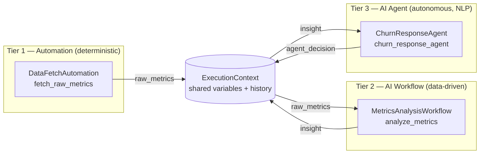

# Architecture

## 1. Why a monorepo, why synchronous-first

Every workflow, automation, and agent lives in one repository so there is exactly
one place to look for "how does the system behave end to end." A single
`ExecutionContext` object is threaded through every module in a pipeline run —
that's the "shared context window" requirement: no databases-as-message-buses, no
serializing state between separately-deployed services, just a dict and a list
that every module reads and appends to.

Synchronous-first means: given a pipeline `[A, B, C]`, `B` never starts until `A`
has returned, and `B`'s output is already merged into the context `C` sees. This
is what makes "tier-1 output feeds tier-3 input" trivial — there is no queue to
wire up, just a return dict.

## 2. Data flow: automation → workflow → agent

Concretely, in `cli.py`:

1. `discover()` scans `automations/`, `workflows/`, `agents/` for `*.yaml`
   manifests (in that tier order) and instantiates the module each one points to.
2. `Orchestrator.run()` creates one `ExecutionContext` and calls `module.run(context)`
   for each module in sequence.
3. Each module's return dict is merged into `context.variables` via
   `context.update(...)` **before** the next module runs.
4. Every step's inputs/outputs/timing/success are appended to `context.history`
   and, if a `StateStore` is attached, persisted to SQLite (`runs` + `steps` tables).

This is exactly the "output from a tier-1 script feeds a tier-3 agent" requirement:
`raw_metrics` (tier 1) → `insight` (tier 2) → `agent_decision` (tier 3), each key
just sitting in the same dict.

## 3. Core engine components

| File | Responsibility |
|---|---|
| `engine/base.py` | `Tier` enum + `BaseModule` abstract contract every module implements |
| `engine/context.py` | `ExecutionContext` (shared state) + `StepRecord` (one step's audit trail) |
| `engine/orchestrator.py` | Sequential runner; merges outputs, records history, optionally persists to `StateStore`, controls stop-vs-continue on error |
| `engine/registry.py` | Reads `*.yaml` manifests in a tier folder, dynamically imports and instantiates the referenced class |
| `engine/state_store.py` | SQLite persistence of run/step history for the `status` CLI command |

`Orchestrator.stop_on_error` controls failure behavior: `True` (default) re-raises
after recording the failed step, so a broken pipeline fails loudly; `False` lets
independent later steps still run (useful once pipelines have parallel-ish
branches, or a non-critical logging agent at the tail).

## 4. Unified control layer

`cli.py` is the "dashboard" for now:

- `python cli.py list` — enumerate every discovered module per tier (health check
  that manifests + entrypoints resolve).
- `python cli.py run` — execute the pipeline once, print the final context and
  per-step status.
- `python cli.py status` — read `orchestrator.db` and print recent runs and their
  steps.

A web UI (FastAPI + a simple table view over the same `StateStore` tables) is a
drop-in addition later — `state_store.py`'s `recent_runs()` / `steps_for_run()`
are already shaped for an API to serve directly.

## 5. Step-by-step: how this was built (and how to extend it)

1. **Define the contract.** `BaseModule` with `name`, `tier`, `description`, and a
   single `run(context) -> dict` method. Every tier implements the same shape on
   purpose — the orchestrator shouldn't need to know which tier it's calling.
2. **Define the shared state.** `ExecutionContext` — a `variables` dict for data
   and a `history` list of `StepRecord`s for audit/debugging.
3. **Build the sequential runner.** `Orchestrator.run()` iterates a list of
   `BaseModule` instances, merging each output into the context and recording a
   `StepRecord`, with a switch for stop-on-error vs. continue-on-error.
4. **Add persistence.** `StateStore` wraps SQLite with two tables (`runs`,
   `steps`) so history survives process restarts and the CLI's `status` command
   has something to read.
5. **Add extensibility.** `registry.discover(directory)` scans a folder for
   `*.yaml` manifests, each naming an `entrypoint` (`module.path:ClassName`), and
   instantiates it — this is what makes "drop a file in, don't touch the core"
   true.
6. **Write example modules per tier** (`automations/example_automation.py`,
   `workflows/example_workflow.py`, `agents/example_agent.py`) that demonstrably
   pass data forward, proving the flow in code rather than just in a diagram.
7. **Build the CLI dashboard** (`cli.py`) wiring `discover()` + `Orchestrator` +
   `StateStore` into `list` / `run` / `status` subcommands.
8. **Add tests** (`tests/test_orchestrator.py`) covering context-threading and
   both error modes.
9. **Add CI** (`.github/workflows/ci.yml`) running `pytest` and a CLI smoke test
   on every push, so a broken module or a bad manifest fails fast.
10. **Extend from here:** to add a real module, drop a `<name>.py` + `<name>.yaml`
    pair into the right tier folder (see the README's "Adding a new module"
    section). No engine change needed.

## 6. Roadmap

The current engine is intentionally a single-process, synchronous, SQLite-backed
core — enough to prove the three-tier handoff and be genuinely useful for small
pipelines. Grow it only when a real need shows up:

- **Redis** — once more than one process needs to read/write the same
  `ExecutionContext` (e.g. a long-running agent tier and a web dashboard both
  need live state), move `variables` into Redis hashes keyed by run ID instead of
  an in-memory dict.
- **Celery / RQ** — once a workflow or agent step is slow enough that it
  shouldn't block the rest of the pipeline (e.g. an LLM call with retries), wrap
  that specific module's `run()` in a task queue instead of making the whole
  orchestrator async.
- **LangGraph** — once an agent's "task" is itself a multi-step reasoning loop
  (planning, tool calls, reflection) rather than a single `run()` call, model
  that agent internally as a LangGraph graph while it still presents a single
  `BaseModule` interface to the orchestrator.
- **FastAPI dashboard** — once CLI-only monitoring becomes limiting, add a thin
  API over `StateStore` (`recent_runs`, `steps_for_run`) and a small frontend;
  the data model doesn't need to change.
- **Parallel branches** — if two tier-2 workflows are independent, the
  orchestrator can grow a `run_parallel(modules)` that fans out and merges
  results back into one context before continuing, without changing `BaseModule`.

Each step above is additive — none require rewriting `BaseModule`, the manifest
format, or the example modules.
