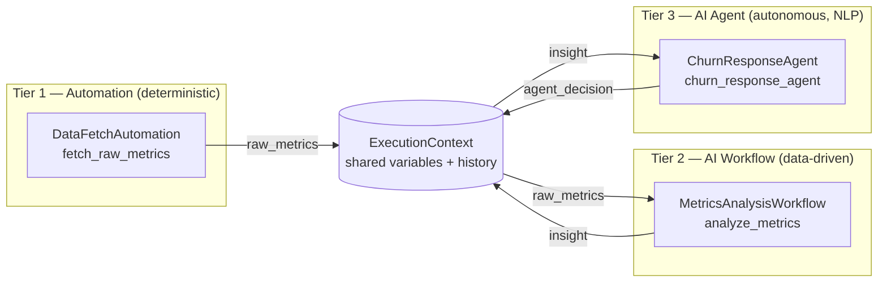

# Architecture

## 1. Why a monorepo, why synchronous-first

Every workflow, automation, and agent lives in one repository so there is exactly
one place to look for "how does the system behave end to end." A single
`ExecutionContext` object is threaded through every module in a pipeline run —
that's the "shared context window" requirement: no databases-as-message-buses, no
serializing state between separately-deployed services, just a dict and a list
that every module reads and appends to.

Synchronous-first means: given a pipeline `[A, B, C]`, `B` never starts until `A`
has returned, and `B`'s output is already merged into the context `C` sees. This
is what makes "tier-1 output feeds tier-3 input" trivial — there is no queue to
wire up, just a return dict.

## 2. Data flow: automation → workflow → agent



Concretely, in `cli.py`:

1. `discover()` scans `automations/`, `workflows/`, `agents/` for `*.yaml`
   manifests (in that tier order) and instantiates the module each one points to.
2. `Orchestrator.run()` creates one `ExecutionContext` and calls `module.run(context)`
   for each module in sequence.
3. Each module's return dict is merged into `context.variables` via
   `context.update(...)` **before** the next module runs.
4. Every step's inputs/outputs/timing/success are appended to `context.history`
   and, if a `StateStore` is attached, persisted to SQLite (`runs` + `steps` tables).

This is exactly the "output from a tier-1 script feeds a tier-3 agent" requirement:
`raw_metrics` (tier 1) → `insight` (tier 2) → `agent_decision` (tier 3), each key
just sitting in the same dict.

## 3. Core engine components

| File | Responsibility |
|---|---|
| `engine/base.py` | `Tier` enum + `BaseModule` abstract contract every module implements |
| `engine/context.py` | `ExecutionContext` (shared state) + `StepRecord` (one step's audit trail) |
| `engine/orchestrator.py` | Sequential runner; merges outputs, records history, optionally persists to `StateStore`, controls stop-vs-continue on error, emits live progress events via `on_event`. Also defines `StepSpec`, for steps that need per-step seeded/mapped inputs rather than just running a bare module. |
| `engine/registry.py` | Reads `*.yaml` manifests in a tier folder (`load_manifests`), dynamically imports and instantiates the referenced class (`instantiate`/`discover`) |
| `engine/state_store.py` | SQLite persistence of run/step history for the `status` CLI command |

`Orchestrator.stop_on_error` controls failure behavior: `True` (default) re-raises
after recording the failed step, so a broken pipeline fails loudly; `False` lets
independent later steps still run (useful once pipelines have parallel-ish
branches, or a non-critical logging agent at the tail).

`Orchestrator.run(initial_context, on_event)` also accepts an optional
`on_event` callback. If given, it's called with a stream of events as the run
happens — `step_started` / `step_completed` / `step_failed` for each module,
plus `run_completed` / `run_failed` at the end (each carries the final
`context`). Per-step events carry an `index` (the step's position in the
pipeline) alongside `tier`/`name`, specifically so a pipeline that uses the
same module twice — entirely possible once pipelines are built by picking
modules freely rather than one-per-tier — doesn't have two tracker rows
fighting over the same identity. A module can call `context.emit(kind,
message)` from inside its own `run()` to add its own events (e.g. `"thought"`,
`"tool_call"`) into that same stream, automatically tagged with which
tier/module produced them (`ExecutionContext.active_module`, set by the
orchestrator before each `module.run()` call). The CLI ignores this entirely
(`on_event=None`, a no-op); the dashboard uses it to drive the live tracker
described below.

Each pipeline "step" the orchestrator runs is a `StepSpec(module, seed)`, not
just a bare module — `seed` is a function of the *current* `ExecutionContext`,
called right before that step's `module.run()`. For the default case (bare
`BaseModule` instances, e.g. `Orchestrator([Double(), AddOne()])`) it's a
no-op wrapped in automatically by `_as_step()`. For a pipeline assembled by the
visual builder, `seed` is where a field mapping actually happens: `seed = lambda
ctx: {"notify_slack": ctx.get("insight")}` copies whatever's currently sitting
under the `insight` key (written by an earlier step) into `notify_slack` right
before this step reads it — the mapping is resolved at run time, once the
source step has actually executed, not baked in ahead of time.

## 4. Unified control layer

There are two front doors onto the same engine and the same `orchestrator.db`:

**`webapp/` — the visual control center (primary, day-to-day use).** A FastAPI
app (`webapp/main.py`) exposes:

- `GET /api/modules` — every enabled module per tier, with its manifest
  `description` and `inputs` schema, plus a `status` (`ready`/`error`) derived
  from `StateStore.latest_step_status()`.
- `POST /api/modules/{tier}/{name}/run` — builds a single-module pipeline
  (`Orchestrator([module])`), starts it in a **background thread**, and
  returns immediately with `{"stream_id": N}` — it does not wait for the run
  to finish.
- `POST /api/pipeline/run` — same idea, for the full tier-1→2→3 pipeline.
- `GET /api/stream/{stream_id}` — a Server-Sent Events stream of that run's
  events, as they happen, as `data: {...}\n\n` lines.
- `GET /api/runs` — recent, persisted run history from `StateStore`, for
  anything that wants to poll it instead.

`stream_id` is deliberately a separate, ephemeral ID space from `StateStore`'s
persisted `run_id` (`webapp/events.py::RunEventBus`) — it only exists to give a
live SSE channel something to key on, and is discarded once that stream ends.
Execution genuinely happens in a background thread (`threading.Thread`, not an
`asyncio` task), so a slow module never blocks FastAPI's event loop; a
`queue.Queue` per stream buffers events between the worker thread and whichever
request is currently reading `/api/stream/{id}`, so a client that connects a
moment late still gets everything from the start.

The static frontend (`webapp/static/`) is plain HTML/CSS/vanilla JS — no
bundler, no framework. Clicking a card's Run button (or "Run Full Pipeline")
POSTs to kick off the run, then opens `new EventSource('/api/stream/{id}')` and
renders three things live as events arrive (`app.js`):

- **A step tracker** — one row per module in that run (just one, for a single
  card; all three tiers, for the full pipeline), each showing ⚪ pending → 🟡
  running → 🟢 done / 🔴 failed as `step_started`/`step_completed`/
  `step_failed` events land.
- **An agent thought accordion** — for any tracker row whose tier is `agent`,
  `thought` and `tool_call` events append live lines to an expandable panel
  under that row (💭 for a thought, 🔧 for a tool call), so you can watch an
  agent's reasoning as it happens rather than only see its final message.
- **A toast notification** — on the terminal `run_completed`/`run_failed`
  event, a corner toast reports success or failure, the card's status pill
  updates (ready/error), and the client explicitly closes the `EventSource`
  (so a normal completion doesn't trigger the browser's automatic SSE
  reconnect).

Automations get a sky-blue accent, workflows violet, agents emerald, so the
tier boundary is visible at a glance independent of the tracker's own
pending/running/done coloring.

**`cli.py` — the scriptable / CI-friendly control layer:**

- `python cli.py list` — enumerate every discovered module per tier (health check
  that manifests + entrypoints resolve).
- `python cli.py run` — execute the pipeline once, print the final context and
  per-step status.
- `python cli.py status` — read `orchestrator.db` and print recent runs and their
  steps.

Both front doors call the exact same `Orchestrator`/`StateStore`/`registry`
code — the web layer adds zero orchestration logic of its own, only HTTP
plumbing and input coercion (`webapp/main.py::_coerce_inputs`, which applies
each field's declared `type` and `default` from the manifest).

## 5. The no-code visual pipeline builder

Everything through §4 assumes one fixed pipeline (automation → workflow →
agent, in that order). The builder lets a user compose their *own* pipeline —
any modules, any order, any number of steps — entirely from the dashboard.

**Manifests declare `outputs` too, not just `inputs`.** `outputs: [{name,
label}]` names the keys a module's `run()` meaningfully writes into context
(e.g. `fetch_raw_metrics` declares `raw_metrics`). This is purely descriptive —
nothing enforces that a module's return dict matches its declared outputs — it
exists so the builder's "map from an earlier step" dropdown has something to
offer. `GET /api/modules` includes `outputs` alongside `inputs` for exactly
this reason.

**A pipeline definition** (what the builder POSTs, and what ends up on disk)
is a name/description plus an ordered list of steps, each `{tier, name,
inputs, mappings}`:

```yaml
name: Custom Churn Chain
slug: custom_churn_chain
description: Built visually
steps:
  - tier: automation
    name: fetch_raw_metrics
    inputs: {signups: 128, churn: 14, revenue: 4210.5}
    mappings: {}
  - tier: workflow
    name: analyze_metrics
    inputs: {risk_threshold: 0.1}
    mappings: {}
  - tier: agent
    name: churn_response_agent
    inputs: {}
    mappings: {notify_slack: {step: 1, output: insight}}
```

A field is either in `inputs` (a literal, same as a module card's form) or in
`mappings` (sourced from an earlier step's declared output) — never both.
`webapp/main.py::_build_steps_from_definition` turns this into a list of
`StepSpec`s: each step's `seed` merges its static `inputs` with, for every
mapped field, `ctx.get(mapping["output"])` at the moment that step runs.

**Storage and validation** (`webapp/pipelines.py`) follow the same convention
as every other tier: `pipelines/<slug>.yaml`, one file per pipeline, plain
enough to read, diff, and hand-edit. `validate_pipeline()` runs before
anything is saved: every step's `(tier, name)` must resolve to a real,
discovered module, and every mapping must reference an *earlier* step index
whose module actually declares that output name — a typo or a forward
reference comes back as a `400` with a specific message, not a pipeline that
silently does the wrong thing (or crashes) when launched.

**One-click save-and-launch.** `POST /api/pipelines` validates, writes the
YAML file, and immediately launches the pipeline through the exact same
background-thread-plus-SSE mechanism as a single-module or full-pipeline run
(`_launch_steps`, shared with the other run endpoints) — the builder's live
tracker, agent thought accordion, and completion toast are the *same* frontend
code as everywhere else, just pointed at a differently-assembled step list.
Once saved, a pipeline gets its own card in the dashboard's **Saved Pipelines**
section (`GET /api/pipelines` to list, `POST /api/pipelines/{slug}/run` to
relaunch it later without rebuilding it).

**What this deliberately doesn't do:** step reordering (only appending and
removing the last step — reordering would require rewriting every later
step's mapping indices, more complexity than the builder needs right now) and
nested-field mapping (an output like `insight` is mapped as a whole dict; there's
no UI for "just its `risk_level` key" — the target field either wants that
whole value or it doesn't). Both are addressable later without changing the
storage format.

## 6. Diagnostics, telemetry, and everyday UI

A batch of additions that don't change how runs execute, only how visible their
state is:

- **`webapp/health.py`** runs four checks on demand (`GET /api/health`): the
  `StateStore` is reachable, every `*.yaml` manifest parses and has a `name`/
  `entrypoint`, every enabled entrypoint actually imports and instantiates, and
  which optional environment variables (currently just `ANTHROPIC_API_KEY`)
  aren't set. The last one never marks the app "degraded" — it's informational,
  since nothing bundled requires it yet. The other three do, because they'd
  otherwise surface later as a confusing error the first time someone clicks
  Run on a module with a broken manifest.
- **`StateStore.metrics_summary()`** aggregates every finished run into total
  count, success rate, and average duration — read by the header ticker.
  `GET /api/runs.csv` streams the same history as CSV via the stdlib `csv`
  module, no new dependency.
- **Per-step `duration_ms`** was added to the orchestrator's `step_completed`/
  `step_failed` events (`engine/orchestrator.py`) so the dashboard's log tabs
  can show real timing, not just pass/fail.
- **`pipeline_store.duplicate_pipeline()`** clones a saved pipeline's `steps`
  under an auto-incremented "(copy)" name, reusing the same `validate_pipeline`
  + `save_pipeline` path a fresh save takes — no separate write path to keep
  in sync.
- **Favorites are shortcuts, not copies.** An earlier design would have
  rendered a favorited card a second time inside a "Favorites" shelf — but two
  DOM elements sharing one `id` (`card__automation__fetch_raw_metrics`) breaks
  every `getElementById` lookup the tracker/status code relies on, silently
  updating only whichever element the browser finds first. Favorites are
  instead thin chips that call the exact same `runModule`/`runSavedPipeline`
  functions, which scroll to and animate the one real card elsewhere on the
  page — no duplicate IDs, ever.
- **Collapsible sections and the search bar** operate purely on CSS classes
  (`.collapsed`, `.search-hidden`, `.search-no-match`) applied to existing DOM,
  re-applied after every re-render since `innerHTML` replacement wipes any
  classes added by a previous pass.

## 7. Data ingestion, templating, the folder watcher, and source viewing

**Ingestion is one shared implementation, two triggers.**
`webapp/ingestion.py::ingest_csv_bytes()`/`ingest_pdf_bytes()` do the actual
work — hash the bytes, check `StateStore` for that hash, parse/extract, save
the raw upload plus its converted form into `artifacts/`, record the hash.
Both `POST /api/ingest/csv`/`pdf` (a browser upload) and
`webapp/watcher.py`'s background thread (a file appearing in
`watched_input/`) call the exact same functions — there is no separate
"auto-ingest" code path to drift out of sync with the manual one. Dedupe is
by SHA-256 of the file's bytes, not filename, so renaming a file doesn't
bypass it.

**The watcher is a plain polling loop**, not `watchdog`: a background
`threading.Thread` lists `watched_input/` every 2 seconds and calls a
callback for any filename it hasn't seen since it started. Files already
present at boot are marked seen immediately (not replayed as "new" on every
restart). This was a deliberate dependency trade-off — a 15-line loop against
one more third-party package for a feature that only needs to notice "a file
that wasn't here before now is."

**Template fields are generic string interpolation**, not LLM-specific
scaffolding. `engine/templating.py::render_template()` replaces `{name}` with
whatever a `lookup` callable resolves it to, leaving unknown names literal.
`interpolate_template_fields()` applies this to a manifest's `type: template`
inputs only. It's called from three places depending on what "context" means
for that run: the single-module endpoint (lookup = the request's own inputs
dict — a template field can reference a sibling field on the same card), a
custom pipeline's per-step `seed()` (lookup = live `ExecutionContext`, so a
later step can reference an earlier one's output), and the built-in
tier-1→2→3 pipeline (`_build_pipeline()` now wraps bare modules in
`StepSpec`s seeded from their own manifest defaults, specifically so a
template field's *default* value — see `churn_response_agent`'s
`custom_note` — interpolates real data even with zero user configuration).
A `BaseModule` never needs to know templating exists; by the time its `run()`
reads `context.get("custom_note")`, substitution already happened.

**Source viewing never accepts a client-supplied path.**
`webapp/linting.py::resolve_source_path()` takes a manifest's own
`entrypoint` string and resolves it via `importlib.util.find_spec()` — the
same mechanism Python itself uses to import the module — so the file lint
runs against is always exactly the file that manifest points to, never
anything a request could redirect. `ruff check --output-format=json` runs
against that one resolved path with a 10-second timeout; a non-zero exit
code (ruff's own convention for "found issues") is not treated as a failure —
only a JSON parse error or timeout falls back to an empty issue list.

## 8. Step-by-step: how this was built (and how to extend it)

1. **Define the contract.** `BaseModule` with `name`, `tier`, `description`, and a
   single `run(context) -> dict` method. Every tier implements the same shape on
   purpose — the orchestrator shouldn't need to know which tier it's calling.
2. **Define the shared state.** `ExecutionContext` — a `variables` dict for data
   and a `history` list of `StepRecord`s for audit/debugging.
3. **Build the sequential runner.** `Orchestrator.run()` iterates a list of
   `BaseModule` instances, merging each output into the context and recording a
   `StepRecord`, with a switch for stop-on-error vs. continue-on-error.
4. **Add persistence.** `StateStore` wraps SQLite with two tables (`runs`,
   `steps`) so history survives process restarts and the CLI's `status` command
   has something to read.
5. **Add extensibility.** `registry.discover(directory)` scans a folder for
   `*.yaml` manifests, each naming an `entrypoint` (`module.path:ClassName`), and
   instantiates it — this is what makes "drop a file in, don't touch the core"
   true.
6. **Write example modules per tier** (`automations/example_automation.py`,
   `workflows/example_workflow.py`, `agents/example_agent.py`) that demonstrably
   pass data forward, proving the flow in code rather than just in a diagram.
7. **Build the CLI control layer** (`cli.py`) wiring `discover()` + `Orchestrator` +
   `StateStore` into `list` / `run` / `status` subcommands.
8. **Add tests** (`tests/test_orchestrator.py`) covering context-threading and
   both error modes.
9. **Add CI** (`.github/workflows/ci.yml`) running `pytest` and a CLI smoke test
   on every push, so a broken module or a bad manifest fails fast.
10. **Add an `inputs` schema to manifests** (list of `{name, label, type, default,
    options}`) so modules can declare form fields without any engine change —
    `registry.load_manifests()` returns them as plain dicts.
11. **Build the visual control center** (`webapp/`): a FastAPI layer
    (`list_modules` / `run_module` / `run_pipeline`) over the same engine, plus a
    static, build-step-free HTML/CSS/JS dashboard that renders manifest `inputs`
    as forms and turns each module into a one-click card.
12. **Add API tests** (`tests/test_webapp.py`, via FastAPI's `TestClient`)
    covering module listing, single-module runs with overridden inputs, 404s,
    and the full-pipeline endpoint.
13. **Add live progress events.** `ExecutionContext.emit()` +
    `Orchestrator.run(..., on_event=...)` turn a run into a stream of
    step/thought/tool-call events instead of an opaque black box (also fixed a
    latent bug along the way: `finish_run("completed")` was unconditionally
    overwriting `finish_run("failed")` at the end of a continue-on-error run).
14. **Instrument the example agent** (`agents/example_agent.py`) to call
    `context.emit("thought", ...)` / `context.emit("tool_call", ...")` with
    small `time.sleep()`s between them — enough to make the live stream
    visibly stream rather than resolve instantly, which is what a real
    LLM-backed agent's latency would look like anyway.
15. **Move execution to a background thread + SSE** (`webapp/events.py`'s
    `RunEventBus`, plus `webapp/main.py`'s run endpoints returning a
    `stream_id` instead of blocking): a synchronous HTTP response can't show
    "in progress," so a live tracker requires the run to happen off the
    request thread and the client to subscribe separately.
16. **Build the tracker, thought accordion, and toasts** (`webapp/static/app.js`,
    `styles.css`) on top of that stream via `EventSource`.
17. **Add `StepSpec` to the orchestrator** (`engine/orchestrator.py`): a
    module plus a `seed(context) -> dict` function run right before it, so a
    pipeline step can pull static values *and* values mapped from an earlier
    step's output — without this, a heterogeneous, user-composed pipeline has
    no way to feed differently-named fields into each other.
18. **Tag events with a step `index`**, not just `tier`/`name` — needed the
    moment a pipeline can legitimately contain the same module twice.
19. **Add `outputs` to manifests** (mirroring `inputs`) so the builder knows
    what's available to map from at each point in a pipeline.
20. **Build pipeline storage + validation** (`webapp/pipelines.py`): the same
    `pipelines/<slug>.yaml` convention as every other tier folder, with
    `validate_pipeline()` checking every module reference and mapping before
    anything is saved or run.
21. **Wire save-and-launch + re-run endpoints** (`webapp/main.py`): `POST
    /api/pipelines` (validate, save, launch) and `POST
    /api/pipelines/{slug}/run` (relaunch a saved one), both reusing
    `_build_steps_from_definition` + the existing background-thread/SSE
    launch path — no new execution mechanism needed.
22. **Build the visual sequencer** (`webapp/static/app.js`, `index.html`,
    `styles.css`): a step-by-step builder UI where each field gets a
    "static value vs. map from Step N" dropdown, reusing the same tracker/
    thought-accordion/toast code the rest of the dashboard already had.
23. **Add pipeline tests** (`tests/test_pipelines.py`): save-and-launch end to
    end, a mapping actually changing a module's behavior (not just being
    accepted), and both validation failure modes (unknown module, bad
    mapping reference).
24. **Add startup/runtime diagnostics** (`webapp/health.py`): validate
    manifests, entrypoints, and the state store on demand via `GET
    /api/health`, surfaced as a header beacon.
25. **Add metrics + CSV export** (`StateStore.metrics_summary()`, `GET
    /api/runs.csv`, `GET /api/metrics`): aggregate run telemetry for the
    header ticker and a downloadable history.
26. **Add pipeline duplication** (`pipeline_store.duplicate_pipeline()`): clone
    a saved pipeline under an auto-incremented name via the same
    validate-and-save path a fresh save uses.
27. **Add per-step timing** (`duration_ms` on `step_completed`/`step_failed`
    events) so the dashboard's log tabs can show real durations.
28. **Build the remaining dashboard polish** (`webapp/static/`): theme toggle,
    search, favorites (as shortcuts to the one real card, not duplicates),
    collapsible sections, toast/notification history, skeleton loaders, and
    the System Info / Agent Thoughts / Raw Output log tabs.
29. **Add diagnostics tests** (`tests/test_diagnostics.py`): health check
    shape, metrics reflecting a completed run, CSV export format, and
    duplication (including the 404 case).
30. **Add shared ingestion + hash-dedupe** (`webapp/ingestion.py`,
    `ingested_files` table): CSV/PDF upload endpoints, both backed by the same
    `ingest_csv_bytes`/`ingest_pdf_bytes` functions the watcher also calls.
31. **Add the folder watcher** (`webapp/watcher.py`): a plain polling loop,
    deliberately not the `watchdog` package, wired to call the same ingestion
    functions as a manual upload.
32. **Add generic template interpolation** (`engine/templating.py`): `{name}`
    substitution against manifest `type: template` fields, applied at three
    call sites depending on what "context" means for that run (single-module
    inputs, a custom pipeline step's live context, or the built-in pipeline's
    own manifest defaults) — demonstrated via `churn_response_agent`'s
    `custom_note` field, not a fake LLM persona picker.
33. **Add read-only source + lint viewing** (`webapp/linting.py`): resolve a
    module's file via `importlib.util.find_spec()` on its own manifest
    entrypoint (never a client-supplied path), run `ruff check` against
    exactly that file.
34. **Add tests for all of the above** (`tests/test_ingestion.py`,
    `test_templating.py`, `test_watcher.py`, `test_linting.py`): dedupe by
    content hash, purge never touching `orchestrator.db`/`pipelines/`, a
    template actually changing a module's output (not just being accepted),
    the watcher ignoring pre-existing files but catching new ones, and lint
    results for both a clean file and a deliberately broken one.
35. **Extend from here:** to add a real module, drop a `<name>.py` + `<name>.yaml`
    pair into the right tier folder (see the README's "Adding a new module"
    section) — it appears in `cli.py list`, the dashboard, and the pipeline
    builder's module picker with no engine or webapp code changes. Declare
    `outputs` too if you want other steps to be able to map from it, or
    `type: template` on an input to make it interpolate against context.

## 9. Roadmap

The current engine is intentionally a single-process, synchronous, SQLite-backed
core — enough to prove the three-tier handoff and be genuinely useful for small
pipelines. Grow it only when a real need shows up:

- **Redis** — once more than one process needs to read/write the same
  `ExecutionContext` (e.g. a long-running agent tier and a web dashboard both
  need live state), move `variables` into Redis hashes keyed by run ID instead of
  an in-memory dict.
- **Celery / RQ** — once a workflow or agent step is slow enough that it
  shouldn't block the rest of the pipeline (e.g. an LLM call with retries), wrap
  that specific module's `run()` in a task queue instead of making the whole
  orchestrator async.
- **LangGraph** — once an agent's "task" is itself a multi-step reasoning loop
  (planning, tool calls, reflection) rather than a single `run()` call, model
  that agent internally as a LangGraph graph while it still presents a single
  `BaseModule` interface to the orchestrator, calling `context.emit()` at each
  internal step so the dashboard's thought accordion keeps working unchanged.
- **Stream replay / reconnect** — `RunEventBus` has no persistence or replay:
  if a client's `EventSource` drops mid-run and reconnects, whatever was
  already drained from the queue by the dropped connection is gone. Fine for a
  single-user local dashboard; move events into something replayable (e.g. a
  per-run log in `StateStore`) before relying on this over a flaky connection.
- **Parallel branches** — if two tier-2 workflows are independent, the
  orchestrator can grow a `run_parallel(modules)` that fans out and merges
  results back into one context before continuing, without changing `BaseModule`.
- **Auth on the dashboard** — the current `webapp/` has no auth layer, fine for
  local/single-user use; add it before exposing the control center beyond
  localhost.
- **Pipeline step reordering + nested-field mapping** — the builder only
  supports appending/removing the *last* step (reordering would invalidate
  earlier steps' mapping indices) and maps a whole output value, not a nested
  key within it (e.g. just `insight.risk_level`). Both are solvable without
  changing the storage format; neither was needed to prove the mechanism.
- **Committing saved pipelines to git automatically** — `POST /api/pipelines`
  writes `pipelines/<slug>.yaml` to disk (so it's a normal file to `git add`
  and commit like anything else), but it deliberately does **not** run `git
  commit`/`push` itself. Auto-committing from a live web handler is a bigger
  trust boundary than a local save — add it explicitly, behind its own opt-in,
  if that's actually wanted later.
- **Watcher poll interval / event-driven alternative** — 2 seconds is fine for
  "drop a file, wait a moment"; if that's ever too slow, swap the polling loop
  for the `watchdog` package's OS-level file events without changing
  `FilesystemWatcher`'s public interface (`start()`/`stop()`/`on_new_file`).
- **No size limits on uploads or the watch folder** — a very large CSV/PDF
  is read entirely into memory (`await file.read()` / `path.read_bytes()`).
  Fine for the kind of files this is meant for; add a size cap before trusting
  it with arbitrary uploads.
- **Template mapping has the same nested-field limitation as pipeline
  mapping** — `{signups}` resolves because it's a flat context key; there's no
  `{insight.risk_level}` syntax for reaching into a nested output dict.
- **Linting runs synchronously in the request handler** — `ruff check` on one
  file is fast enough that this hasn't mattered, but a slow linter or a huge
  file would block that request; move it to the same background-thread/SSE
  pattern as runs if that ever becomes true.

Each step above is additive — none require rewriting `BaseModule`, the manifest
format, or the example modules.
