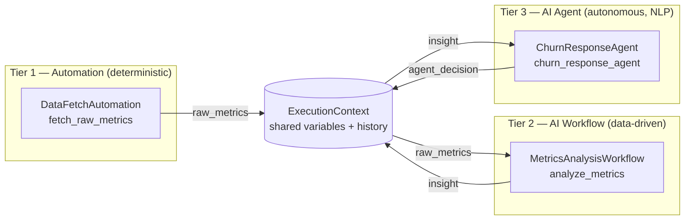

# Architecture

## 1. Why a monorepo, why synchronous-first

Every workflow, automation, and agent lives in one repository so there is exactly
one place to look for "how does the system behave end to end." A single
`ExecutionContext` object is threaded through every module in a pipeline run —
that's the "shared context window" requirement: no databases-as-message-buses, no
serializing state between separately-deployed services, just a dict and a list
that every module reads and appends to.

Synchronous-first means: given a pipeline `[A, B, C]`, `B` never starts until `A`
has returned, and `B`'s output is already merged into the context `C` sees. This
is what makes "tier-1 output feeds tier-3 input" trivial — there is no queue to
wire up, just a return dict.

## 2. Data flow: automation → workflow → agent



Concretely, in `cli.py`:

1. `discover()` scans `automations/`, `workflows/`, `agents/` for `*.yaml`
   manifests (in that tier order) and instantiates the module each one points to.
2. `Orchestrator.run()` creates one `ExecutionContext` and calls `module.run(context)`
   for each module in sequence.
3. Each module's return dict is merged into `context.variables` via
   `context.update(...)` **before** the next module runs.
4. Every step's inputs/outputs/timing/success are appended to `context.history`
   and, if a `StateStore` is attached, persisted to SQLite (`runs` + `steps` tables).

This is exactly the "output from a tier-1 script feeds a tier-3 agent" requirement:
`raw_metrics` (tier 1) → `insight` (tier 2) → `agent_decision` (tier 3), each key
just sitting in the same dict.

## 3. Core engine components

| File | Responsibility |
|---|---|
| `engine/base.py` | `Tier` enum + `BaseModule` abstract contract every module implements |
| `engine/context.py` | `ExecutionContext` (shared state) + `StepRecord` (one step's audit trail) |
| `engine/orchestrator.py` | Sequential runner; merges outputs, records history, optionally persists to `StateStore`, controls stop-vs-continue on error, emits live progress events via `on_event`. Also defines `StepSpec`, for steps that need per-step seeded/mapped inputs rather than just running a bare module. |
| `engine/registry.py` | Reads `*.yaml` manifests in a tier folder (`load_manifests`), dynamically imports and instantiates the referenced class (`instantiate`/`discover`) |
| `engine/state_store.py` | SQLite persistence of run/step history for the `status` CLI command |

`Orchestrator.stop_on_error` controls failure behavior: `True` (default) re-raises
after recording the failed step, so a broken pipeline fails loudly; `False` lets
independent later steps still run (useful once pipelines have parallel-ish
branches, or a non-critical logging agent at the tail).

`Orchestrator.run(initial_context, on_event)` also accepts an optional
`on_event` callback. If given, it's called with a stream of events as the run
happens — `step_started` / `step_completed` / `step_failed` for each module,
plus `run_completed` / `run_failed` at the end (each carries the final
`context`). Per-step events carry an `index` (the step's position in the
pipeline) alongside `tier`/`name`, specifically so a pipeline that uses the
same module twice — entirely possible once pipelines are built by picking
modules freely rather than one-per-tier — doesn't have two tracker rows
fighting over the same identity. A module can call `context.emit(kind,
message)` from inside its own `run()` to add its own events (e.g. `"thought"`,
`"tool_call"`) into that same stream, automatically tagged with which
tier/module produced them (`ExecutionContext.active_module`, set by the
orchestrator before each `module.run()` call). The CLI ignores this entirely
(`on_event=None`, a no-op); the dashboard uses it to drive the live tracker
described below.

Each pipeline "step" the orchestrator runs is a `StepSpec(module, seed)`, not
just a bare module — `seed` is a function of the *current* `ExecutionContext`,
called right before that step's `module.run()`. For the default case (bare
`BaseModule` instances, e.g. `Orchestrator([Double(), AddOne()])`) it's a
no-op wrapped in automatically by `_as_step()`. For a pipeline assembled by the
visual builder, `seed` is where a field mapping actually happens: `seed = lambda
ctx: {"notify_slack": ctx.get("insight")}` copies whatever's currently sitting
under the `insight` key (written by an earlier step) into `notify_slack` right
before this step reads it — the mapping is resolved at run time, once the
source step has actually executed, not baked in ahead of time.

## 4. Unified control layer

There are two front doors onto the same engine and the same `orchestrator.db`:

**`webapp/` — the visual control center (primary, day-to-day use).** A FastAPI
app (`webapp/main.py`) exposes:

- `GET /api/modules` — every enabled module per tier, with its manifest
  `description` and `inputs` schema, plus a `status` (`ready`/`error`) derived
  from `StateStore.latest_step_status()`.
- `POST /api/modules/{tier}/{name}/run` — builds a single-module pipeline
  (`Orchestrator([module])`), starts it in a **background thread**, and
  returns immediately with `{"stream_id": N}` — it does not wait for the run
  to finish.
- `POST /api/pipeline/run` — same idea, for the full tier-1→2→3 pipeline.
- `GET /api/stream/{stream_id}` — a Server-Sent Events stream of that run's
  events, as they happen, as `data: {...}\n\n` lines.
- `GET /api/runs` — recent, persisted run history from `StateStore`, for
  anything that wants to poll it instead.

`stream_id` is deliberately a separate, ephemeral ID space from `StateStore`'s
persisted `run_id` (`webapp/events.py::RunEventBus`) — it only exists to give a
live SSE channel something to key on, and is discarded once that stream ends.
Execution genuinely happens in a background thread (`threading.Thread`, not an
`asyncio` task), so a slow module never blocks FastAPI's event loop; a
`queue.Queue` per stream buffers events between the worker thread and whichever
request is currently reading `/api/stream/{id}`, so a client that connects a
moment late still gets everything from the start.

The static frontend (`webapp/static/`) is plain HTML/CSS/vanilla JS — no
bundler, no framework. Clicking a card's Run button (or "Run Full Pipeline")
POSTs to kick off the run, then opens `new EventSource('/api/stream/{id}')` and
renders three things live as events arrive (`app.js`):

- **A step tracker** — one row per module in that run (just one, for a single
  card; all three tiers, for the full pipeline), each showing ⚪ pending → 🟡
  running → 🟢 done / 🔴 failed as `step_started`/`step_completed`/
  `step_failed` events land.
- **An agent thought accordion** — for any tracker row whose tier is `agent`,
  `thought` and `tool_call` events append live lines to an expandable panel
  under that row (💭 for a thought, 🔧 for a tool call), so you can watch an
  agent's reasoning as it happens rather than only see its final message.
- **A toast notification** — on the terminal `run_completed`/`run_failed`
  event, a corner toast reports success or failure, the card's status pill
  updates (ready/error), and the client explicitly closes the `EventSource`
  (so a normal completion doesn't trigger the browser's automatic SSE
  reconnect).

Automations get a sky-blue accent, workflows violet, agents emerald, so the
tier boundary is visible at a glance independent of the tracker's own
pending/running/done coloring.

**`cli.py` — the scriptable / CI-friendly control layer:**

- `python cli.py list` — enumerate every discovered module per tier (health check
  that manifests + entrypoints resolve).
- `python cli.py run` — execute the pipeline once, print the final context and
  per-step status.
- `python cli.py status` — read `orchestrator.db` and print recent runs and their
  steps.

Both front doors call the exact same `Orchestrator`/`StateStore`/`registry`
code — the web layer adds zero orchestration logic of its own, only HTTP
plumbing and input coercion (`webapp/main.py::_coerce_inputs`, which applies
each field's declared `type` and `default` from the manifest).

## 5. The no-code visual pipeline builder

Everything through §4 assumes one fixed pipeline (automation → workflow →
agent, in that order). The builder lets a user compose their *own* pipeline —
any modules, any order, any number of steps — entirely from the dashboard.

**Manifests declare `outputs` too, not just `inputs`.** `outputs: [{name,
label}]` names the keys a module's `run()` meaningfully writes into context
(e.g. `fetch_raw_metrics` declares `raw_metrics`). This is purely descriptive —
nothing enforces that a module's return dict matches its declared outputs — it
exists so the builder's "map from an earlier step" dropdown has something to
offer. `GET /api/modules` includes `outputs` alongside `inputs` for exactly
this reason.

**A pipeline definition** (what the builder POSTs, and what ends up on disk)
is a name/description plus an ordered list of steps, each `{tier, name,
inputs, mappings}`:

```yaml
name: Custom Churn Chain
slug: custom_churn_chain
description: Built visually
steps:
  - tier: automation
    name: fetch_raw_metrics
    inputs: {signups: 128, churn: 14, revenue: 4210.5}
    mappings: {}
  - tier: workflow
    name: analyze_metrics
    inputs: {risk_threshold: 0.1}
    mappings: {}
  - tier: agent
    name: churn_response_agent
    inputs: {}
    mappings: {notify_slack: {step: 1, output: insight}}
```

A field is either in `inputs` (a literal, same as a module card's form) or in
`mappings` (sourced from an earlier step's declared output) — never both.
`webapp/main.py::_build_steps_from_definition` turns this into a list of
`StepSpec`s: each step's `seed` merges its static `inputs` with, for every
mapped field, `ctx.get(mapping["output"])` at the moment that step runs.

**Storage and validation** (`webapp/pipelines.py`) follow the same convention
as every other tier: `pipelines/<slug>.yaml`, one file per pipeline, plain
enough to read, diff, and hand-edit. `validate_pipeline()` runs before
anything is saved: every step's `(tier, name)` must resolve to a real,
discovered module, and every mapping must reference an *earlier* step index
whose module actually declares that output name — a typo or a forward
reference comes back as a `400` with a specific message, not a pipeline that
silently does the wrong thing (or crashes) when launched.

**One-click save-and-launch.** `POST /api/pipelines` validates, writes the
YAML file, and immediately launches the pipeline through the exact same
background-thread-plus-SSE mechanism as a single-module or full-pipeline run
(`_launch_steps`, shared with the other run endpoints) — the builder's live
tracker, agent thought accordion, and completion toast are the *same* frontend
code as everywhere else, just pointed at a differently-assembled step list.
Once saved, a pipeline gets its own card in the dashboard's **Saved Pipelines**
section (`GET /api/pipelines` to list, `POST /api/pipelines/{slug}/run` to
relaunch it later without rebuilding it).

Step reordering, arbitrary-step removal, and nested-field (dotted-path)
mapping were all originally deferred here as "addressable later without
changing the storage format" — Batches 4 and 5 addressed all three; see
their build-history entries in section 8 for how.

## 6. Diagnostics, telemetry, and everyday UI

A batch of additions that don't change how runs execute, only how visible their
state is:

- **`webapp/health.py`** runs four checks on demand (`GET /api/health`): the
  `StateStore` is reachable, every `*.yaml` manifest parses and has a `name`/
  `entrypoint`, every enabled entrypoint actually imports and instantiates, and
  which optional environment variables (currently just `ANTHROPIC_API_KEY`)
  aren't set. The last one never marks the app "degraded" — it's informational,
  since nothing bundled requires it yet. The other three do, because they'd
  otherwise surface later as a confusing error the first time someone clicks
  Run on a module with a broken manifest.
- **`StateStore.metrics_summary()`** aggregates every finished run into total
  count, success rate, and average duration — read by the header ticker.
  `GET /api/runs.csv` streams the same history as CSV via the stdlib `csv`
  module, no new dependency.
- **Per-step `duration_ms`** was added to the orchestrator's `step_completed`/
  `step_failed` events (`engine/orchestrator.py`) so the dashboard's log tabs
  can show real timing, not just pass/fail.
- **`pipeline_store.duplicate_pipeline()`** clones a saved pipeline's `steps`
  under an auto-incremented "(copy)" name, reusing the same `validate_pipeline`
  + `save_pipeline` path a fresh save takes — no separate write path to keep
  in sync.
- **Favorites are shortcuts, not copies.** An earlier design would have
  rendered a favorited card a second time inside a "Favorites" shelf — but two
  DOM elements sharing one `id` (`card__automation__fetch_raw_metrics`) breaks
  every `getElementById` lookup the tracker/status code relies on, silently
  updating only whichever element the browser finds first. Favorites are
  instead thin chips that call the exact same `runModule`/`runSavedPipeline`
  functions, which scroll to and animate the one real card elsewhere on the
  page — no duplicate IDs, ever.
- **Collapsible sections and the search bar** operate purely on CSS classes
  (`.collapsed`, `.search-hidden`, `.search-no-match`) applied to existing DOM,
  re-applied after every re-render since `innerHTML` replacement wipes any
  classes added by a previous pass.

## 7. Data ingestion, templating, the folder watcher, and source viewing

**Ingestion is one shared implementation, two triggers.**
`webapp/ingestion.py::ingest_csv_bytes()`/`ingest_pdf_bytes()` do the actual
work — hash the bytes, check `StateStore` for that hash, parse/extract, save
the raw upload plus its converted form into `artifacts/`, record the hash.
Both `POST /api/ingest/csv`/`pdf` (a browser upload) and
`webapp/watcher.py`'s background thread (a file appearing in
`watched_input/`) call the exact same functions — there is no separate
"auto-ingest" code path to drift out of sync with the manual one. Dedupe is
by SHA-256 of the file's bytes, not filename, so renaming a file doesn't
bypass it.

**The watcher is a plain polling loop**, not `watchdog`: a background
`threading.Thread` lists `watched_input/` every 2 seconds and calls a
callback for any filename it hasn't seen since it started. Files already
present at boot are marked seen immediately (not replayed as "new" on every
restart). This was a deliberate dependency trade-off — a 15-line loop against
one more third-party package for a feature that only needs to notice "a file
that wasn't here before now is."

**Template fields are generic string interpolation**, not LLM-specific
scaffolding. `engine/templating.py::render_template()` replaces `{name}` with
whatever a `lookup` callable resolves it to, leaving unknown names literal.
`interpolate_template_fields()` applies this to a manifest's `type: template`
inputs only. It's called from three places depending on what "context" means
for that run: the single-module endpoint (lookup = the request's own inputs
dict — a template field can reference a sibling field on the same card), a
custom pipeline's per-step `seed()` (lookup = live `ExecutionContext`, so a
later step can reference an earlier one's output), and the built-in
tier-1→2→3 pipeline (`_build_pipeline()` now wraps bare modules in
`StepSpec`s seeded from their own manifest defaults, specifically so a
template field's *default* value — see `churn_response_agent`'s
`custom_note` — interpolates real data even with zero user configuration).
A `BaseModule` never needs to know templating exists; by the time its `run()`
reads `context.get("custom_note")`, substitution already happened.

**Source viewing never accepts a client-supplied path.**
`webapp/linting.py::resolve_source_path()` takes a manifest's own
`entrypoint` string and resolves it via `importlib.util.find_spec()` — the
same mechanism Python itself uses to import the module — so the file lint
runs against is always exactly the file that manifest points to, never
anything a request could redirect. `ruff check --output-format=json` runs
against that one resolved path with a 10-second timeout; a non-zero exit
code (ruff's own convention for "found issues") is not treated as a failure —
only a JSON parse error or timeout falls back to an empty issue list.

## 8. Step-by-step: how this was built (and how to extend it)

1. **Define the contract.** `BaseModule` with `name`, `tier`, `description`, and a
   single `run(context) -> dict` method. Every tier implements the same shape on
   purpose — the orchestrator shouldn't need to know which tier it's calling.
2. **Define the shared state.** `ExecutionContext` — a `variables` dict for data
   and a `history` list of `StepRecord`s for audit/debugging.
3. **Build the sequential runner.** `Orchestrator.run()` iterates a list of
   `BaseModule` instances, merging each output into the context and recording a
   `StepRecord`, with a switch for stop-on-error vs. continue-on-error.
4. **Add persistence.** `StateStore` wraps SQLite with two tables (`runs`,
   `steps`) so history survives process restarts and the CLI's `status` command
   has something to read.
5. **Add extensibility.** `registry.discover(directory)` scans a folder for
   `*.yaml` manifests, each naming an `entrypoint` (`module.path:ClassName`), and
   instantiates it — this is what makes "drop a file in, don't touch the core"
   true.
6. **Write example modules per tier** (`automations/example_automation.py`,
   `workflows/example_workflow.py`, `agents/example_agent.py`) that demonstrably
   pass data forward, proving the flow in code rather than just in a diagram.
7. **Build the CLI control layer** (`cli.py`) wiring `discover()` + `Orchestrator` +
   `StateStore` into `list` / `run` / `status` subcommands.
8. **Add tests** (`tests/test_orchestrator.py`) covering context-threading and
   both error modes.
9. **Add CI** (`.github/workflows/ci.yml`) running `pytest` and a CLI smoke test
   on every push, so a broken module or a bad manifest fails fast.
10. **Add an `inputs` schema to manifests** (list of `{name, label, type, default,
    options}`) so modules can declare form fields without any engine change —
    `registry.load_manifests()` returns them as plain dicts.
11. **Build the visual control center** (`webapp/`): a FastAPI layer
    (`list_modules` / `run_module` / `run_pipeline`) over the same engine, plus a
    static, build-step-free HTML/CSS/JS dashboard that renders manifest `inputs`
    as forms and turns each module into a one-click card.
12. **Add API tests** (`tests/test_webapp.py`, via FastAPI's `TestClient`)
    covering module listing, single-module runs with overridden inputs, 404s,
    and the full-pipeline endpoint.
13. **Add live progress events.** `ExecutionContext.emit()` +
    `Orchestrator.run(..., on_event=...)` turn a run into a stream of
    step/thought/tool-call events instead of an opaque black box (also fixed a
    latent bug along the way: `finish_run("completed")` was unconditionally
    overwriting `finish_run("failed")` at the end of a continue-on-error run).
14. **Instrument the example agent** (`agents/example_agent.py`) to call
    `context.emit("thought", ...)` / `context.emit("tool_call", ...")` with
    small `time.sleep()`s between them — enough to make the live stream
    visibly stream rather than resolve instantly, which is what a real
    LLM-backed agent's latency would look like anyway.
15. **Move execution to a background thread + SSE** (`webapp/events.py`'s
    `RunEventBus`, plus `webapp/main.py`'s run endpoints returning a
    `stream_id` instead of blocking): a synchronous HTTP response can't show
    "in progress," so a live tracker requires the run to happen off the
    request thread and the client to subscribe separately.
16. **Build the tracker, thought accordion, and toasts** (`webapp/static/app.js`,
    `styles.css`) on top of that stream via `EventSource`.
17. **Add `StepSpec` to the orchestrator** (`engine/orchestrator.py`): a
    module plus a `seed(context) -> dict` function run right before it, so a
    pipeline step can pull static values *and* values mapped from an earlier
    step's output — without this, a heterogeneous, user-composed pipeline has
    no way to feed differently-named fields into each other.
18. **Tag events with a step `index`**, not just `tier`/`name` — needed the
    moment a pipeline can legitimately contain the same module twice.
19. **Add `outputs` to manifests** (mirroring `inputs`) so the builder knows
    what's available to map from at each point in a pipeline.
20. **Build pipeline storage + validation** (`webapp/pipelines.py`): the same
    `pipelines/<slug>.yaml` convention as every other tier folder, with
    `validate_pipeline()` checking every module reference and mapping before
    anything is saved or run.
21. **Wire save-and-launch + re-run endpoints** (`webapp/main.py`): `POST
    /api/pipelines` (validate, save, launch) and `POST
    /api/pipelines/{slug}/run` (relaunch a saved one), both reusing
    `_build_steps_from_definition` + the existing background-thread/SSE
    launch path — no new execution mechanism needed.
22. **Build the visual sequencer** (`webapp/static/app.js`, `index.html`,
    `styles.css`): a step-by-step builder UI where each field gets a
    "static value vs. map from Step N" dropdown, reusing the same tracker/
    thought-accordion/toast code the rest of the dashboard already had.
23. **Add pipeline tests** (`tests/test_pipelines.py`): save-and-launch end to
    end, a mapping actually changing a module's behavior (not just being
    accepted), and both validation failure modes (unknown module, bad
    mapping reference).
24. **Add startup/runtime diagnostics** (`webapp/health.py`): validate
    manifests, entrypoints, and the state store on demand via `GET
    /api/health`, surfaced as a header beacon.
25. **Add metrics + CSV export** (`StateStore.metrics_summary()`, `GET
    /api/runs.csv`, `GET /api/metrics`): aggregate run telemetry for the
    header ticker and a downloadable history.
26. **Add pipeline duplication** (`pipeline_store.duplicate_pipeline()`): clone
    a saved pipeline under an auto-incremented name via the same
    validate-and-save path a fresh save uses.
27. **Add per-step timing** (`duration_ms` on `step_completed`/`step_failed`
    events) so the dashboard's log tabs can show real durations.
28. **Build the remaining dashboard polish** (`webapp/static/`): theme toggle,
    search, favorites (as shortcuts to the one real card, not duplicates),
    collapsible sections, toast/notification history, skeleton loaders, and
    the System Info / Agent Thoughts / Raw Output log tabs.
29. **Add diagnostics tests** (`tests/test_diagnostics.py`): health check
    shape, metrics reflecting a completed run, CSV export format, and
    duplication (including the 404 case).
30. **Add shared ingestion + hash-dedupe** (`webapp/ingestion.py`,
    `ingested_files` table): CSV/PDF upload endpoints, both backed by the same
    `ingest_csv_bytes`/`ingest_pdf_bytes` functions the watcher also calls.
31. **Add the folder watcher** (`webapp/watcher.py`): a plain polling loop,
    deliberately not the `watchdog` package, wired to call the same ingestion
    functions as a manual upload.
32. **Add generic template interpolation** (`engine/templating.py`): `{name}`
    substitution against manifest `type: template` fields, applied at three
    call sites depending on what "context" means for that run (single-module
    inputs, a custom pipeline step's live context, or the built-in pipeline's
    own manifest defaults) — demonstrated via `churn_response_agent`'s
    `custom_note` field, not a fake LLM persona picker.
33. **Add read-only source + lint viewing** (`webapp/linting.py`): resolve a
    module's file via `importlib.util.find_spec()` on its own manifest
    entrypoint (never a client-supplied path), run `ruff check` against
    exactly that file.
34. **Add tests for all of the above** (`tests/test_ingestion.py`,
    `test_templating.py`, `test_watcher.py`, `test_linting.py`): dedupe by
    content hash, purge never touching `orchestrator.db`/`pipelines/`, a
    template actually changing a module's output (not just being accepted),
    the watcher ignoring pre-existing files but catching new ones, and lint
    results for both a clean file and a deliberately broken one.
35. **Extend from here:** to add a real module, drop a `<name>.py` + `<name>.yaml`
    pair into the right tier folder (see the README's "Adding a new module"
    section) — it appears in `cli.py list`, the dashboard, and the pipeline
    builder's module picker with no engine or webapp code changes. Declare
    `outputs` too if you want other steps to be able to map from it, or
    `type: template` on an input to make it interpolate against context.
36. **Add per-step execution timeout** (`engine/orchestrator.py`): `StepSpec.
    timeout_seconds` runs `module.run()` in a shared `ThreadPoolExecutor` and
    calls `future.result(timeout=...)`; a timeout is surfaced as a normal
    failed step (a `TimeoutError`), with the error message explicit that
    Python can't forcibly kill the thread — it only stops the orchestrator
    from waiting on it.
37. **Add result caching** (`webapp/cache.py`, `StateStore.set_cached_result`/
    `get_cached_result`, a new `result_cache` table): a single-module run's
    output is cached by a SHA-256 hash of `{tier, name, inputs}`; a repeat run
    with identical inputs replays instantly via a synthesized SSE event
    sequence (`_replay_cached_result` in `webapp/main.py`) instead of a second
    background thread, so the frontend's existing tracker code needs no
    special case beyond a `cached: true` flag. A **Force refresh** checkbox
    per card bypasses it. Deliberately scoped to single-module runs — a
    pipeline step's inputs can depend on live upstream context, so "same
    inputs" isn't well-defined there the way it is for one module in isolation.
38. **Add graceful shutdown** (`webapp/main.py`'s `lifespan` context manager):
    every background run thread is tracked in an `_active_run_threads` set;
    on shutdown, each gets joined with a timeout before the watcher, scheduler,
    and state store connection are torn down.
39. **Add a cron-style scheduler** (`webapp/scheduler.py`, a new `schedules`
    table in `StateStore`): a background thread polls for schedules whose
    `next_run_at` has passed and calls back into `_trigger_schedule`, which
    launches the same module/pipeline execution path as a manual run — just
    without an SSE stream, since nobody's watching a scheduled run live (a
    stream nobody drains would leak). This is a plain recurring-interval
    timer, not a real cron-expression parser — no `croniter` dependency, and
    it's honest about not supporting minute/hour/day-of-week syntax nothing
    here would use.
40. **Add CSV auto-cleansing** (`ingestion.cleanse_records`): every ingested
    CSV is trimmed, blank rows and exact-duplicate rows are dropped, and
    empty cells become `null`, applied automatically before the JSON
    conversion is saved — with the before/after counts surfaced in the
    ingestion result and a small UI banner when anything changed.
41. **Add keyword search over artifacts** (`ingestion.search_artifacts`,
    `GET /api/artifacts/search`): a case-insensitive substring search across
    every ingested file's *extracted* content (the `.json`/`.txt` conversion,
    not the raw upload bytes), returning a snippet per match.
42. **Add a process performance ticker** (`webapp/perf.py`, via `psutil`):
    this process's own CPU%, RSS memory, thread count, and uptime, polled
    into the header every few seconds — deliberately scoped to "this one
    process," not a system-wide monitor.
43. **Add run comparison** (`_parsed_steps_for_run`/`_diff_dicts` in
    `webapp/main.py`, `GET /api/runs/{id}` and `GET /api/runs/compare`): a
    step-by-step, key-level diff between any two recorded runs' outputs,
    surfaced via two dropdowns and a Compare button under Recent Runs.
44. **Add a DAG visualizer for saved pipelines** (`webapp/graph.py`,
    `GET /api/pipelines/{slug}/graph`): since a pipeline step's mapping can
    reference *any* strictly-earlier step (enforced by `validate_pipeline`),
    the step list is already a valid topological order and the mapping edges
    form a genuine DAG, not just a chain — rendered client-side as hand-built
    SVG (sequential backbone + labeled arcs for mapping edges that skip
    steps), no charting library.
45. **Add keyboard shortcuts, a regex tester, and a slowest-step highlight**:
    `/` focuses search, `Esc` closes open dropdown panels, `?` shows a
    shortcut reminder; a pure-client-side regex tester widget lives under a
    new **Tools** section; and after any multi-step run, whichever step had
    the highest `duration_ms` gets a highlighted row and a badge, read
    straight off the same SSE events the tracker already receives.
46. **Add tests for all of Batch 3** (`test_orchestrator.py`'s timeout test,
    `test_scheduler.py`, `test_webapp.py`'s cache/compare/schedule tests,
    `test_ingestion.py`'s cleansing/search tests, `test_pipelines.py`'s graph
    test, `test_diagnostics.py`'s performance test): 55 tests total, all
    exercising real behavior (a monkeypatched call counter proving a cache
    hit skips re-execution, an actual slow module proving a timeout fires,
    a real scheduler thread proving it fires on interval and honors
    pause/resume) rather than asserting shapes alone.
47. **Add pipeline step reordering** (`webapp/static/app.js`'s
    `moveBuilderStep`): swapping two step positions rewires every explicit
    mapping's step index that referenced either position, and is blocked
    outright if the step moving into the earlier slot has an explicit
    mapping referencing what's currently there (the only direction that can
    create a forward reference, since a mapping can only ever point at a
    strictly earlier step). Documented, not silently ignored: a step that
    implicitly reads a shared context key another step produces *without* a
    declared mapping can still change behavior when reordered, since every
    module's output lands in the shared context regardless of mapping — the
    builder shows this caveat inline.
48. **Add nested-path (dotted) mapping and template resolution**
    (`engine/templating.py`'s `resolve_path`, reused by both
    `interpolate_template_fields`'s `{a.b.c}` syntax and
    `_build_steps_from_definition`'s field-mapping seed): a path's base name
    is resolved via the existing flat `lookup`, then each remaining segment
    walks one level into a dict, returning `None` (leaving a template
    literal, or `None` for a mapped field) the moment a segment is missing or
    the value isn't a dict. `validate_pipeline` checks only a mapping's base
    output name against the manifest's declared outputs — it can't validate
    a nested path since the manifest doesn't describe a nested output's shape.
49. **Add an upload/ingestion size limit** (`ingestion.read_upload_with_limit`,
    `MAX_UPLOAD_BYTES` = 20 MB): uploads are read in 1 MB chunks and rejected
    (413) the moment the running total exceeds the cap, so an oversized file
    is never fully buffered into memory just to be turned away; the folder
    watcher checks `path.stat().st_size` before ever reading a dropped file.
50. **Move linting off the request thread** (`linting.read_module_source_async`,
    a dedicated `ThreadPoolExecutor`): the file read + `ruff` subprocess call
    now runs via `loop.run_in_executor`, so the async endpoint awaits it
    without blocking the event loop on a slow lint or a large file.
51. **Add state store backup/export** (`StateStore.export_snapshot()`,
    `GET /api/backup/export` for a portable JSON snapshot of every run/step/
    schedule/ingested-file record plus the saved-pipelines list, and
    `GET /api/backup/db` for the raw SQLite file itself), surfaced as two
    download links in the health panel dropdown.
52. **Add secrets redaction** (`engine/redaction.py`'s `redact_secrets`,
    wired into `Orchestrator.run()`): a dict value is masked before it's
    used to build a `StepRecord` (what `StateStore.log_step` persists) or an
    emitted SSE event — but *after* `context.update(output)`, so the live
    `ExecutionContext` a later step reads still has the real value. One
    redaction point in the engine protects every downstream consumer
    (persisted history, live SSE, the JSON backup, the result cache) at once,
    rather than requiring each to remember to redact separately.
53. **Add rate limiting to run-triggering endpoints** (`webapp/ratelimit.py`'s
    `RateLimiter`, a per-client sliding window at 30 requests/10s): guards
    module runs, pipeline runs, and save-and-launch against an accidental
    request storm. Also fixed a related frontend gap while adding this: the
    run-trigger fetch calls never checked `res.ok` before destructuring
    `stream_id`, so a 4xx/5xx response (now genuinely reachable via a 429)
    would silently try to stream from `stream_id: undefined` instead of
    surfacing the server's error — a shared `fetchRunTrigger()` helper fixes
    this at all four call sites.
54. **Add JSON file ingestion** (`ingestion.ingest_json_bytes`,
    `POST /api/ingest/json`, folder-watcher `.json` handling): a top-level
    array is treated as the record list (mirroring a CSV's rows); anything
    else is wrapped as one row. Unlike CSV/PDF, no separate converted
    artifact is written — the raw upload already ships in the format
    ingestion turns CSV/PDF into, so it's directly reused as the
    searchable/previewable artifact.
55. **Add tests for all of Batch 4, plus a shared test fixture**
    (`tests/conftest.py`'s autouse `_reset_run_rate_limiter`): the rate
    limiter is a module-level singleton shared by every test that imports
    `webapp.main` (Python loads a module once), so without a reset the whole
    suite's cumulative request count could trip it well before any single
    test meant to exercise that behavior — the fixture clears it before each
    test so results stay independent of run order or timing. 77 tests total.
56. **Add arbitrary middle-step removal to the builder**
    (`webapp/static/app.js`'s `removeBuilderStep`): the mirror image of
    Batch 4's reordering — removing a step shifts every later mapping's
    step index down by one, and is blocked outright if another step's
    explicit mapping depends on the one being removed (there's no "step N
    no longer exists" fallback value).
57. **Add parallel branch execution** (`engine.orchestrator.ParallelGroup`,
    `Orchestrator._run_parallel_group`): branches are seeded sequentially
    (a plain dict merge — no need for concurrency there) before any
    branch's `module.run()` is submitted, so no branch ever sees a
    sibling's output during setup; then every branch's `module.run()` is
    submitted directly to the shared `_EXECUTOR` and awaited with its own
    optional timeout via `future.result(timeout=...)` — deliberately not
    routed through `_run_module()`'s own timeout path, which would
    re-submit to the same pool from within a pool thread and risk
    exhausting it. Each branch still gets its own `StepRecord` and
    step_started/step_completed/step_failed events (tagged `parallel: True`
    plus `branch_index`), so nothing about a single step's own behavior
    needs to know it ran inside a group. `_EXECUTOR`'s worker count was
    bumped from 8 to 16 for headroom, since a group submits every branch at
    once. Not yet exposed in the no-code visual builder — a real, separate
    UI feature (see the roadmap).
58. **Add SSE reconnect/replay** (`webapp/events.py`'s `RunEventBus`
    rewritten from a destructive `queue.Queue` per stream to an append-only
    event list per stream, guarded by a `threading.Condition`; the
    `/api/stream/{id}` endpoint pairs this with SSE's native
    `id:`/`Last-Event-ID` mechanism): the previous queue-based bus's own
    docstring claimed "a client that connects a moment late still gets
    everything from the start," which was only true for the *first*
    connection — a second connection (or a reconnect after a drop) got
    nothing, since `queue.Queue.get()` permanently removes what it reads.
    The frontend's `subscribeToStream` also used to treat any `onerror` as
    fatal, closing the connection immediately and pre-empting the browser's
    own auto-reconnect; it now only gives up after 5 consecutive errors,
    letting a transient drop resolve itself via reconnect-and-resume.
    Finished streams' event logs are kept for 5 minutes (swept lazily on
    the next `create()` call) so a reconnect shortly after a run ends can
    still replay it.
59. **Add persistent cross-run agent memory** (`engine.context.MemoryStore`,
    exposed as `context.memory`; `StateStore.get_memory`/`set_memory`/
    `delete_memory`/`all_memory`, a new `memory` table): accepts a
    `state_store` as `Any` rather than importing `StateStore` by type, to
    avoid a `context`↔`state_store` import cycle (`state_store.py` already
    imports `StepRecord` from `context.py`). Falls back to a local
    in-memory dict when no store is attached (e.g. a bare `ExecutionContext`
    in a test), so nothing about existing code needs to change. Demonstrated
    in `churn_response_agent`, which now remembers the last run's risk
    level and calls out when a *separate, independent* later run's risk
    level differs — proving the persistence is real, not just plumbing.
    Surfaced for inspection (redacted, like everything else) via
    `GET /api/memory` and a new **Agent Memory** dashboard section.
    Fixed a latent test-isolation gap along the way:
    `test_pipeline_graph_reports_nodes_sequence_and_mapping_edges` launched
    a pipeline via `POST /api/pipelines` but never waited for it to finish,
    so its background run could leak into whichever test ran next — harmless
    before (the agent had no observable side effects), but a real source of
    flakiness the moment it gained one.
60. **Add run history retention** (`StateStore.prune_runs`,
    `POST /api/runs/purge`, a purge control next to Recent Runs): deletes
    finished runs and their steps older than a cutoff, mirroring artifact
    purge — a run still in progress is never a candidate no matter how old
    it started.
61. **Add backup restore** (`StateStore.restore_snapshot`,
    `POST /api/backup/restore`, a **Restore backup…** upload in the health
    panel): strictly additive — every table is restored via
    `INSERT OR IGNORE` keyed by its own primary key/slug, so restoring the
    same snapshot twice, or into a store that already has some of this
    data, never overwrites anything and is always safe to repeat. A
    pipeline referencing a module that doesn't exist in this install is
    skipped rather than failing the whole restore. `export_snapshot()` was
    extended to include `memory` (previously omitted) so a restore is a
    genuine round trip of everything `context.memory` can hold.
62. **Add a compact/dense view toggle** (`#density-toggle`, a
    `body.density-compact` class): shrinks card padding, grid column
    minimum width, and form-field sizing; persisted in `localStorage` via
    the exact same pattern as the light/dark theme toggle.
63. **Add tests for all of Batch 5**: `ParallelGroup` concurrency proven by
    wall-clock timing (concurrent branches finish in ~1 branch's duration,
    not the sum of all of them), `webapp/events.py`'s replay/reconnect
    behavior at both the bus level and through the real `/api/stream`
    endpoint with a genuine `Last-Event-ID` header, cross-run memory
    proven via two separate `Orchestrator.run()` calls (and, at the API
    level, two separate pipeline launches) sharing one `StateStore`, and
    restore's additive/idempotent guarantee (restoring twice inserts
    nothing new; an existing key is never clobbered). 100 tests total.
64. **Add a generic HTTP request automation** (`automations/http_request.py`
    + manifest): calls any user-supplied URL via `httpx` (already in the
    dependency tree for FastAPI's test client — no new dependency) with
    per-run method/headers/body/timeout. A non-2xx response is a *result*
    (`http_response.ok: false`), not an exception — only unreachable hosts,
    timeouts, or malformed inputs raise, and the raised message includes
    the method + URL (httpx's own "[Errno 111] Connection refused" doesn't
    say *what* couldn't be reached). Introduced a new manifest key,
    `include_in_full_pipeline: false`, so a module that makes real outbound
    calls can opt out of the fixed one-click demo pipeline while staying
    runnable standalone and in hand-built pipelines — the demo pipeline
    stays fast, deterministic, and offline.
65. **Add conditional (skip-unless) pipeline steps**
    (`engine/conditions.py`'s `evaluate_condition` + `OPERATORS`;
    `StepSpec.condition`/`condition_label`; a `step_skipped` event; a
    `condition: {source, operator, value}` key per saved-pipeline step; a
    **Run only if…** row per builder step): the condition is evaluated
    right before the step would seed and run — false means skip (no seed,
    no run, no StepRecord), never failure, and the run continues.
    Evaluation is deliberately total: numeric-looking values compare as
    numbers (everything the dashboard sends is text), a missing key or
    type mismatch is just false, and a condition callable that *raises*
    counts as false (skipping is the safe failure mode for a broken
    condition). Conditions reference context keys, never step indexes, so
    the builder's reorder/remove logic needs no condition rewiring — unlike
    mappings. Parallel-group branches accept conditions at the engine level
    too (a skipped branch neither seeds nor runs, and a skipped failing
    branch doesn't fail its group).
66. **Add a per-module circuit breaker** (`module_health` table +
    `record_module_failure`/`record_module_success`/`reset_breaker` in
    `StateStore`; `_record_breaker_event` observing every run's
    step_completed/step_failed events in `webapp/main.py`; `GET
    /api/breakers`, `POST /api/breakers/{tier}/{name}/reset`): N
    *consecutive* failures (default 3, per-module
    `circuit_breaker_threshold` manifest override) trips the breaker, and
    every launch path — module run, full pipeline, saved pipelines,
    schedules — then refuses with a 409 naming the tripped module. A
    success resets the streak but never closes an open breaker (only an
    explicit reset does, so a flaky module can't re-arm itself); a
    schedule blocked by a breaker records that as its `last_status` via
    the scheduler's existing exception handling rather than silently not
    running. Deliberately excluded from backup snapshots: breaker state is
    transient health data about *this* install's recent runs, not durable
    work product.
67. **Add XLSX run-history export** (`GET /api/runs.xlsx`, `openpyxl` —
    imported lazily inside the endpoint so serving the dashboard never
    pays for it): same runs as the CSV export plus a second **Steps**
    sheet (run_id, module, tier, success, error, timestamps) — per-step
    detail is the one thing the flat CSV genuinely can't carry, which is
    what justifies the second format existing at all.
68. **Add full-text search across run history** (`StateStore.search_steps`,
    `GET /api/runs/search`, a search box in Recent Runs): case-insensitive
    `LIKE` over every recorded step's output JSON and error text, newest
    first, each hit carrying a ±60-char snippet and which side
    (`output`/`error`) matched. No post-hoc redaction needed: step outputs
    are redacted *before* they're logged (entry 52), so the stored text —
    and therefore any snippet of it — is already safe. Declared before the
    `/api/runs/{run_id}` route so FastAPI matches `/api/runs/search`
    correctly.
69. **Add an environment/config viewer** (`health.environment_report`, `GET
    /api/environment`, an **Environment & Config** dashboard section):
    `.env.example` is treated as the source of truth for which env vars
    the project declares; each is reported set/missing, with values shown
    verbatim for non-secret names but only *length* for secret-shaped ones
    (reusing the redactor's key heuristic — the page never receives the
    actual secret). Alongside: the live values of the app's operational
    knobs (step timeout, breaker threshold, rate limit, upload cap, cache
    age, watcher/scheduler intervals, SSE retention, DB path), read from
    the running objects rather than restating constants.
70. **Expose `ParallelGroup` in the visual builder** (closing the roadmap
    gap flagged in Batch 5): a saved-pipeline step can now be `{type:
    "parallel", name?, branches: [module steps...]}` — validated to have
    ≥2 branches, each branch's mappings only referencing steps strictly
    *before* the group (branches run concurrently; there is no sibling
    ordering to depend on). A later step's mapping may reference the
    group's slot, offering the union of its branches' declared outputs —
    outputs merge into the shared context either way, so resolution at
    run time is unchanged. The builder gained **+ Add Parallel Group**,
    per-branch module selectors/fields/mappings keyed `"slot:branch"`
    (`getBuilderStepRef` resolves either key shape; move/remove dependency
    checks and index rewiring iterate branch fieldSources too), and the
    tracker renders a group header plus one indented row per branch keyed
    by the same `index`+`branch_index` the SSE events carry. The DAG
    endpoint renders a group as one node carrying its branch list, with
    branch mappings aggregated onto the group's slot.
71. **Add tests for all of Batch 6**: the HTTP module against a real
    loopback `http.server` (headers/body echo, non-2xx-is-a-result,
    malformed-header rejection) and through the real module-run endpoint;
    condition evaluation as a table of operator cases plus engine-level
    skip/continue/raising-condition behavior and API-level gated pipelines
    (skip when unmet, run when met, YAML round-trip, bad-operator/missing
    -source rejection); breaker trip/reset at store level and end-to-end
    (three real failed runs → 409 → reset → accepted again), including
    that a suite-level fixture resets breaker state so a tripped breaker
    can't leak into other test files; XLSX parsed back with `openpyxl`
    asserting both sheets and row integrity; run-history search hitting
    outputs and error text of genuinely failed runs; environment view
    asserting a set secret exposes its length but never its value; and
    parallel-group pipelines saved, run (branch-tagged events asserted),
    rejected below two branches, rejected for sibling-referencing
    mappings, and graphed. 145 tests total.
72. **Add automatic step retries with backoff** (`StepSpec.max_retries`/
    `retry_backoff_seconds`; `_run_with_retries`/`_await_branch_with_retries`
    in `engine/orchestrator.py`; a `step_retrying` event; a **Retry on
    failure** row per builder step/branch): a failing attempt is retried in
    place (no re-seed) up to `max_retries` times, waiting
    `retry_backoff_seconds * 2**attempt` between attempts and emitting
    `step_retrying` first so a dashboard can show "retry 1/3" instead of a
    step silently going quiet. Only the terminal outcome — success after
    retries, or failure once retries are exhausted — reaches a
    `step_completed`/`step_failed` event and (per Batch 6's circuit
    breaker) the breaker's failure count; a transient failure that
    eventually succeeds never counts against it. A parallel branch retries
    by resubmitting `branch.module.run` to the shared executor, blocking
    only that branch's slot in the collection loop — every other branch's
    future keeps running independently regardless of how long one
    branch's retries take.
73. **Add an inbound webhook trigger for saved pipelines**
    (`POST /api/pipelines/{slug}/webhook`; a copyable webhook URL on each
    saved-pipeline card): the POST body (a JSON object, or empty) is
    merged into step 1's own input dict before building that pipeline's
    steps (`_apply_entry_overrides`, `_build_steps_from_definition`'s new
    `entry_overrides` parameter) — unknown keys are silently ignored, same
    as every other input dict here. For a `type: parallel` first step, the
    override is applied to every branch's inputs. No auth (single-user/
    local, same as everywhere else in this app), but it still goes through
    the same rate limiter and circuit-breaker check as any other launch
    path.
74. **Add editing a saved pipeline in the builder** (an **Edit** action;
    `moduleStepToBuilderStep`/`definitionToBuilderSteps` rebuild the
    builder's internal fieldSources/condition/retry shape from a saved
    definition, resolving a saved dotted-path mapping back into
    `{step, output, nestedPath}`): renaming is disabled while editing (the
    name field only, enforced client-side) so **Save & Launch** always
    re-POSTs under the same name and therefore overwrites the same
    slug/file in place — no delete-pipeline endpoint needed, and no risk
    of an orphaned duplicate under a new name. A **New pipeline** button
    in the editing banner resets the session. Along the way, fixed the
    edit flow's `scrollIntoView` landing a target flush against the
    sticky topbar (added `scroll-margin-top` to `.builder-panel`).
75. **Add a run detail drill-down** (click-to-expand rows in Recent Runs,
    backed by the already-existing `GET /api/runs/{run_id}`; results
    cached client-side per run id since a finished run's steps never
    change): surfaced a pre-existing class-name collision along the way —
    the new table row reused `.run-row`, already a flex-row class for a
    module card's Run-button row, so the `<tr>` rendered as
    `display: flex` and its cells wrapped onto two visual lines instead of
    laying out as table columns. Renamed to `.history-row`. Also added
    `table-layout: fixed` to `.runs-table table` and `white-space: pre-wrap`
    to the drill-down's output `<pre>` — without both, a wide recorded
    JSON value could force the whole table wider than its container.
76. **Add per-module performance statistics** (`StateStore.module_stats()`
    grouping the `steps` table by (tier, name); folded into `GET
    /api/modules` per card and exposed standalone at `GET
    /api/modules/stats`): total runs, success rate, average duration. A
    module with zero recorded runs reports `total_runs: 0` and `None` for
    the rate/duration fields rather than erroring or omitting the key.
77. **Add pipeline YAML export/import**
    (`GET /api/pipelines/{slug}/export` serves the pipeline's own saved
    YAML file directly; `POST /api/pipelines/import` accepts an uploaded
    YAML file through the exact same `pipeline_store.save_pipeline()`
    validation path a builder save uses — an unknown module or bad
    mapping is rejected identically either way): import under an existing
    pipeline's name overwrites it in place, same semantics as re-saving
    an edited pipeline (entry 74).
78. **Add re-running a past run with its original inputs**
    (`StepRecord.inputs`; a new `steps.inputs` column with a
    startup-time `_migrate_locked()` migration for databases created
    before this column existed; `POST /api/runs/{run_id}/rerun`): the
    first attempt only captured a `StepSpec.seed()` call's return value,
    which is empty for the standalone "run this module" and
    scheduled-module launch paths — those seed by passing values as the
    run's `initial_context` instead, a different mechanism the engine
    didn't know to record. Fixed by snapshotting `dict(context.variables)`
    right after seeding (covers both paths, since either way the values
    are merged into context before the module runs) rather than just the
    seed function's own return value. A re-run replays each recorded
    step's module with its own recorded snapshot as a brand-new run —
    faithful per-step replay, not a reconstruction of the original
    pipeline's mappings/conditions/parallel-group topology (not part of
    run history, only each step's module + resolved inputs are). A
    secret-shaped input is redacted before it's ever logged, so replaying
    it sends the masked placeholder, never the real value. The frontend's
    **↻ Re-run with these inputs** button in a run's drill-down reuses the
    same tracker/log machinery as every other launch; since a full
    Recent-Runs refresh (needed to show the new row) collapses whatever
    detail row was open, `onDone` re-expands the freshly created run's own
    row afterward instead of leaving the just-finished result to vanish.
79. **Add tests for all of Batch 7**: retries proving exponential backoff
    timing, exhaustion vs. eventual success, and independent per-branch
    retry in a parallel group; webhook override/no-body/unknown-key/
    malformed-body/missing-pipeline/parallel-branch-override cases;
    resaving a pipeline under the same name overwriting it in place with
    no duplicate left behind (the contract the edit flow depends on);
    export/import round-tripping a real saved pipeline plus malformed-
    YAML/non-object/unknown-module rejection and overwrite-on-import;
    per-module stats reflecting a real run's delta (not an absolute count,
    since the module-level store is shared across the whole test file) and
    zero-runs reporting `None` rather than an error; and inputs-recording
    covering both seeding paths (StepSpec.seed and initial_context),
    redaction of a secret-shaped recorded input, capture even on failure,
    per-branch capture in a parallel group, a schema-migration test
    opening a pre-existing database that predates the `inputs` column, and
    end-to-end rerun of both a single-module run and a full 3-step
    pipeline run. 184 tests total.
80. **Add agent-to-agent delegation** (`agents/escalation_agent.py`, a new
    Tier 3 module): `churn_response_agent` now writes a `handoff` dict
    (`requested`/`reason`/`priority`/`risk_level`/`churn_rate`) into its
    output whenever risk is high and its `enable_handoff` toggle (default
    on) is set; `escalation_agent` reads that same key straight out of
    shared context — no explicit field mapping needed for the implicit
    read, since the builder only renders mapping selects for a module's
    *declared* inputs, and `escalation_agent` declares `inputs: []`
    deliberately. It declines cleanly (`status: "skipped"`) if no handoff
    is waiting, otherwise picks a specialist by priority and drafts a
    retention plan. This is genuine agent-to-agent delegation — one agent
    deciding *another agent* should take the case — distinct from the
    usual upstream-tier handoff every other module already does.
    `include_in_full_pipeline: false` keeps it out of the fixed 3-step demo
    (same mechanism as `http_request`, entry 64), since it only makes sense
    chained after `churn_response_agent` in a real saved pipeline.
81. **Add a run history trend sparkline** (`renderRunsTrend()` in
    `app.js`, inline SVG, no charting dependency): one bar per run, oldest
    to newest left-to-right, height encoding duration and color encoding
    status — reusing the app's existing reserved status colors
    (`--ready`/`--running`/`--error`) rather than inventing per-chart hues,
    with a legend (dot + label, never color-alone) and a hover tooltip
    (duration leads as the bold value, run id/status/timestamp follow).
    Each bar is a custom rounded-top/square-bottom SVG path (not a plain
    `<rect>`) to get the 4px data-end radius without rounding the baseline
    corners. Sits above the Recent Runs table, reusing the same `/api/runs`
    data already fetched for the table — no new endpoint.
82. **Add time-of-day (daily-at-HH:MM) scheduling** (`schedule_type` +
    `daily_time` columns on `schedules`, migrated via `_migrate_locked()`;
    `next_daily_run_at()` in `webapp/scheduler.py`): the existing
    interval-only scheduler (entry 39) now supports a second mode picked
    per schedule. `HH:MM` is interpreted in the *machine's local timezone*
    (what a user typing "09:00" actually means) via `datetime.astimezone()`,
    then converted back to UTC for storage so it compares directly against
    every other `next_run_at`, interval or daily alike, without the
    scheduler's due-check needing to know which kind it's looking at. The
    schedule-creation form gained a Frequency dropdown that swaps the
    seconds-interval field for an `<input type="time">` field.
83. **Add artifact tagging + tag-based filtering** (`artifact_tags` table
    keyed by filename — the on-disk name is already unique thanks to its
    millisecond-timestamp prefix, so no synthetic id was needed;
    `PUT /api/artifacts/{filename}/tags` replaces a file's whole tag set,
    `GET /api/artifacts?tag=` filters case-insensitively): each artifact row
    gets tag chips plus an inline "+ tag" input (Enter to add, click a
    chip's × to remove), and a second filter box next to the existing
    keyword-search box narrows the list by tag. Every chip shares one
    neutral style rather than a per-tag hue, since tags are free-text with
    unbounded cardinality — assigning a fixed categorical color per tag
    would mean an ever-growing, eventually-repeating palette, exactly what
    the project's charting conventions (established for the trend
    sparkline, entry 81) rule out for open-ended categories.
84. **Add a keyboard-driven command palette** (Ctrl/Cmd+K, `app.js`'s
    "Command palette" section; a new full-screen overlay in `index.html`):
    lists every module ("Run"), every saved pipeline ("Pipeline" — jumps to
    and flash-highlights its card rather than running it, a deliberately
    lighter action than a module command), plus three fixed actions (open
    the builder, toggle theme, toggle density). Typing filters by
    title+description; arrow keys move the active row; Enter runs the
    active command. Reuses `runModule()` unchanged for the "Run" commands
    (it already scrolls to and runs a module's card with whatever inputs
    are currently set) and adds one small new primitive, `flashHighlight()`
    (a CSS animation class toggled on/off), for the pipeline-jump case that
    had no prior equivalent.
85. **Add bulk selection and bulk purge for Recent Runs**
    (`StateStore.delete_runs(run_ids)`, `POST /api/runs/bulk-delete`): a
    checkbox per row plus a header "select all" checkbox, with a "Delete
    selected (N)" button that stays disabled until at least one row is
    checked. This is the fine-grained counterpart to the existing
    age-based purge (entry 60) — pick specific runs rather than "older
    than X hours". Checkbox clicks call `stopPropagation()` so selecting a
    row never also triggers its click-to-expand drill-down (entry 75);
    `delete_runs` silently ignores any id that no longer exists rather than
    erroring, since a run could finish disappearing (purged, or deleted by
    a concurrent bulk-delete) between the checkbox being rendered and the
    button being clicked.
86. **Add tests for all of Batch 8**: unit + API-level tests for the
    churn-response/escalation handoff across three risk scenarios (high,
    low, toggle-disabled) plus confirming `escalation_agent` is listed but
    excluded from the fixed full pipeline; `next_daily_run_at()` staying
    same-day when the target time is still ahead vs. rolling to tomorrow
    when it's passed, plus a live `Scheduler` tick proving a daily
    schedule reschedules itself ~24h out; daily-schedule creation,
    malformed-time and missing-time-field rejection, and
    unknown-schedule-type rejection through the API; artifact tag
    set/replace/dedupe-and-sort/blank-entry-dropping, unknown-filename
    rejection, and case-insensitive tag filtering; and
    `delete_runs`/`/api/runs/bulk-delete` removing only the chosen ids,
    ignoring unknown ids, and no-op on an empty selection. The trend
    sparkline and command palette are pure frontend features with no new
    backend surface to unit-test (consistent with how earlier
    frontend-only features like the theme toggle and keyboard shortcuts
    were verified) — both were live-verified in a real browser instead,
    including a Ctrl+K open/filter/Escape-close/jump-to-pipeline/run-a-
    module/toggle-density round trip and a bulk-select-then-delete round
    trip confirming rows actually disappear. 212 tests total.
87. **Add .xlsx spreadsheet ingestion** (`ingestion.xlsx_bytes_to_records()`,
    reading the first sheet's row 1 as headers via openpyxl — already a
    dependency for the XLSX run-history export, imported lazily here too so
    serving the dashboard never pays for it; `POST /api/ingest/xlsx`): reuses
    `cleanse_records()` unchanged, so an .xlsx upload gets the exact same
    trim/blank-row/duplicate-row cleanup a CSV upload already does once it's
    parsed into records. Wired into the dropzone, the file-type accept list,
    and the filesystem watcher's `.csv`/`.pdf`/`.json`/`.xlsx` dispatch.
88. **Add pipeline version history with diff/restore**
    (`pipelines/_versions/<slug>/<timestamp>.yaml`, one file per prior
    version, written by `_archive_current_version()` right before
    `save_pipeline()` overwrites the current file — covers a builder
    re-save, an import under an existing name, and a restore alike, since
    all three go through the same `save_pipeline()` call): `GET
    /api/pipelines/{slug}/versions` lists them newest-first (the version id
    is itself a fixed-width UTC timestamp, so lexicographic and
    chronological order coincide), `GET .../versions/{id}` returns the
    archived definition plus a `_diff_dicts()` comparison against current
    (the same shallow key-level diff helper `/api/runs/compare` already
    uses), and `POST .../versions/{id}/restore` re-validates the old
    definition against modules on disk *today* and saves it as current —
    which means restoring is itself undoable, since `save_pipeline()`
    archives the pre-restore definition on the way in. A same-microsecond
    double-save (unlikely, but possible on a fast test run) gets a `-N`
    disambiguating suffix rather than silently overwriting one archived
    version with another. A **History** action on each saved-pipeline card
    expands a version list with **View diff** / **Restore** per row.
89. **Add a global scheduler pause/resume switch** (`Scheduler.paused`, an
    in-memory flag checked first thing in `_tick()`; `POST
    /api/scheduler/pause` / `/resume`, `GET /api/scheduler/status`): a
    maintenance-window control distinct from disabling an individual
    schedule — while paused, nothing fires no matter what any one
    schedule's own `enabled` state says, and every schedule's state is left
    completely untouched, so resuming picks up exactly where pausing left
    off. In-memory only (like `poll_interval`), so it resets to unpaused on
    a server restart — deliberately not persisted, since this is a live
    "stop everything right now" switch, not a saved setting. The Schedules
    section header gets a **⏸ Pause all** / **▶ Resume all** toggle plus a
    banner while paused.
90. **Add a resource usage alert banner** (pure frontend — `loadPerformance()`
    in `app.js`, already polling the existing `/api/performance` endpoint
    every 3s): crossing a CPU (80%) or memory (500MB) threshold highlights
    the specific ticker stat and shows a dismissable-by-recovery banner
    below the header, plus a one-time toast on the OK→WARN transition (not
    on every poll, so it doesn't spam). Thresholds are fixed constants, not
    user-configurable — this is a single lightweight local process, and the
    two numbers are called out in comments if they ever need revisiting.
91. **Add pipeline builder undo** (`builderUndoStack`, a bounded array of
    deep-cloned `builderSteps` snapshots; Ctrl/Cmd+Z or a new **↶ Undo**
    button): scoped deliberately to *structural* changes — add/remove a
    step or branch, reorder, swap a step's module — not every field-level
    keystroke or toggle, which would flood the stack with edits nobody
    thinks of as an undoable "action." `snapshotBuilderUndo()` is called
    once at each such mutation's call site, right after its own guard
    clauses pass (so a blocked removal/move, which changes nothing, never
    pushes a spurious snapshot); the stack is cleared whenever `builderSteps`
    is replaced wholesale instead of incrementally edited (opening a
    different pipeline for editing, or canceling an edit back to a blank
    pipeline), since undoing "into" an unrelated pipeline's history would
    make no sense.
92. **Add a shared agent blackboard** (`engine.context.Blackboard`, exposed
    as `context.blackboard`; a new `blackboard` column on `runs`, populated
    by `Orchestrator.run()` at every `finish_run()` call site and redacted
    the same way `context.variables` already is before persisting): a
    second, complementary multi-agent collaboration pattern alongside batch
    8's handoff — where a handoff is a point-to-point request from one
    named agent to another, the blackboard is a broadcast channel any
    agent-tier module can post a free-form, timestamped note to and any
    other agent (now or later in the same run) can read in full, with
    neither side needing to know who else is participating. Wired for
    real: `churn_response_agent` posts its risk assessment and decision;
    `escalation_agent` reads whatever's already on the board (not just the
    `handoff` key) before acting, and posts its own outcome whether it acts
    or declines. `GET /api/runs/{run_id}` now also returns `blackboard`;
    the run detail drill-down renders a **🗒 Shared Agent Blackboard**
    section when it's non-empty.
93. **Add tests for all of Batch 9**: XLSX ingestion's structured-record
    parsing, blank-row skipping, content-hash dedupe, and malformed-file
    rejection, plus a filesystem-watcher round trip; pipeline version
    history's archive-on-first-save no-op, archive-on-resave, multiple
    versions surviving multiple resaves, restore bringing back the old
    definition (and archiving the pre-restore one), and 404s for an
    unknown pipeline or version; `Scheduler.paused` blocking a due-and-
    enabled schedule from firing and resuming letting it fire, plus an API
    round trip through pause/status/resume that always resumes at the end
    so it can't leak into later tests sharing the same app-level scheduler;
    `Blackboard.post()`/`.all()` ordering, extra fields, and copy-not-
    reference semantics, an orchestrator run persisting a real module's
    blackboard entry with a secret-shaped extra field redacted, an empty
    blackboard for a run where nothing posted, and both
    `churn_response_agent`/`escalation_agent` posting genuine notes
    through a real chained pipeline (high-risk and low-risk alike, since
    `escalation_agent` posts a note whether it acts or declines). The
    resource-usage banner and builder undo are pure frontend features with
    no new backend surface (consistent with how earlier frontend-only
    features were verified) — both were live-verified in a real browser
    instead, including a mocked-high-usage round trip for the banner and
    an add/remove/undo/Ctrl+Z round trip for the builder. 238 tests total.
94. **Add a runtime module enable/disable toggle** (`module_overrides` table
    — `(tier, name)` primary key, `enabled`, `updated_at`; `set_module_enabled()`
    / `get_module_enabled_override()` / `all_module_overrides()` on
    `StateStore`; `PATCH /api/modules/{tier}/{name}`): a card's own On/Off
    switch, independent of the module's manifest `enabled` flag and
    persisted across a restart — no YAML edit needed. Folded into the same
    pre-launch check the circuit breaker already used, renamed
    `_ensure_breakers_closed` → `_ensure_modules_runnable` (still the one
    function checked at all 8 launch-path call sites), so a disabled module
    blocks standalone run, full pipeline, saved pipeline, schedule, webhook,
    and rerun exactly like a tripped breaker — same 409, a distinct message.
    `_is_module_effectively_enabled()` resolves the override if one's ever
    been set, else falls back to the manifest's own `enabled` default. `GET
    /api/modules` now reports `runtime_enabled` per module for the card's
    toggle state.
95. **Add URL-based file ingestion** (`webapp/ingestion.py`'s
    `filename_from_url()` / `fetch_url_bytes()`, a streaming
    `httpx.Client(...).stream("GET", url)` read in 1MB chunks against the
    same `MAX_UPLOAD_BYTES` ceiling and `UploadTooLargeError` a direct
    upload already enforces; `POST /api/ingest/url`, dispatched by file
    extension to the same `ingest_csv_bytes` / `ingest_json_bytes` /
    `ingest_xlsx_bytes` parsers a direct upload uses): paste a link next to
    the dropzone instead of only dragging a local file — same size cap,
    same content-hash duplicate detection, same auto-cleansing.
96. **Add a pipeline starter template gallery** (`webapp/templates.py`'s
    static, hand-written `PIPELINE_TEMPLATES` list — not user data, not
    persisted, not editable through the API; `save_pipeline_from_template()`
    in `webapp/pipelines.py`, reusing `duplicate_pipeline()`'s
    non-colliding-name pattern; `GET /api/pipeline-templates`, `POST
    /api/pipeline-templates/{id}/clone`): three templates built entirely
    from the five bundled modules — the basic 3-tier churn-response chain,
    batch 8's multi-agent handoff-with-escalation chain, and an
    outbound-HTTP webhook notifier — so a new user has genuinely useful
    starting points instead of always building from one blank step. A
    **Pipeline Templates** section with a card per template and a **Use
    this template** button that clones it into Saved Pipelines.
97. **Add a Recent Actions audit trail** (`audit_log` table — append-only,
    `action`/`detail`/`created_at`; `record_audit_event()` /
    `list_audit_events()` on `StateStore`; `GET /api/audit-log`): every
    destructive/administrative action — run purge, bulk-delete runs,
    artifact purge, backup restore, circuit breaker reset, scheduler
    pause/resume, pipeline version restore — logs one row at its existing
    call site, no new abstraction layer. A **Recent Actions** panel lists
    them newest-first with a human label, detail, and timestamp; the
    dashboard refreshes it right after triggering any of the above so it's
    never stale without a manual click.
98. **Add a one-click module self-test** (`POST /api/self-test`): actually
    calls every enabled module's `run()` once with its own manifest's
    default inputs (`_coerce_inputs(manifest, {})`, the same defaults a
    card's own Run button uses when no field is touched) — unlike
    `/api/health`, which only confirms manifests parse and entrypoints
    instantiate, this catches a module that imports fine but breaks the
    moment it's actually called. Each module gets its own fresh,
    disposable `ExecutionContext` with no `state_store` attached, so a
    self-test run never touches real run history, circuit breaker counts,
    or persistent agent memory (`MemoryStore` falls back to a throwaway
    in-memory dict with no store attached) — and it's deliberately never
    logged to the audit trail, since it's a read-only diagnostic, not an
    administrative action. A module disabled via batch 10's own toggle is
    reported `skipped` rather than attempted. A **🧪 Self-Test** button in
    the header opens a dropdown reporting pass/fail per module with error
    detail and timing, mirroring the existing health-panel/notifications
    dropdown pattern.
99. **Add tests for all of Batch 10**: module-toggle precedence (override
    beats manifest default) and its block-then-lift round trip across
    every launch path, plus a 404 for an unknown module; URL ingestion's
    CSV/JSON/XLSX dispatch, a 404 upstream, a too-large stream, and
    content-hash dedupe against a real local `HTTPServer` fixture (content
    deliberately made byte-distinct from other test files' fixtures after
    two cross-file dedupe collisions surfaced only on a full-suite run);
    every template listed and cloned, distinct-name-on-second-clone, a 404
    for an unknown template, and the escalation template's handoff mapping
    actually running end-to-end through the real high-risk path; every
    audited action logging a row with the right action/detail (circuit
    breaker reset, run purge, bulk-delete, artifact purge, scheduler
    pause/resume, pipeline version restore, backup restore) plus
    newest-first ordering and a `limit` round trip at the store level; the
    self-test endpoint covering every bundled module with a definite
    status and timing, a real `fetch_raw_metrics` pass proving genuine
    execution (not just import), a disabled module reported `skipped`,
    and confirming a self-test run never grows run history, never mutates
    persistent agent memory, and never appears in the audit log. 279 tests
    total.
100. **Add deleting a saved pipeline** (`delete_pipeline()` in
     `webapp/pipelines.py`; `DELETE /api/pipelines/{slug}`): removes only the
     current `<slug>.yaml` — its archived `_versions/<slug>/` history is
     deliberately left in place, since neither `list_pipeline_versions()`
     nor `restore_pipeline_version()` ever required the current file to
     exist. `GET /api/pipelines/{slug}/versions` was relaxed to 404 only
     when there's truly nothing under a slug (no current file *and* no
     archived versions), so a deleted pipeline's history stays listable and
     restorable via the API without recreating it under the same name
     first. A **Delete** button (with a browser `confirm()`) on each saved-
     pipeline card; a lingering frontend bug was caught here too —
     `renderSavedPipelines()` hid the whole section when the list went to
     zero but never cleared `savedPipelinesGrid.innerHTML`, leaving a stale
     (deleted) card sitting hidden in the DOM — fixed alongside this feature.
101. **Add saving a pipeline without launching it** (`PipelineDefinition.launch:
     bool = True` on `POST /api/pipelines`; `false` skips
     `_ensure_modules_runnable` and the launch step, returning just
     `{"pipeline": saved}` with no `stream_id`): the original "Save & Launch"
     button stays the default (omitting `launch` behaves exactly as before),
     and a new **Save** button posts with `launch: false` for a draft that
     isn't ready to fire yet, or one only ever meant to be triggered by a
     schedule or webhook. The builder's validation + payload-building logic
     was extracted into a shared `collectBuilderPipelinePayload()` so both
     buttons validate identically without duplicating the step-serialization
     code.
102. **Add a runtime-configurable circuit breaker threshold** (new
     `breaker_overrides` table — `(tier, name)` primary key, `threshold`,
     `updated_at`, kept separate from `module_overrides` since the two
     toggles are independent; `set_breaker_threshold()` /
     `get_breaker_threshold_override()` / `clear_breaker_threshold_override()`
     on `StateStore`; `PATCH` / `DELETE /api/breakers/{tier}/{name}/threshold`):
     `_breaker_threshold()` checks the override first, falling back to the
     module's manifest `circuit_breaker_threshold` (or the engine-wide
     default of 3) exactly like `_is_module_effectively_enabled()` already
     does for the enable/disable toggle. Lowering the threshold trips the
     breaker sooner on the very next failure; raising it never silently
     un-trips an already-open breaker, consistent with the existing
     "only an explicit reset closes it" rule. Each module card gets a
     compact **Breaker trips after N failure(s)** control with a **Set**
     button and a **Use default** button that appears only when overridden.
103. **Add diffing two saved pipelines** (`GET /api/pipelines/compare?a=&b=`):
     reuses `_diff_dicts()` — the same shallow key-level diff already
     powering `/api/runs/compare` and a pipeline's own version history —
     applied to two different pipelines' current definitions instead of two
     runs or two versions of one. A **Compare** row appears under Saved
     Pipelines once there are at least two to compare, with two `<select>`s
     and a result panel styled like the existing run-comparison bar.
104. **Add a CSV export for the Recent Actions audit trail**
     (`GET /api/audit-log.csv`): mirrors `GET /api/runs.csv`'s exact
     `csv.DictWriter` + `StreamingResponse` pattern. An **Export CSV** link
     next to the panel's **Refresh** button.
105. **Add a new-module scaffolding wizard** (`webapp/scaffold.py`'s
     `scaffold_module()`; `POST /api/modules/scaffold`): generates a starter
     `<name>.py` + `<name>.yaml` pair in the right tier directory — the
     exact boilerplate the README's "Adding a new module" section otherwise
     asks a user to hand-write. The description is embedded via Python's
     `!r` format conversion (never string-formatted directly into source),
     so any quotes/backslashes/newlines a user types still produce valid,
     compilable Python; the YAML manifest is built as a dict and written
     with `yaml.safe_dump()` rather than hand-templated, for the same
     reason. The derived module name follows the same lowercase/underscore
     convention as a pipeline slug, with the extra constraint that it must
     start with a letter (Python can't `import 123_thing`). Collides loudly
     (400) rather than overwriting if a module of that name already exists
     in the target tier. Immediately discoverable with no server restart,
     since the registry re-scans each tier directory on every request. A
     small form under **Tools** (tier, name, description) with a
     **Scaffold module** button.
106. **Add tests for all of Batch 11**: pipeline deletion (removed from the
     saved list, 404 for an unknown slug, and — the actual point of leaving
     version history intact — a deleted pipeline's versions still listable
     and restorable back to a real saved pipeline); save-without-launch
     persisting but never creating a run row, still validating and blocking
     a bad module reference, and launch remaining the default when omitted;
     breaker-threshold override precedence, the modules listing reflecting
     both the effective threshold and whether it's overridden, rejecting a
     threshold under 1, 404s for an unknown module, and the two behavioral
     proofs that matter most — lowering the threshold trips the breaker on
     the very first failure, and raising it afterward doesn't silently
     un-trip an already-open one; pipeline comparison reporting the right
     differing keys, no differences for two pipelines with identical steps,
     and 404s when either slug is unknown; the audit CSV export's header,
     row content, and `limit` handling; module scaffolding's generated
     `.py` actually parsing as valid Python and its class actually
     instantiating and running (not just "looks like a stub"), a
     tricky description (quotes, a backslash, a newline) surviving into
     valid Python *and* a correct YAML value, rejections for an unknown
     tier / a letters-and-numbers-free name / a name that would start with
     a digit / a same-tier collision, and the same set of checks again
     through the real HTTP endpoint end-to-end (with an autouse fixture
     cleaning up every file it creates, since — unlike pipelines/artifacts —
     scaffolding writes into the real, git-tracked `automations/`/
     `workflows/`/`agents/` source directories). Also root-caused a
     pre-existing flaky test discovered while stabilizing this batch's
     full-suite run: `handle_event()` in `_run_in_background()` (Batch 3)
     calls `bus.publish(event)` and then `_record_breaker_event(event)` for
     the same event, in that order, in the background worker thread — but
     there's no happens-before relationship enforced between that thread
     and whichever thread a test's stream-read resumes on after observing
     "run_failed"/"step_failed" over SSE, so a test that awaits that event
     and then immediately asserts or resets breaker state can race the
     recording itself, sometimes running before it, sometimes after. This
     let `test_pipeline_step_fails_for_real_once_retries_are_exhausted`
     (Batch 7) leave `fetch_raw_metrics`'s breaker tripped roughly one run
     in five, even with a `finally: store.reset_breaker(...)` at the end of
     that test — the reset itself could race the delayed recording and
     lose. Fixed generally rather than per-test: a new autouse
     `_reset_all_circuit_breakers` fixture in `tests/conftest.py` resets
     every module's breaker before each test in the whole suite, closing
     the window regardless of which test or file caused the pollution.
     Confirmed stable across 6 consecutive full clean-state runs after the
     fix (2 of the preceding ~10 runs had failed on this same test before
     it). 311 tests total.

## 9. Roadmap

The current engine is intentionally a single-process, synchronous, SQLite-backed
core — enough to prove the three-tier handoff and be genuinely useful for small
pipelines. Grow it only when a real need shows up:

- **Redis** — once more than one process needs to read/write the same
  `ExecutionContext` (e.g. a long-running agent tier and a web dashboard both
  need live state), move `variables` into Redis hashes keyed by run ID instead of
  an in-memory dict.
- **Celery / RQ** — once a workflow or agent step is slow enough that it
  shouldn't block the rest of the pipeline (e.g. an LLM call with retries), wrap
  that specific module's `run()` in a task queue instead of making the whole
  orchestrator async.
- **LangGraph** — once an agent's "task" is itself a multi-step reasoning loop
  (planning, tool calls, reflection) rather than a single `run()` call, model
  that agent internally as a LangGraph graph while it still presents a single
  `BaseModule` interface to the orchestrator, calling `context.emit()` at each
  internal step so the dashboard's thought accordion keeps working unchanged.
- **Auth on the dashboard** — the current `webapp/` has no auth layer, fine for
  local/single-user use; add it before exposing the control center beyond
  localhost.
- **Parallel-branch output collisions aren't detected** — two branches of a
  `ParallelGroup` writing the same output key is undefined (whichever
  merges back into context last wins). The builder and validator could
  warn when two branches declare the same output name; today they don't.
- **Committing saved pipelines to git automatically** — `POST /api/pipelines`
  writes `pipelines/<slug>.yaml` to disk (so it's a normal file to `git add`
  and commit like anything else), but it deliberately does **not** run `git
  commit`/`push` itself. Auto-committing from a live web handler is a bigger
  trust boundary than a local save — add it explicitly, behind its own opt-in,
  if that's actually wanted later.
- **Watcher poll interval / event-driven alternative** — 2 seconds is fine for
  "drop a file, wait a moment"; if that's ever too slow, swap the polling loop
  for the `watchdog` package's OS-level file events without changing
  `FilesystemWatcher`'s public interface (`start()`/`stop()`/`on_new_file`).
- **Rate limiter is per-process, in-memory, IP-keyed** — fine for a single
  local process behind no reverse proxy; if this ever runs behind one that
  changes the client IP `request.client.host` sees (or if this needs to
  survive process restarts / scale to multiple processes), swap
  `webapp/ratelimit.py`'s in-memory dict for something shared (Redis) rather
  than adding process-local state that silently stops working.
- **Redaction is key-name-based, not content-based** — `engine/redaction.py`
  masks a value only if its *key* looks like a secret; a module that embeds a
  real secret inside a differently-named field, or inside a larger string
  (e.g. an error message), isn't protected. Catching every possible secret
  shape would mean scanning arbitrary string content, a much bigger and much
  less reliable problem than this solves.
- **JSON ingestion doesn't get CSV's auto-cleansing** — `ingest_json_bytes`
  parses and hash-dedupes but doesn't run `cleanse_records()` — that was
  designed for messy hand-edited/spreadsheet-exported CSVs, a failure mode
  that doesn't really apply to JSON's more rigid structure. Revisit if a real
  need for JSON-specific cleanup shows up.
- **Webhook triggers have no signature/secret verification** — consistent
  with the rest of this app being single-user/local with no auth layer, but
  worth calling out explicitly since a webhook URL is the one launch path
  meant to be called by something other than the dashboard itself. Add a
  shared-secret header check before exposing one past localhost.
- **Re-run replays steps, not the original pipeline** — `POST
  /api/runs/{run_id}/rerun` faithfully replays each recorded step's module
  + resolved inputs, but run history doesn't store the mappings,
  conditions, retry policy, or parallel-group topology that originally
  produced the run — only what each step actually saw and did. A re-run is
  therefore always a flat sequential replay, even if the original run came
  from a saved pipeline with parallel groups. Reconstructing full topology
  would mean recording (and versioning) the pipeline definition alongside
  every run, not just its steps.

Each step above is additive — none require rewriting `BaseModule`, the manifest
format, or the example modules.
