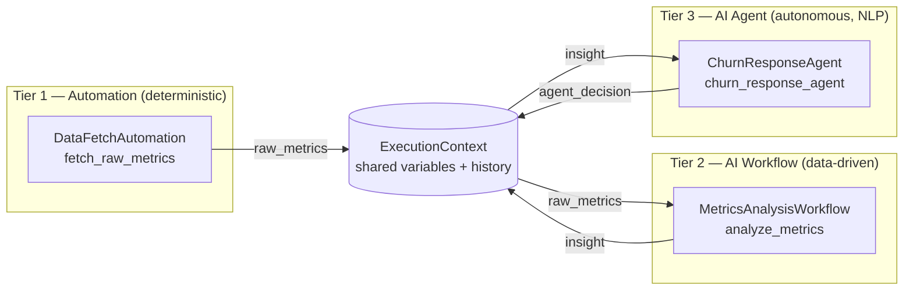

# Architecture

## 1. Why a monorepo, why synchronous-first

Every workflow, automation, and agent lives in one repository so there is exactly
one place to look for "how does the system behave end to end." A single
`ExecutionContext` object is threaded through every module in a pipeline run —
that's the "shared context window" requirement: no databases-as-message-buses, no
serializing state between separately-deployed services, just a dict and a list
that every module reads and appends to.

Synchronous-first means: given a pipeline `[A, B, C]`, `B` never starts until `A`
has returned, and `B`'s output is already merged into the context `C` sees. This
is what makes "tier-1 output feeds tier-3 input" trivial — there is no queue to
wire up, just a return dict.

## 2. Data flow: automation → workflow → agent

Concretely, in `cli.py`:

1. `discover()` scans `automations/`, `workflows/`, `agents/` for `*.yaml`
   manifests (in that tier order) and instantiates the module each one points to.
2. `Orchestrator.run()` creates one `ExecutionContext` and calls `module.run(context)`
   for each module in sequence.
3. Each module's return dict is merged into `context.variables` via
   `context.update(...)` **before** the next module runs.
4. Every step's inputs/outputs/timing/success are appended to `context.history`
   and, if a `StateStore` is attached, persisted to SQLite (`runs` + `steps` tables).

This is exactly the "output from a tier-1 script feeds a tier-3 agent" requirement:
`raw_metrics` (tier 1) → `insight` (tier 2) → `agent_decision` (tier 3), each key
just sitting in the same dict.

## 3. Core engine components

| File | Responsibility |
|---|---|
| `engine/base.py` | `Tier` enum + `BaseModule` abstract contract every module implements |
| `engine/context.py` | `ExecutionContext` (shared state) + `StepRecord` (one step's audit trail) |
| `engine/orchestrator.py` | Sequential runner; merges outputs, records history, optionally persists to `StateStore`, controls stop-vs-continue on error, emits live progress events via `on_event` |
| `engine/registry.py` | Reads `*.yaml` manifests in a tier folder (`load_manifests`), dynamically imports and instantiates the referenced class (`instantiate`/`discover`) |
| `engine/state_store.py` | SQLite persistence of run/step history for the `status` CLI command |

`Orchestrator.stop_on_error` controls failure behavior: `True` (default) re-raises
after recording the failed step, so a broken pipeline fails loudly; `False` lets
independent later steps still run (useful once pipelines have parallel-ish
branches, or a non-critical logging agent at the tail).

`Orchestrator.run(initial_context, on_event)` also accepts an optional
`on_event` callback. If given, it's called with a stream of events as the run
happens — `step_started` / `step_completed` / `step_failed` for each module,
plus `run_completed` / `run_failed` at the end (each carries the final
`context`). A module can call `context.emit(kind, message)` from inside its own
`run()` to add its own events (e.g. `"thought"`, `"tool_call"`) into that same
stream, automatically tagged with which tier/module produced them
(`ExecutionContext.active_module`, set by the orchestrator before each
`module.run()` call). The CLI ignores this entirely (`on_event=None`, a no-op);
the dashboard uses it to drive the live tracker described below.

## 4. Unified control layer

There are two front doors onto the same engine and the same `orchestrator.db`:

**`webapp/` — the visual control center (primary, day-to-day use).** A FastAPI
app (`webapp/main.py`) exposes:

- `GET /api/modules` — every enabled module per tier, with its manifest
  `description` and `inputs` schema, plus a `status` (`ready`/`error`) derived
  from `StateStore.latest_step_status()`.
- `POST /api/modules/{tier}/{name}/run` — builds a single-module pipeline
  (`Orchestrator([module])`), starts it in a **background thread**, and
  returns immediately with `{"stream_id": N}` — it does not wait for the run
  to finish.
- `POST /api/pipeline/run` — same idea, for the full tier-1→2→3 pipeline.
- `GET /api/stream/{stream_id}` — a Server-Sent Events stream of that run's
  events, as they happen, as `data: {...}\n\n` lines.
- `GET /api/runs` — recent, persisted run history from `StateStore`, for
  anything that wants to poll it instead.

`stream_id` is deliberately a separate, ephemeral ID space from `StateStore`'s
persisted `run_id` (`webapp/events.py::RunEventBus`) — it only exists to give a
live SSE channel something to key on, and is discarded once that stream ends.
Execution genuinely happens in a background thread (`threading.Thread`, not an
`asyncio` task), so a slow module never blocks FastAPI's event loop; a
`queue.Queue` per stream buffers events between the worker thread and whichever
request is currently reading `/api/stream/{id}`, so a client that connects a
moment late still gets everything from the start.

The static frontend (`webapp/static/`) is plain HTML/CSS/vanilla JS — no
bundler, no framework. Clicking a card's Run button (or "Run Full Pipeline")
POSTs to kick off the run, then opens `new EventSource('/api/stream/{id}')` and
renders three things live as events arrive (`app.js`):

- **A step tracker** — one row per module in that run (just one, for a single
  card; all three tiers, for the full pipeline), each showing ⚪ pending → 🟡
  running → 🟢 done / 🔴 failed as `step_started`/`step_completed`/
  `step_failed` events land.
- **An agent thought accordion** — for any tracker row whose tier is `agent`,
  `thought` and `tool_call` events append live lines to an expandable panel
  under that row (💭 for a thought, 🔧 for a tool call), so you can watch an
  agent's reasoning as it happens rather than only see its final message.
- **A toast notification** — on the terminal `run_completed`/`run_failed`
  event, a corner toast reports success or failure, the card's status pill
  updates (ready/error), and the client explicitly closes the `EventSource`
  (so a normal completion doesn't trigger the browser's automatic SSE
  reconnect).

Automations get a sky-blue accent, workflows violet, agents emerald, so the
tier boundary is visible at a glance independent of the tracker's own
pending/running/done coloring.

**`cli.py` — the scriptable / CI-friendly control layer:**

- `python cli.py list` — enumerate every discovered module per tier (health check
  that manifests + entrypoints resolve).
- `python cli.py run` — execute the pipeline once, print the final context and
  per-step status.
- `python cli.py status` — read `orchestrator.db` and print recent runs and their
  steps.

Both front doors call the exact same `Orchestrator`/`StateStore`/`registry`
code — the web layer adds zero orchestration logic of its own, only HTTP
plumbing and input coercion (`webapp/main.py::_coerce_inputs`, which applies
each field's declared `type` and `default` from the manifest).

## 5. Step-by-step: how this was built (and how to extend it)

1. **Define the contract.** `BaseModule` with `name`, `tier`, `description`, and a
   single `run(context) -> dict` method. Every tier implements the same shape on
   purpose — the orchestrator shouldn't need to know which tier it's calling.
2. **Define the shared state.** `ExecutionContext` — a `variables` dict for data
   and a `history` list of `StepRecord`s for audit/debugging.
3. **Build the sequential runner.** `Orchestrator.run()` iterates a list of
   `BaseModule` instances, merging each output into the context and recording a
   `StepRecord`, with a switch for stop-on-error vs. continue-on-error.
4. **Add persistence.** `StateStore` wraps SQLite with two tables (`runs`,
   `steps`) so history survives process restarts and the CLI's `status` command
   has something to read.
5. **Add extensibility.** `registry.discover(directory)` scans a folder for
   `*.yaml` manifests, each naming an `entrypoint` (`module.path:ClassName`), and
   instantiates it — this is what makes "drop a file in, don't touch the core"
   true.
6. **Write example modules per tier** (`automations/example_automation.py`,
   `workflows/example_workflow.py`, `agents/example_agent.py`) that demonstrably
   pass data forward, proving the flow in code rather than just in a diagram.
7. **Build the CLI control layer** (`cli.py`) wiring `discover()` + `Orchestrator` +
   `StateStore` into `list` / `run` / `status` subcommands.
8. **Add tests** (`tests/test_orchestrator.py`) covering context-threading and
   both error modes.
9. **Add CI** (`.github/workflows/ci.yml`) running `pytest` and a CLI smoke test
   on every push, so a broken module or a bad manifest fails fast.
10. **Add an `inputs` schema to manifests** (list of `{name, label, type, default,
    options}`) so modules can declare form fields without any engine change —
    `registry.load_manifests()` returns them as plain dicts.
11. **Build the visual control center** (`webapp/`): a FastAPI layer
    (`list_modules` / `run_module` / `run_pipeline`) over the same engine, plus a
    static, build-step-free HTML/CSS/JS dashboard that renders manifest `inputs`
    as forms and turns each module into a one-click card.
12. **Add API tests** (`tests/test_webapp.py`, via FastAPI's `TestClient`)
    covering module listing, single-module runs with overridden inputs, 404s,
    and the full-pipeline endpoint.
13. **Add live progress events.** `ExecutionContext.emit()` +
    `Orchestrator.run(..., on_event=...)` turn a run into a stream of
    step/thought/tool-call events instead of an opaque black box (also fixed a
    latent bug along the way: `finish_run("completed")` was unconditionally
    overwriting `finish_run("failed")` at the end of a continue-on-error run).
14. **Instrument the example agent** (`agents/example_agent.py`) to call
    `context.emit("thought", ...)` / `context.emit("tool_call", ...")` with
    small `time.sleep()`s between them — enough to make the live stream
    visibly stream rather than resolve instantly, which is what a real
    LLM-backed agent's latency would look like anyway.
15. **Move execution to a background thread + SSE** (`webapp/events.py`'s
    `RunEventBus`, plus `webapp/main.py`'s run endpoints returning a
    `stream_id` instead of blocking): a synchronous HTTP response can't show
    "in progress," so a live tracker requires the run to happen off the
    request thread and the client to subscribe separately.
16. **Build the tracker, thought accordion, and toasts** (`webapp/static/app.js`,
    `styles.css`) on top of that stream via `EventSource`.
17. **Extend from here:** to add a real module, drop a `<name>.py` + `<name>.yaml`
    pair into the right tier folder (see the README's "Adding a new module"
    section) — it appears in both `cli.py list` and the dashboard with no
    engine or webapp code changes. Call `context.emit(...)` from inside it if
    you want its own progress to show up in the live tracker.

## 6. Roadmap

The current engine is intentionally a single-process, synchronous, SQLite-backed
core — enough to prove the three-tier handoff and be genuinely useful for small
pipelines. Grow it only when a real need shows up:

- **Redis** — once more than one process needs to read/write the same
  `ExecutionContext` (e.g. a long-running agent tier and a web dashboard both
  need live state), move `variables` into Redis hashes keyed by run ID instead of
  an in-memory dict.
- **Celery / RQ** — once a workflow or agent step is slow enough that it
  shouldn't block the rest of the pipeline (e.g. an LLM call with retries), wrap
  that specific module's `run()` in a task queue instead of making the whole
  orchestrator async.
- **LangGraph** — once an agent's "task" is itself a multi-step reasoning loop
  (planning, tool calls, reflection) rather than a single `run()` call, model
  that agent internally as a LangGraph graph while it still presents a single
  `BaseModule` interface to the orchestrator, calling `context.emit()` at each
  internal step so the dashboard's thought accordion keeps working unchanged.
- **Stream replay / reconnect** — `RunEventBus` has no persistence or replay:
  if a client's `EventSource` drops mid-run and reconnects, whatever was
  already drained from the queue by the dropped connection is gone. Fine for a
  single-user local dashboard; move events into something replayable (e.g. a
  per-run log in `StateStore`) before relying on this over a flaky connection.
- **Parallel branches** — if two tier-2 workflows are independent, the
  orchestrator can grow a `run_parallel(modules)` that fans out and merges
  results back into one context before continuing, without changing `BaseModule`.
- **Auth on the dashboard** — the current `webapp/` has no auth layer, fine for
  local/single-user use; add it before exposing the control center beyond
  localhost.

Each step above is additive — none require rewriting `BaseModule`, the manifest
format, or the example modules.
